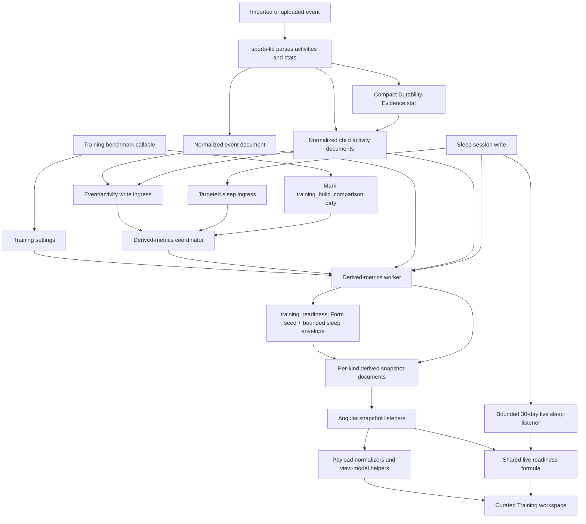

# Training Workspace Architecture and Maintenance Guide

This document is the implementation guide for the authenticated `/training` workspace. It is intended for product
engineers, data engineers, reviewers, and AI coding agents. Update it whenever the Training product contract, a derived
metric payload, the sports-lib durability protocol, or the refresh pipeline changes.

Current compatibility baseline:

- Quantified Self derived-metric schema: `11`
- `@sports-alliance/sports-lib`: `17.1.2`
- Training disciplines: Running, Cycling, and Swimming
- Power/capacity disciplines: Running and Cycling only
- Calendar boundaries: UTC unless a section explicitly says otherwise

## Product Contract

Training is a curated analytical workspace, not a second configurable dashboard. Its purpose is to answer:

1. What is the athlete doing now compared with their normal training?
2. What caused the change in load?
3. How are fitness, fatigue, freshness, and intensity changing?
4. What recent performance evidence supports imported settings such as FTP or VO2 max?
5. Is long-session durability changing?
6. How does the current build compare with a deliberately selected historical build?
7. What recovery and sleep context was recorded alongside those builds?
8. What do the available current load and recorded recovery signals say right now?

The following rules are architectural constraints:

- The frontend must not query activity or event history to calculate Training insights.
- The frontend must not download or reparse source files to calculate Training insights.
- Historical and comparative Training calculations belong in derived-metric builders or sports-lib, not Angular
  components. Readiness uses one environment-neutral formula in `shared/readiness.ts`: the frontend applies it to live
  Form/ramp plus bounded sleep evidence, while Functions applies it at each daily cutoff for the historical series.
- Dashboard remains the user's modular surface. Training does not remove, relocate, or reconfigure Dashboard tiles, and
  curated Training-only insights do not become hidden Dashboard dependencies. An explicitly configured Dashboard
  Aerobic Capacity or Aerobic Durability tile may opt into only its matching Training snapshot kind.
- Missing TSS, zones, pace, sleep, power, heart rate, or durability evidence remains unavailable. Missing values are not
  converted to zero.
- Merged benchmark events are excluded from Training. Multisport parent events are retained, but their normalized child
  activities are classified and counted separately.
- Hiding a sport changes detailed cards only. It does not change the overall state, load explanation, or underlying
  derived calculations.
- Sleep is context. It never changes the Training state and is not presented as a causal explanation of performance.
- Imported FTP and VO2 max values are settings or source observations. They are not silently relabeled as new estimates.
- Durability shown on Training comes only from the persisted sports-lib `Durability Evidence` activity stat.

## Ownership: Sports-lib Versus Quantified Self

| Concern | Owner | Source of truth |
| --- | --- | --- |
| Canonical activity types and activity groups | sports-lib | `src/activities/activity.types.ts` in sports-lib |
| Activity-level durability input selection | sports-lib | `src/events/utilities/activity-durability.ts` |
| Activity-level durability eligibility and formulas | sports-lib | `activity-durability.ts` and `data.durability-evidence.ts` |
| Compact durability stat creation and invalidation | sports-lib | `activity.utilities.ts` and the durability source fingerprint |
| Power-curve interpolation and window comparison | sports-lib | `src/events/utilities/power-curve-sampling.ts` |
| Curated Training disciplines | Quantified Self shared layer | `shared/training-disciplines.ts` |
| Joining normalized activities to parent events | Quantified Self Functions | `functions/src/derived-metrics/derived-metrics.service.ts` |
| Current, usual, weekly, and benchmark windows | Quantified Self Functions | derived-metric builders |
| Derived snapshot persistence and refresh | Quantified Self Functions | coordinator, triggers, ingress worker, and derived worker |
| User visibility and benchmark settings | Quantified Self Functions/shared contracts | authenticated callables and `shared/derived-metrics.ts` |
| Payload validation and view models | Quantified Self frontend | `dashboard-derived-metrics.service.ts` and Training helpers |
| Shared readiness scoring, labels, and confidence | Quantified Self shared layer | `shared/readiness.ts` |
| Historical 14-day readiness series | Quantified Self Functions | `training_readiness` derived builder |
| Layout, wording, empty states, and charts | Quantified Self frontend | `training-workspace.component.*` and child components |

In short:

```text
sports-lib answers:       Is this individual activity valid evidence, and what is the result?
Quantified Self answers:  How should valid evidence be grouped, compared, refreshed, and explained to the user?
```

Do not duplicate sports-lib durability formulas inside Functions. Do not move Training history queries into the
frontend.

## Architecture Overview



The page is eventually consistent. A complete event/activity historical scan happens in the worker, never in the
browser. The browser can continue showing the latest complete payload while a newer generation is building. The only
live contextual read added by Readiness is the bounded sleep-session listener shown above; it does not read event or
activity history. A readiness-only worker refresh reuses a compatible Form snapshot seed and fetches only the bounded
sleep envelope, so it does not perform a new event or activity scan. Event-driven all-metric builds still share their
already-loaded Form history, and the existing sleep-triggered Best Build comparison retains its broader dependencies.

## Route and Frontend Entry Points

- Route: `src/app/app.routing.module.ts`
- Lazy routing module: `src/app/training.routing.module.ts`
- Angular module: `src/app/modules/training.module.ts`
- Workspace controller: `src/app/components/training/training-workspace.component.ts`
- Workspace template: `src/app/components/training/training-workspace.component.html`
- Workspace styles: `src/app/components/training/training-workspace.component.scss`
- Shared readiness formula: `shared/readiness.ts`
- Shared readiness snapshot validator: `shared/training-readiness-metric.ts`
- Historical readiness builder: `functions/src/derived-metrics/derived-metrics.service.ts`
- Benchmark dialog: `src/app/components/training/training-build-benchmark-dialog.component.*`
- Sport visibility dialog: `src/app/components/training/training-sport-visibility-dialog.component.*`
- Swimming chart: `src/app/components/training/training-swim-performance-chart.component.*`
- Durability trajectory: `src/app/components/training/training-durability-trajectory-chart.component.*`
- Snapshot service: `src/app/services/dashboard-derived-metrics.service.ts`
- Shared payload contracts: `shared/derived-metrics.ts`
- Shared discipline registry: `shared/training-disciplines.ts`
- User help copy: `src/app/shared/help.content.ts`

During the staged rollout, Training is intentionally absent from the sidenav and Dashboard actions. The `/training` route
remains registered and directly reachable for internal QA.

Frontend transformation responsibilities are intentionally split into focused helpers:

| Helper | Responsibility |
| --- | --- |
| `training-analysis.helper.ts` | Overall 28-day comparison and state inputs |
| `training-capacity.helper.ts` | Imported-marker provenance and FTP/CP interpretation |
| `training-derived-metrics.helper.ts` | Strict normalization of explanation, durability, and readiness-history payloads |
| `training-durability-view.helper.ts` | Context grouping, comparison rows, tones, and weekly trajectory models |
| `training-explanation-view.helper.ts` | Load, contributor, sport-driver, rhythm, and coverage cards |
| `training-power-profile.helper.ts` | 90-day versus one-year power retention |
| `dashboard-training-insights.helper.ts` | Live readiness adapter and bounded sleep window |
| `training-readiness.helper.ts` | Training-specific readiness wording, driver freshness, implication, and trend geometry |
| `training-recovery-estimate.helper.ts` | Imported recovery countdown wording |
| `training-sport-visibility.helper.ts` | Automatic/fixed sport resolution and compact labels |
| `training-swim-performance.helper.ts` | Swim pace units and pool/open-water chart model |

## Firestore Data Model

Training reads or writes these user-scoped paths:

```text
users/{uid}/events/{eventId}
users/{uid}/activities/{activityId}
users/{uid}/sleepSessions/{sleepSessionId}
users/{uid}/config/settings
users/{uid}/derivedMetrics/coordinator
users/{uid}/derivedMetrics/{metricKind}
```

### Events

Parent event documents provide event identity, date, tags, merged-event classification, parent TSS, and display metadata.
Overall load and top contributors use parent-event TSS to avoid double-counting a multisport event.

The shared classifier treats `mergeType: 'benchmark'` and legacy `isMerge: true` as merged benchmark events. A
`mergeType: 'multi'` parent is a standard multisport event and remains eligible so its child legs can be analysed.

### Activities

Normalized child activity documents provide sport-specific stats and activity types. They are joined to their parent using
`eventID`. A child activity is ignored by curated Training builders when:

- `eventID` is missing;
- its parent event does not exist;
- the parent is a merged benchmark event;
- its activity type cannot be assigned to Running, Cycling, or Swimming; or
- its effective date is missing.

The join deliberately uses activity-level stats. Parent stats and `endDate` must not leak into a child leg. Provider and
device provenance may fall back to the parent when the child does not carry it. Functions creates one canonical joined
activity source per valid parent/child relationship. When Training Explanation is dirty, unsupported activity types
remain in that source with no curated discipline so it can report them as Other or Unclassified. Other metric-only
batches discard those unsupported wrappers during the join. Discipline-specific builders ignore unclassified sources
when they share an Explanation build. The join retains references to the selected child and parent data instead of
cloning a second activity metric object.

### Sleep sessions

Training uses main overnight sleep sessions for contextual comparisons. Naps are excluded. The backend has two narrow
sleep sources: `training_build_comparison` fetches the 28/84-day and selected build ranges, while `training_readiness`
fetches a bounded sleep-end envelope of about 43 days. That envelope lets each of the 14 daily cutoffs independently
apply the canonical 30-day sleep lookback without querying event or activity history. Separately, the Training and
Dashboard current-readiness surfaces share one bounded live sleep query: it is lower-bounded to the last 30 days, keeps
an open upper bound for newly imported nights, and never loads event or activity history. A local refresh timer
re-evaluates the shared result when a future-dated record becomes eligible, the latest night reaches its 48-hour limit,
or a night leaves the 30-day baseline window; it reschedules after every boundary and caps long browser timers. Both
live and backend paths reject unknown providers or invalid sleep dates, ignore non-positive physiological samples, and
discard unusable timezone offsets instead of letting malformed evidence change or break the result.

### Settings

The settings branch is:

```ts
trainingSettings: {
  visibleDisciplines?: Array<'running' | 'cycling' | 'swimming'>;
  buildBenchmarks?: {
    running?: TrainingBuildBenchmarkSelection;
    cycling?: TrainingBuildBenchmarkSelection;
    swimming?: TrainingBuildBenchmarkSelection;
  };
}
```

Absence of `visibleDisciplines` means automatic sport selection. It is not equivalent to an empty array. Benchmark
selections are independent per discipline.

### Derived snapshots

Every metric kind has its own snapshot document. The important fields are:

```ts
{
  entryType: 'snapshot';
  metricKind: DerivedMetricKind;
  schemaVersion: number;
  status: 'ready' | 'building' | 'failed' | 'stale';
  updatedAtMs: number;
  builtFromEventMutationVersion?: number | null;
  sourceEventCount: number;
  payload: unknown | null;
  lastError?: string | null;
}
```

The coordinator owns `generation`, `eventMutationVersion`, dirty kinds, processing state, timestamps, and the last error.
A generation claim prevents an old Cloud Task from overwriting a newer request.

## Training Disciplines and Activity Groups

`shared/training-disciplines.ts` is the Quantified Self registry. It resolves provider aliases through sports-lib and then
maps sports-lib groups to the three curated disciplines.

| Training discipline | sports-lib groups | Current canonical activity types |
| --- | --- | --- |
| Running | `RunningGroup`, `TrailRunningGroup` | Running, Treadmill, Indoor Running, Virtual Running, Trail Running |
| Cycling | `CyclingGroup`, `MountainBikingGroup` | Cycling, Indoor Cycling, Biking, Virtual Cycling, E-Biking, Mountain Biking, Enduro MTB, Downhill Cycling |
| Swimming | `SwimmingGroup` | Swimming, Open Water Swimming |

Important behavior:

- Mountain biking is part of Cycling; it is not a fourth Training discipline.
- A triathlon or multisport aggregate type is not classified. Its normalized running, cycling, and swimming child legs
  are classified individually.
- Each child leg counts as a session in its discipline.
- One multisport parent event can anchor separate Running, Cycling, and Swimming benchmarks.
- Known unsupported sports are reported as `Other` in load explanation when possible. Unknown strings are
  `Unclassified`.
- The overall state and explanation remain global even if a discipline is hidden from detailed cards.

When sports-lib changes a relevant group, update and test the shared registry. The registry spec enumerates every member
of all five relevant groups so new activity types cannot silently become unclassified.

## Derived-Metric Refresh Pipeline

### Metric registry

All metric kinds and their payload contracts live in `shared/derived-metrics.ts`. The backend build registry in
`derived-metrics.service.ts` declares source dependencies per kind. The worker uses those declarations to avoid fetching
settings, sleep, swim lengths, or activity documents for unrelated metrics.

| Metric kind | Training use | Primary source |
| --- | --- | --- |
| `form` | Form/load chart and CTL/ATL state inputs | Parent event TSS |
| `recovery_now` | Imported recovery-remaining card | Bounded parent event recovery stats |
| `acwr` | Load metrics | Parent event TSS |
| `ramp_rate` | State and load metrics | Parent event TSS |
| `monotony_strain` | Load metrics | Parent event TSS |
| `form_now`, `form_plus_7d` | Current/projected freshness values | Parent event TSS |
| `freshness_forecast` | Zero-future-load scenario chart | Parent event TSS |
| `intensity_distribution` | Global intensity chart | Parent event power/HR zones |
| `training_summary` | Overall comparison and discipline Training Mix | Joined normalized activities |
| `training_capacity` | FTP, VO2 max, and critical-power evidence | Joined activities plus `power_curve` |
| `power_curve` | Running/Cycling one-year curves and 90-day retention | Persisted activity power curves |
| `training_explanation` | What drove this | Parent events plus joined child activities |
| `training_durability` | Current/usual durability and 12-week trajectory | Persisted activity durability stats |
| `training_build_comparison` | Best Build and sleep context | Activities, settings, parent events, sleep |
| `training_readiness` | Readiness 14-day trend | Form snapshot seed plus bounded sleep sessions |
| `training_swim_performance` | Pool/open-water pace and contextual SWOLF | Activities plus active swim lengths |

The workspace also requests registered Easy/Hard and efficiency metrics because it currently uses the complete derived
scope. They are not standalone Training cards. Do not assume every requested snapshot maps one-to-one to visible markup.

Training currently watches `TRAINING_WORKSPACE_DERIVED_METRIC_KINDS`, which is all registered derived kinds. Training-only
kinds are excluded from the default Dashboard subscription and freshness scope. Dashboard adds `training_capacity` or
`training_durability` to that scope only while a matching explicitly configured tile exists. Opening a normal Dashboard
therefore does not create a hidden Training dependency or freshness probe for those kinds.

### Shared Dashboard and Training insight reuse

The configurable Dashboard can present a narrow, read-only view of selected Training evidence:

- **Aerobic Capacity** selects the most recent imported running or cycling VO2 max, displays its provider/source
  provenance, and compares only observations from the same source. FTP settings and modeled critical power never become
  VO2 values.
- **Aerobic Durability** uses the persisted `training_durability` payload and the existing sports-lib evidence protocol.
  The card selects the current context with the most eligible samples, then uses eligibility ratio and discipline priority
  as deterministic tie-breakers, followed by the lexical context key when every meaningful signal is equal. Running,
  Cycling, and Open water show aerobic decoupling; Pool shows pace retention. Missing weeks remain gaps.
- **Readiness** uses the environment-neutral formula in `shared/readiness.ts` in both surfaces. Dashboard applies it to
  current Form/ramp and bounded live sleep. Training uses that same live current result and also reads a backend-derived
  `training_readiness` snapshot containing 14 UTC-aligned daily cutoffs. Each historical day uses the Form state for that
  day, its seven-day CTL change, and only sleep evidence that had ended by that cutoff; a night older than 48 hours is
  ineligible. HRV and minimum-heart-rate baselines use up to 14 prior nights from the same provider and require at least
  three prior values. The live sleep query is lower-bounded to 30 days and keeps an open upper bound so an open page can
  receive newly imported nights. The backend sleep query is bounded at both ends to the envelope required for all 14
  cutoffs, and the formula then applies its own 30-day lookback at each cutoff. Future records are ignored. Training
  replaces the final chart point with the live current result only when the retained snapshot is for the current UTC day,
  so the headline and today's dot stay in sync without plotting a new score on yesterday after a day rollover. Score,
  status, confidence, timestamp, driver freshness, baseline evidence count, and missing values stay separate. Persisting
  the baseline count lets the frontend verify historical confidence against the shared formula instead of accepting only
  a plausible range. The combined load freshness uses the oldest contributing Form/ramp timestamp so one fresh input
  cannot hide a stale one. The result is not a medical score, VO2 estimate, workout prescription, or change to the
  curated Training state; the implication text remains neutral and asks the user to inspect evidence rather than obey a
  score. Equal-time sleep records use stable provider, date, and ID tie-breakers so live and historical calculations
  cannot select different latest evidence because query order changed.

Dashboard Manager recommendation eligibility may inspect existing snapshot documents to decide whether these tiles are
useful. Activity-backed recommendations require evidence in the default 90-day tile window, Sleep requires evidence in
its default 14-day window, Readiness accepts sleep-only evidence only when its latest aggregated non-nap night is no more
than 48 hours old, and Power Curve uses each discipline's prepared 1-year snapshot. It does not request a rebuild merely
because the manager dialog was opened.

### Writes and ingress

- Event creates, updates, and deletes enqueue debounced derived-metric ingress.
- Activity creates, updates, and deletes enqueue the same ingress.
- Sleep writes enqueue `training_build_comparison` and `training_readiness` and do not increment the event mutation
  version. Readiness itself has no activity dependency and can reuse the Form seed; the pre-existing build comparison
  still owns the wider activity/settings scan needed for build-range recovery context.
- The benchmark callable marks only `training_build_comparison` dirty.
- The visibility callable writes settings only; it does not rebuild data because visibility is presentation state.

Ingress is debounced by UID and a short time bucket. Deterministic task names coalesce bursts of event/activity writes.
The ingress worker marks the relevant kinds dirty and queues one derived worker generation.

Admin queue observability treats these as two separate Cloud Tasks queues: derived ingress shows invalidations waiting to
coalesce, while derived workers show snapshot builds waiting to run. The global Cloud Tasks depth and the Admin Dashboard
Derived Metrics row include both queues so ingress backlogs cannot disappear from headline health totals.

### Frontend freshness probe

On `/training`, the frontend:

1. Subscribes directly to each requested snapshot document.
2. Converts unknown or malformed data through a payload normalizer.
3. Treats an old schema or a ready-but-invalid payload as stale.
4. Calls authenticated, App-Check-protected `ensureDerivedMetrics`.

Missing, failed, or stale kinds have a 30-second request cooldown. Healthy scopes still receive a lightweight freshness
probe with a five-minute cooldown. The callable compares coordinator/snapshot state, the calendar day, mutation versions,
and the latest event update before deciding whether to queue work.

Readiness payload validity is also checked in the callable with the same environment-neutral runtime validator used by
the frontend. A `ready` document that predates a required history field or otherwise fails that contract is therefore
treated as stale by both layers. Snapshot-specific freshness failures enqueue only the affected kinds even when the
initial page probe contains the complete Training scope, so this case queues only `training_readiness`. That targeted
repair reuses a compatible Form snapshot seed and the bounded sleep envelope; it does not trigger an event or activity
history scan. Keep the validator shared when the readiness payload evolves so backend freshness cannot call an invalid
document fresh while the frontend remains indefinitely on Preparing.

This probe is important in local development and recovery scenarios: opening Training can repair missing or stale
snapshots even when no new Firestore write arrives.

### Worker lifecycle

`processDerivedMetricsTask` runs with 2 GiB of memory and per-instance concurrency `1` because a single full-history
Training build can hold large event and activity source sets. Cloud Run must scale separate instances for concurrent
builds instead of placing multiple full-history generations in one JavaScript heap. The worker creates one canonical
parent/activity join and shares that same array across sleep-range resolution, curated builders, and explanation
builders; do not restore separate joined copies or per-activity spread clones.

The derived worker:

1. Claims the expected coordinator generation.
2. Marks requested snapshots `building`.
3. Resolves source requirements for only the dirty kinds.
4. Fetches events, normalized activities, bounded recovery events, settings, swim lengths, and sleep only as required.
5. Builds payloads with a single `buildAtMs` anchor.
6. Re-checks the user deletion guard before every write stage.
7. Writes all requested snapshots `ready` with the same mutation version.
8. Completes the generation or requeues newly dirtied kinds.

Failures mark affected snapshots failed, preserve an error, and are rethrown so the Cloud Tasks retry policy can apply.

## Page Lifecycle and Sport Visibility

The workspace subscribes to the authenticated user and resets all state when the UID changes. It never allows a previous
user's dialogs or view models to survive an account switch.

Sport visibility has two modes:

- **Automatic:** use any discipline with current 28-day activity or a saved benchmark. If nothing qualifies, show all
  three disciplines.
- **Fixed:** show the persisted non-empty subset selected by the user.

The action label compacts to one sport, `2 sports`, or `All 3`; its accessible label lists the actual disciplines and
whether selection is automatic.

Visibility affects:

- Best Build cards;
- discipline Training Mix cards;
- capacity cards;
- Swimming Pace;
- durability tabs; and
- Running/Cycling power profiles.

Visibility does not affect:

- the overall Training state;
- training time and session comparison used by that state section;
- What drove this;
- global form/freshness/load charts; or
- the all-eligible-activity intensity-distribution chart.

## Page Sections and Calculations

The sections appear in the following fixed order.

### 1. Compared With Your Usual 28 Days

The section combines `training_summary`, form/load metrics, `recovery_now`, and the recovery comparison stored in
`training_build_comparison`.

#### Training summary

For every discipline:

- Current window: today plus the preceding 27 UTC days.
- Baseline: the immediately preceding 84 UTC days, multiplied by `28 / 84` to produce a normalized 28-day value.
- Sessions: child activity count.
- Time: sum of activity `Duration` stats.
- Intensity: power zones when present, otherwise heart-rate zones.
- Easy: zones 1-2.
- Moderate: zones 3-4.
- Hard: zones 5-7.

The top training time and session values sum all three disciplines, regardless of detailed-card visibility.

#### Training state

The frontend classifies existing form signals in this order:

| State | Rule |
| --- | --- |
| Starting | `fitness < 5` and `fatigue < 10` |
| Overload | `form <= -30`, or `form <= -20` while `fatigue > fitness * 1.25` |
| Fatigued | `form <= -10` |
| Building | `rampRate >= 1` and form is missing or `< 6` |
| Fresh | `form >= 8` and ramp is missing or `<= 0` |
| Detraining | `rampRate <= -3` and form is missing or `> -8` |
| Balanced | any other available signal combination |

If all state inputs are missing, the page shows an awaiting-data state rather than guessing.

#### Readiness today

Training renders one wide Readiness card instead of separate top-level readiness and sleep cards. The current result is
contextual rather than causal or prescriptive. It calls the same shared formula as the optional Dashboard tile and
combines only:

- the current derived Form/ramp snapshots;
- sleep score when recorded, otherwise a duration-based score centered on eight hours;
- latest-night HRV versus up to 14 prior nights from the same provider; and
- latest-night minimum heart rate versus up to 14 prior nights from the same provider.

The sleep listener is lower-bounded to 30 days, excludes naps, ignores future-dated records, and accepts a latest night
only through 48 hours after its end. The card also refreshes when a future record becomes eligible or baseline evidence
leaves the 30-day window, even if Firestore emits nothing. Score, status, confidence, calculation timestamp, signal
count, driver values, and driver freshness are shown separately. Combined Form/ramp freshness is the oldest contributing
timestamp. The training implication is deliberately non-prescriptive: it summarizes whether evidence is supportive,
mixed, or strained and directs attention to the drivers rather than choosing a workout. Failed Form/ramp reads and a
failed sleep listener are identified separately from genuinely missing evidence. Sleep already loaded before a listener
failure remains visible only while it is still eligible; load-only readiness remains available afterward.

The same card plots a backend-derived 14-day series. `training_readiness` declares only `formDocs` and
`trainingReadinessSleepDocs`; it never declares activities or settings. On a readiness-only refresh, the worker accepts a
schema-compatible Form snapshot seed, avoids a full event scan, and queries a bounded sleep-end envelope covering every
daily cutoff's own 30-day lookback. Each daily point evaluates the shared formula at that UTC day's final millisecond,
except today, which uses the worker build timestamp. Missing scores remain chart gaps and the frontend rejects malformed,
non-contiguous, or internally inconsistent payloads, including confidence that does not match the recorded signal and
baseline evidence counts. The latest complete series may remain visible while its status is updating or after a failed
refresh. The live current calculation replaces today's plotted score only when the snapshot's `asOfDayMs` is the current
UTC day, so newly imported sleep can update the card without waiting for a historical snapshot and a stale series cannot
mislabel a new score as yesterday's. An open Training route schedules a narrow UTC-day rollover refresh for `form_now`,
`ramp_rate`, and `training_readiness`. Those projection-sensitive kinds can reuse a compatible Form seed and do not
require an event or activity scan.

#### Recovery remaining

`recovery_now` combines supported imported post-workout recovery estimates. The card counts down using the stored end
time. It is explicitly labeled as an imported estimate, not readiness, and does not change the Training state. The
worker scans a bounded 16-day event window; no events in that window is a valid empty result for new or inactive users
and is logged as informational rather than a warning.

#### Recovery history

The expandable Recovery history inside Readiness uses:

- Current: the current 28-day window.
- Reference: the immediately preceding 84-day window.
- Main overnight sleep only; naps excluded.
- Metrics: average sleep per night, recorded-night coverage, bedtime variation, and median overnight HRV.

Comparative deltas require the same provider and sufficient coverage in both windows. The minimum is at least seven
nights and at least half of each window (`14/28` and `42/84` for the normal comparison). Bedtime regularity requires a
usable timezone; the builder must not fabricate local bedtime from UTC timestamps. Garmin normally supplies this as
`startTimeOffsetInSeconds`, while COROS can supply explicit offsets or its start/end timezone fields, and Suunto can
supply an offset-bearing sleep timestamp. Any provider can omit that evidence, and older backfilled records can predate
offset persistence. Those nights still contribute valid duration and overnight HRV when available, but not bedtime
variation. The frontend must therefore accept a missing bedtime variation independently of total recorded-night count.
It renders only the missing metric as unavailable, explains the local-time or HRV evidence requirement, and keeps other
valid recovery metrics visible. Comparison copy must not imply that every metric is available.
Provider mappers preserve null or blank timezone fields as missing rather than coercing them to UTC; COROS can still fall
back from a missing explicit offset to its start/end timezone fields.

Sleep values remain visible without deltas when coverage or provider comparability is insufficient.

### 2. Best Build vs Now

`training_build_comparison` builds one independent card per visible discipline.

#### Benchmark selection

Each discipline can store one selection:

```ts
type TrainingBuildBenchmarkSelection =
  | { mode: 'event'; durationWeeks: 8 | 10 | 12; eventId: string }
  | { mode: 'period'; durationWeeks: 8 | 10 | 12; endDayMs: number };
```

- Event mode: the selected event anchors the build; benchmark end is the day before the event.
- Period mode: the selected UTC date is the benchmark end.
- Current and historical windows always have the same 8, 10, or 12-week length.
- The benchmark must end before the current window begins.
- The anchor event is not part of the historical workload.
- Selecting an event never adds or changes its `Race` tag.
- Exact case-insensitive `Race` tags only affect suggestion priority.

The picker shows up to 20 tagged races and up to 100 other historical events. It can filter all history, the latest year,
or earlier history, and sort by latest, longest, or highest load. Generic `New Event` names are suppressed; date and
available distance, duration, and TSS provide identity.

#### Callable validation

`setTrainingBuildBenchmark` requires authentication and App Check. It validates:

- discipline;
- selection shape and duration preset;
- Firestore-safe event ID;
- UTC-normalized period date;
- non-overlap;
- event existence;
- deletion-guard state;
- merged-event exclusion; and
- at least one child activity belonging to the requested discipline.

The callable writes only `trainingSettings.buildBenchmarks.{discipline}`. Clearing uses field deletion. It then dirties
only `training_build_comparison` without incrementing the event mutation version.

Save failures remain visible in the dialog and are also announced through the shared Material snackbar, because the
inline error can sit below the viewport in the long mobile event picker. Known App Check failures use actionable
secure-session copy instead of exposing raw Firebase transport details.

#### Compared workload

Each current and benchmark window contains:

- child activity count;
- duration;
- distance when available;
- TSS and its source count when available;
- active weeks;
- longest activity;
- easy/moderate/hard zone time when available;
- context-matched durability;
- distance-weighted pool pace; and
- distance-weighted open-water pace.

Pool and open-water pace are never combined. Swimming distance uses swim units. Pace deltas are described as faster or
slower, where lower seconds per 100 m/yd is better.

Durability rows are comparable only when the exact context exists in both windows and each side has at least two eligible
activities. For example, cycling power cannot be compared with running speed, and a 25 m freestyle pool context cannot be
combined with a 50 m breaststroke context.

Every ready card also compares sleep over the exact current and historical build ranges using the same provider and
coverage rules as the top recovery context. To avoid duplicating the full recovery card, Best Build shows a compact
key-metric summary by default and reveals its complete metric table, evidence limitations, and source text only when the
user opens **Details**. Sleep differences under 15 minutes are summarized as similar; exact values remain in the table.

Card states are `not-configured`, `updating`, `invalid`, `unavailable`, and `ready`. Optimistic pending selections remain
updating until the snapshot's stable selection key matches the saved choice.

### 3. What Drove This

`training_explanation` compares the current 28 days with the median of three distinct preceding 28-day blocks.

It intentionally separates parent-event load from child-activity composition:

- Parent events determine total TSS and top contributors. This avoids double-counting multisport legs.
- Child activities determine Running/Cycling/Swimming/Other/Unclassified composition and rhythm.

The cards show:

- overall TSS relative to the baseline median;
- up to three of the top five current parent-event contributors;
- the sport bucket with the largest absolute TSS change; and
- the discipline with the largest active-day change.

Rhythm includes session count, active days, active weeks, longest inactivity gap, and longest session. Coverage text makes
missing parent TSS and unclassified child activity types visible. A sparse one-off baseline must not be described as a
confident usual pattern.

### 4. Load Trajectory

This section reuses global derived load metrics:

- Form chart.
- Seven-day freshness forecast.
- CTL.
- ATL.
- Ramp rate.
- ACWR.
- Monotony.
- Strain.
- Form now.
- Form after seven zero-load days.

Daily load is TSS on UTC days. CTL and ATL use exponentially decaying recurrences with 42-day and 7-day time constants:

```text
CTL_today = CTL_previous + (load_today - CTL_previous) / 42
ATL_today = ATL_previous + (load_today - ATL_previous) / 7
Form      = CTL - ATL
```

The forecast is a scenario with zero future load, not a prediction of what the athlete will actually do.

### 5. Training Mix

Discipline cards use `training_summary`:

- Current 28-day child activity count and duration.
- Current zone percentages.
- Normalized preceding-84-day zone percentages.

Power zones take priority over heart-rate zones per activity. If neither exists, that activity contributes to count and
duration but not to the zone denominator.

The separate intensity-distribution chart is global and can include any activity with eligible power or heart-rate zone
data. It is not filtered by the sport visibility control.

### 6. Settings vs Recent Evidence

This section contains capacity evidence, swimming performance, durability, and power profiles.

#### Capacity evidence

Capacity is limited to Running and Cycling. Swimming must not render FTP, critical power, or a power curve.

For each power discipline:

- FTP setting: the latest stable imported FTP observation, with provider/device provenance and prior value when comparable.
- Imported VO2 max: the latest stable source-matched observation.
- Modeled critical power: a 90-day model using best recorded power-curve efforts from 3 to 20 minutes.

An FTP value that exactly matches the session-derived `95% of 20-minute power` heuristic is not treated as an imported
long-lived setting. The critical-power model reports evidence count, fit confidence, R-squared, normalized error, W', and
W/kg only when the implied weights are consistent.

The frontend compares modeled CP with imported FTP using a 5% tolerance:

- Model above FTP: the FTP setting may be conservative.
- Model below FTP: recent efforts have not validated FTP; this is not automatically fitness loss.
- Within 5%: recent power supports the setting.

VO2 max is never directly compared with FTP or critical power because it answers a different question and may originate
from a device estimate or laboratory observation.

#### Swimming pace and SWOLF

`training_swim_performance` provides twelve UTC-aligned weekly points with separate pool and open-water series.

- Pace uses an explicit Average Swim Pace stat.
- Pace is distance-weighted; elapsed duration is not used because rests would distort it.
- Missing pace stays `null` while weekly activity count and distance remain available.
- SWOLF uses active swim lengths only.
- One dominant stroke and pool-length context is selected across the 12-week range.
- SWOLF values from different strokes or pool lengths are never combined.
- CSS is not inferred from ordinary workouts.

The chart has a full-height layout and an inverted pace axis, because lower seconds per 100 m/yd means faster swimming.
Units follow the user's swim pace settings.

#### Power profile

Running and Cycling compare the 90-day best curve with the one-year best curve at:

```text
5 seconds, 1 minute, 5 minutes, 20 minutes, 1 hour
```

The shared sports-lib sampler:

- prefers an exact duration;
- keeps the strongest duplicate;
- interpolates in reciprocal-duration (`1/t`) space;
- requires neighboring durations within a 1.25 ratio by default; and
- never extrapolates outside the stored curve.

Retention is `recent / reference * 100`. Delta is retention minus 100 percentage points. The chart itself shows the
one-year curve; summary chips explain the 90-day retention.

The profile summary is a non-growing header above the embedded Power Curve. Its horizontal inset matches the chart
header so the summary, chart title, benchmark values, and plot remain aligned at every responsive width.

## Durability Deep Dive

Durability is shared between sports-lib, Training, Best Build, and event detail. It measures whether an athlete maintains
external output for a similar cardiovascular cost during a long, reasonably steady aerobic session. It is not a generic
score for every workout.

### Supported activities

The engine currently supports:

- Running, Treadmill, Indoor Running, Virtual Running, and Trail Running.
- Cycling, Indoor Cycling, Biking, Virtual Cycling, E-Biking, Mountain Biking, Enduro MTB, and Downhill Cycling.
- Swimming and Open Water Swimming.

Support means the engine understands the activity type. An individual activity can still be explicitly ineligible.

### Input selection

| Context | Output | Required response/context |
| --- | --- | --- |
| Cycling and MTB | Power | Heart-rate stream |
| Running and trail | Grade-adjusted speed preferred | Heart-rate stream |
| Flat/indoor running fallback | Raw speed | Heart rate; indoor type or at least 80% flat grade coverage within +/-2% |
| Open-water swimming | Speed | Heart-rate stream |
| Pool swimming | Active-length pace | Dominant comparable stroke and pool length; SWOLF optional |

Cycling does not fall back to speed. Outdoor running does not use raw speed on arbitrary terrain. Pool swimming uses a
different consistency protocol because a one-hertz HR/output model is inappropriate for length-based data.

### Aerobic protocol v1

Protocol constants:

| Parameter | Value |
| --- | --- |
| Smoothing window | 60 seconds |
| Warm-up excluded | 10 minutes |
| Cool-down excluded | 5 minutes |
| Minimum activity duration | 40 minutes |
| Minimum qualifying paired data | 30 minutes |
| Minimum total and per-half coverage | 60% |
| Maximum output coefficient of variation | 0.25 |
| Maximum zones 4-7 ratio | 20% |

After warm-up and cool-down exclusion, the comparison window is divided into fixed wall-clock halves. Output and heart
rate are smoothed, but samples remain aligned to elapsed seconds. Aerobic efficiency is:

```text
efficiency = output / heart_rate
decoupling_percent = (first_half_efficiency - second_half_efficiency)
                     / first_half_efficiency * 100
output_retention_percent = second_half_output / first_half_output * 100
heart_rate_drift_bpm = second_half_heart_rate - first_half_heart_rate
```

Lower absolute decoupling and HR drift are interpreted as steadier. Higher output retention is interpreted as better.

Hard-zone exclusion uses power zones for power output when available, otherwise heart-rate zones. Zones 4-7 above 20%
make the workout too intense for this steady aerobic protocol. Missing zone stats do not create a hard-zone failure; the
variability and coverage gates still apply.

### Pool protocol v1

Pool durability:

1. Keeps active lengths only.
2. Rejects drill, unknown, mixed, IM, medley, and individual-medley stroke contexts.
3. Groups lengths by exact pool length and normalized stroke.
4. Selects the dominant context by length count.
5. Requires at least 24 comparable lengths and at least 8 lengths in each outer third.
6. Requires 40 minutes total activity duration, 30 minutes qualifying context duration, 60% context coverage, acceptable
   intensity, and pace coefficient of variation no greater than 0.25.
7. Compares the first and final thirds.

```text
pace_retention_percent = first_pace_seconds_per_100m
                         / final_pace_seconds_per_100m * 100
swolf_change = final_swolf - first_swolf
```

Higher pace retention is better. Lower SWOLF change is steadier. SWOLF remains unavailable if it is not recorded.

### Eligibility and missing evidence

Persisted ineligibility reasons include:

- `missing-output`
- `missing-heart-rate`
- `insufficient-duration`
- `insufficient-coverage`
- `insufficient-halves`
- `too-variable`
- `too-intense`
- `unsupported-context`

Unsupported activity types produce no durability summary. Supported activities produce a compact summary even when
ineligible, allowing Training to explain exclusions rather than treating them as zero.

### Persistence and invalidation

The activity stat is `DataDurabilityEvidence`, serialized as `Durability Evidence`. It stores:

- protocol version;
- deterministic source fingerprint;
- discipline and output source;
- optional pool context;
- duration and coverage;
- eligibility details; and
- compact eligible evidence.

It never stores the display timeline or a second copy of long streams.

Frontend event sanitization relies on sports-lib's `DynamicDataLoader` registry to retain serialized stats. The
`event-json-sanitizer.spec.ts` regression test therefore checks the literal persisted `Durability Evidence` key against
the real sports-lib registry without importing `DataDurabilityEvidence`; importing the class in that test could register
it as a side effect and mask a bundling or tree-shaking regression. Add an explicit runtime registration import only if a
deployed bundle reproduces the missing-registration warning.

The source fingerprint includes the protocol, effective activity type and duration, relevant output/HR/grade streams,
zone durations, and pool-length context. When any effective input changes, sports-lib recalculates the stat. An unchanged,
canonical stat is reused. A valid summary-only stat is preserved when raw inputs are no longer available.

Compact aerobic evidence rounds its persisted base output and heart-rate values before calculating efficiency, retention,
decoupling, and drift. This keeps the serialized summary arithmetically self-consistent at its stored precision, including
low-speed open-water evidence, so constructor validation cannot reject evidence produced by the analyzer itself.

Merged parent event summaries explicitly exclude child durability evidence because multiple contexts cannot be reduced to
one trustworthy event-level value.

### Quantified Self durability aggregation

Functions validates the persisted stat through sports-lib's canonical normalizer. It never reconstructs evidence from
average power, pace, HR, or raw streams.

Aggregation uses exact context keys:

```text
scope | output source | output unit | pool length or - | stroke or -
```

For each context, the worker stores medians for duration, coverage, decoupling, output retention, HR drift, pace retention,
and SWOLF change. Training compares:

- Current 28 days.
- Median of the three prior 28-day blocks.
- Twelve fixed UTC weeks for the trajectory.
- Up to five recent supporting eligible activities.

The 12-week chart is a durability trend, not a general power-availability chart. For cycling power contexts, the
frontend reports candidates, activities whose processed durability evidence confirms recorded power, eligible samples,
and the primary ineligibility reasons already present in the snapshot. The power-confirmed count is the evidence count
minus `missing-output` exclusions; it does not query activity history. Bar height shows power-recorded activities, the
compact bar label shows `eligible / power-recorded`, and the line appears only for eligible aerobic-decoupling evidence.
A stored Power Curve alone therefore does not guarantee a durability point. Sports-lib records one primary eligibility
reason per activity, so aggregate exclusion copy must call these **primary exclusions** rather than implying an
exhaustive list of every threshold that activity missed.

The trajectory chart host is conditionally mounted only after its view model exists. Its Angular view query must remain
dynamic and initialize through the shared ECharts host controller when that element appears; a static query resolves
before the conditional view and leaves the chart blank. The component lifecycle spec must exercise that delayed host
insertion rather than only assigning a synthetic element before testing chart options.

The usual value is withheld unless evidence exists in at least two baseline blocks with at least two samples in total.
Best Build requires at least two samples on both sides of the exact context.

Coverage distinguishes:

- candidate activities;
- activities with any durability stat;
- eligible activities;
- missing evidence;
- ineligible evidence; and
- exclusion reasons.

Older activities parsed before the durability stat existed can remain `missingEvidenceActivityCount` until a sports-lib
reparse processes them. If the original source is unavailable, missing evidence remains honest and permanent.

Sports-lib reparse persistence keeps event, activity, and metadata writes behind the account-deletion guard. Its Firestore
transaction writes use a bounded retry for transient transaction failures, including Firestore's retryable
`INVALID_ARGUMENT: Invalid transaction` response, and emit phase logs for `write_all_event_data`, `merge_metadata`,
`delete_stale_activities`, and `processing_metadata`. Use those phase logs to identify which persistence step failed in
long-running heavy reparse jobs before changing queue retry policy.

### Event detail reuse

Event detail uses the same sports-lib analyzer and may request a transient timeline for visualization. This does not alter
the Training rule: aggregate Training snapshots use only persisted compact activity evidence.

The event performance-chart region uses a shared `23.1vh` height. On extra-small viewports, the durability eligibility
summary starts collapsed behind an accessible disclosure button so the plot retains useful vertical space. Expanding the
summary keeps its list height bounded and scrollable instead of allowing evidence rows to squeeze out the chart. Desktop
viewports continue to show the summary by default.

## Status and Empty-State Semantics

Snapshot status and payload validity are separate concerns. A `ready` document with the wrong schema or an invalid payload
is treated as stale and re-requested.

UI principles:

- Primary numeric and stat values use the app's locally bundled Barlow Condensed family with tabular numerals. Headings,
  labels, status words, and narrative explanations remain in Inter. ECharts continues to use its shared Barlow Condensed
  font token so chart typography matches the surrounding Training metrics.
- `missing`, `queued`, `processing`, `building`, and `stale` show a preparing/updating state.
- `failed` shows a retry-oriented unavailable state.
- A previous valid payload may remain visible while a replacement builds.
- A chart with no previous payload is not mounted while its snapshot builds. Training shows a compact, bounded status card
  instead, so chart minimum heights and overlays cannot stretch or bleed during the initial load.
- A valid payload with zero eligible data shows a domain-specific empty state, not a spinner.
- A durability week without an eligible sample must expose candidate/input counts and primary exclusion reasons rather
  than using an unexplained `Empty` label.
- Null optional metrics render as an em dash or unavailable copy, never zero.
- Compact loading cards remain readable without reserving the full chart canvas. Ready empty states keep the full chart card
  height so their domain-specific explanation is not compressed.
- Comparison colors use metric semantics: more is not automatically better. Lower pace, lower absolute decoupling, lower
  bedtime variation, and lower SWOLF change have inverse semantics.

Frontend payload normalizers are security and resilience boundaries. Treat Firestore payloads and user settings as
untrusted input even though Functions produced them.

## Security and Write Safety

All Training settings writes go through callable Functions. Both callables require:

- Firebase Authentication;
- App Check;
- strict request normalization;
- a user deletion guard before work; and
- a second deletion guard inside the write transaction.

The frontend must not write `trainingSettings` directly. Settings writes use merge semantics and touch only the requested
branch. Clearing one benchmark must not overwrite visibility or another discipline's benchmark.

Derived triggers and workers also check deletion state before enqueueing and before writes. Never add user-scoped async
state without extending recursive deletion handling and deletion guards.

## Extending Training Safely

### Adding an activity to an existing discipline

1. Add or normalize the activity type in sports-lib.
2. Add it to the correct sports-lib activity group.
3. Confirm the shared discipline-registry enumeration spec now expects it.
4. Decide whether the existing durability adapter has meaningful output for it.
5. Add sports-lib durability tests if it should be supported; otherwise keep it explicitly unsupported.
6. Rebuild and publish sports-lib before updating Quantified Self dependency locks.

Do not add provider aliases directly to the Training builder.

### Adding a new Training discipline

This is intentionally larger than adding a card. Update:

- sports-lib group and activity support;
- `TRAINING_DISCIPLINES` and activity-group mapping;
- visible-discipline and benchmark contracts;
- all three-discipline accumulators and payload normalizers;
- callables and validation copy;
- automatic/fixed visibility behavior;
- build comparison formatting and metric semantics;
- responsive grids;
- help content; and
- backend, frontend, shared-contract, rules, and browser tests.

Power/capacity support must remain independently modeled. Do not automatically add a new discipline to
`POWER_CAPACITY_DISCIPLINES`.

### Adding a new durability context

Prefer a capability-based sports-lib adapter with:

- explicit supported activity types;
- output-source priority;
- physiological response source;
- eligibility rules;
- comparison segmentation; and
- a stable context key.

Do not reuse raw outdoor speed where terrain, current, wind, motor assistance, or machine resistance makes it
physiologically incomparable. Indoor rowing is a strong future candidate; strength, team sports, climbing, downhill
skiing, and multisport aggregates need different fatigue models rather than this steady aerobic protocol.

### Adding a derived metric

1. Add the kind and payload to `shared/derived-metrics.ts`.
2. Decide whether it is default, projection-sensitive, calendar-sensitive, Dashboard-visible, or Training-only.
3. Add a backend build-registry entry with the narrowest source dependencies.
4. Add a pure builder and focused Functions tests.
5. Add a strict frontend normalizer and focused tests.
6. Register snapshot status/context parsing in `DashboardDerivedMetricsService`.
7. Add explicit loading, failed, empty, and ready UI states.
8. Bump `DERIVED_METRIC_SCHEMA_VERSION` only when existing snapshots must be invalidated.
9. Update this document and user help.

Do not read settings or sleep unconditionally in the worker. Source requirements are part of the performance contract.

## Testing and Verification

### Sports-lib

From `../sports-lib`:

```bash
npm test -- --runInBand \
  src/events/utilities/activity-durability.spec.ts \
  src/events/utilities/power-curve-sampling.spec.ts
npm run build
```

Run the full sports-lib suite before publishing a version that changes serialized evidence or public exports.

### Functions

From the Quantified Self root:

```bash
npm --prefix functions test -- \
  src/derived-metrics/derived-metrics.service.spec.ts \
  src/derived-metrics/set-training-build-benchmark.spec.ts \
  src/derived-metrics/set-training-visible-disciplines.spec.ts \
  src/tasks/derived-metrics-worker.spec.ts \
  src/tasks/derived-metrics-ingress-worker.spec.ts
npm --prefix functions run build
```

Also run trigger and Cloud Tasks tests when refresh plumbing changes. Run Firestore/Storage rules tests when security rules
or persisted write paths change.

### Frontend

Run the closest helper/component specs, including:

```text
training-workspace.component.spec.ts
training-build-benchmark-dialog.component.spec.ts
training-sport-visibility-dialog.component.spec.ts
training-analysis.helper.spec.ts
training-capacity.helper.spec.ts
training-derived-metrics.helper.spec.ts
training-durability-view.helper.spec.ts
training-explanation-view.helper.spec.ts
training-power-profile.helper.spec.ts
dashboard-training-insights.helper.spec.ts
training-readiness.helper.spec.ts
training-recovery-estimate.helper.spec.ts
training-swim-performance.helper.spec.ts
training-durability-trajectory-chart.component.spec.ts
event-json-sanitizer.spec.ts
```

Then verify:

```bash
npx tsc --noEmit -p src/tsconfig.app.json
npx ng build --configuration local
git diff --check
```

### Browser QA matrix

Inspect authenticated `/training` at desktop, tablet, and narrow-mobile widths. Cover:

- automatic and fixed sport visibility;
- all sports and each single-sport mode;
- benchmark unset, saving, updating, invalid, cleared, and ready;
- event and manual benchmark flows for 8/10/12 weeks;
- no TSS, no zones, no pace, no SWOLF, and no sleep;
- limited and cross-provider sleep;
- Readiness today preparing, unavailable, partial, full-evidence, 48-hour expiry, stale history, chart-gap, and
  expandable Recovery history states;
- durability missing evidence, ineligible evidence, sparse baseline, and ready comparison;
- one and multiple capacity/power cards;
- loading, stale, failed, and valid empty snapshots;
- dark and light themes;
- no horizontal overflow; and
- no browser console errors.

## Local Development and Diagnostics

Start with the repository workflows in `.agent/workflows/serve-local.md` and
`.agent/workflows/start-emulators.md`. Build Functions before starting the emulators.

The localhost frontend normally calls emulated Functions; `local-prod-functions` explicitly targets production Functions.
Backend code can still reach real services depending on environment variables and credentials, so verify the active
project and never assume `localhost` means isolated data.

Derived metrics also require the Cloud Tasks emulator configuration used by this repository. When
`CLOUD_TASKS_EMULATOR_HOST` is set, task lookup and queue statistics stay local and must not fall through to the production
Cloud Tasks API.

When Training appears stuck on Preparing:

1. Check the browser snapshot status and console.
2. Inspect `users/{uid}/derivedMetrics/coordinator` status, generation, dirty kinds, timestamps, and `lastError`.
3. Inspect the requested snapshot document's status, schema, mutation version, payload, and `lastError`.
4. Confirm `ensureDerivedMetrics` was called and whether it returned `queued: true` or `false`.
5. Check derived ingress and worker logs for the same UID and generation.
6. Confirm the Cloud Tasks emulator/queue is running and dispatching both ingress and derived worker tasks.
7. Confirm Functions and frontend use compatible `shared/derived-metrics.ts` contracts.
8. Confirm both root and Functions installations use the expected sports-lib version.

Do not fix Preparing states by adding frontend history queries, polling raw activities, or reparsing files in Angular.

For durability specifically, distinguish:

- **Missing snapshot:** refresh/queue problem.
- **Missing evidence:** activity was not parsed with a compatible durability stat.
- **Ineligible evidence:** sports-lib processed it and recorded a reason.
- **No comparable usual:** current evidence exists, but the prior blocks are too sparse.

## Release Order

When a Training change depends on a new sports-lib version:

1. Build and test sports-lib.
2. Publish the exact sports-lib version.
3. Install that published version in both root and `functions`, then verify both lockfiles resolve the same artifact.
4. Deploy Functions before the frontend so new-schema clients do not read old builders.
5. Allow the existing sports-lib reparse process to populate newly introduced activity stats where original sources exist.
6. Deploy the frontend.
7. Verify a real account with ready, sparse, and missing-data states.

Existing snapshots rebuild lazily after a schema bump. A new activity-level sports-lib stat may additionally require a
reparse; changing only the derived schema cannot create missing activity evidence.

## Maintenance Checklist

Before merging a Training change, confirm:

- [ ] Sports and activity groups still come from the shared registry.
- [ ] Multisport parent load is not double-counted.
- [ ] Child activity stats are not contaminated with parent stats.
- [ ] Merged benchmark events and future events are excluded where promised.
- [ ] Optional values remain null instead of zero.
- [ ] The frontend does not query activity/event history or raw streams.
- [ ] sports-lib remains the only durability calculation owner.
- [ ] Settings writes are authenticated, App-Check protected, deletion guarded, normalized, and branch-scoped.
- [ ] Source dependencies are fetched only for metric kinds that need them.
- [ ] Snapshot schema and frontend normalizers agree.
- [ ] Loading, failed, empty, updating, invalid, and ready states are readable.
- [ ] Metric delta colors follow metric semantics.
- [ ] Help content and this document are current.
- [ ] Focused tests, Functions build, frontend build, sports-lib build, and `git diff --check` pass.
