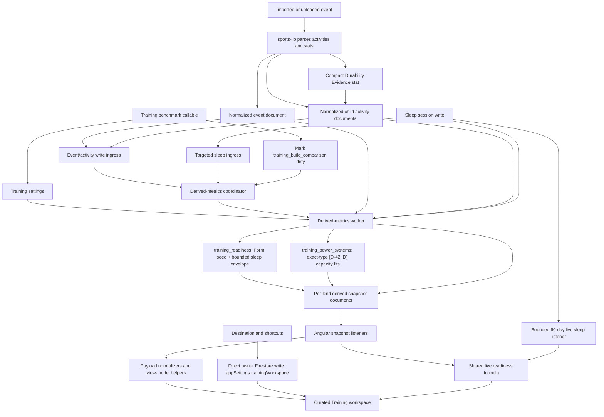

# Training Workspace Architecture and Maintenance Guide

## Planning reads through MCP and the Assistant

The #690 read-only slice exposes current plans, standalone/associated workouts, complete v1 instructions and existing
delivery summaries. It does not introduce new storage or modify `WorkoutStructureV1`. Five tools and their strict scope,
projection and bounds are documented in [MCP server](mcp-server.md#training-plans-and-planned-workouts-690-read-only-slice).
Source support is not a deployed or registered-client promise. No provider certification, #652 approval flow, sync
enablement, deployment or plugin installation is implied. Writes remain tracked in #690 with #652.

Independent `training-plans:read` consent is available without a UID or Pro gate; the planning UI pilot remains unchanged.
The Assistant's default-off Training plans choice is conversation-owned, not a UI gate. Current calendar reads default to
standalone plus active-plan workouts, include skipped, exclude deleted, and allow explicit inactive-plan/all scopes.
Historical dates still read current records, not history. Calendar dates are not instants or delivery timezones.
Full structures preserve canonical primitives, ordered node IDs, notes, repeat limits and Sports Lib owner-unit formatting.
There are no new `Data*` classes, completed-event metrics, inferred duration estimates, provider calls or writes.

The shared delivery-summary helper provides UI wording and MCP machine outcomes from the same current evidence. Whole-plan
counts include every current non-deleted workout, with no success claim for incomplete scans, empty plans, stale evidence
or old-account copies. Confirmation is provider-side workout delivery, never receipt on a watch or native provider plan.
Read-only Firestore snapshots and fresh revision/deletion/consent fences prevent releasing obsolete schedules.
MCP input accounting covers complete fetched pages, including unused tail records, without double-counting cached
projections. Valid sync-off settings without a destination remain readable. Planning-only plugin questions must route
directly to planning reads without asking for metric permission or catalog access.

Every planning feature PR must assess MCP impact using the root instructions and MCP skill. New recipe targets require
explicit public schemas, formatters and tests in the same PR; presentation-only spacing can document no wire impact;
private provider artifact metadata must remain excluded. Review safe projections, lifecycle semantics, scope isolation,
pagination/bytes, unit formatting, Assistant evidence/routing and bundled skills together. A real deferral needs a focused
#583 subissue in Project 2 before completion. Read coverage never authorizes wider consent, writes or deployment.

This document is the implementation guide for the authenticated `/training` workspace. It is intended for product
engineers, data engineers, reviewers, and AI coding agents. Update it whenever the Training product contract, a derived
metric payload, the sports-lib durability protocol, or the refresh pipeline changes.

Private [Timeline notes](timeline-notes.md) are available from the compact secondary header action to every signed-in
account, independently of Training plan checks. The workspace supplies a shared note context to readiness, load/Form,
freshness forecast, body-weight, power-system history, swimming trends and weekly durability charts. Notes preserve each
chart's existing calendar convention; weekly tooltips retain actual dates. They never change Training inputs, formulas,
readiness, forecasts, persisted snapshots or sport filters. The manager owns editing and account-scoped settings; charts
never fetch private notes. The owner’s Dashboard reuses these adapters for Form and Freshness Forecast alongside HRV,
Sleep, and its calendars through one shared notes workspace. Public/library previews and non-calendar charts are not opted in.
Note-only changes merge marker/shading series through the shared ECharts host; they do not rebuild Training options
or reset metric series, zoom or legends. Normal data/theme changes still render the complete chart, retaining the
weekly/date-offset adapters. Explicit time bounds bypass sample scans when projecting notes, and range registrations
remain deduplicated until disposal. Readiness and body-weight date labels use the bounded shared Intl formatter cache;
local-time formatting remains uncached. These are presentation-only optimizations with no Training calculation,
planning or MCP contract impact.

Current compatibility baseline:

- Quantified Self derived-metric schema: `19`
- `@sports-alliance/sports-lib`: `21.0.3`
- Training sport groups: eight modeled benchmark families plus data-backed Fitness & Gym and Other training volume groups
- Imported FTP/VO2 capacity disciplines: Running and Cycling only
- Rolling power-system capacity: every exact canonical activity type with usable persisted power curves
- Calendar boundaries: UTC unless a section explicitly says otherwise

## Product Contract

Training is a curated analytical workspace, not a second configurable dashboard. Its purpose is to answer:

1. What is the athlete doing now compared with their normal training?
2. What caused the change in load?
3. How are fitness, fatigue, freshness, and intensity changing?
4. What recent performance evidence supports imported settings such as FTP or VO2 max, and what does the rolling
   power-duration evidence support for CP, W′, and Pmax?
5. Is long-session durability changing?
6. How does the current build compare with a deliberately selected historical build?
7. What recovery and sleep context was recorded alongside those builds?
8. What do the available current load and recorded recovery signals say right now?

The following rules are architectural constraints:

- The frontend must not query activity or event history to calculate Training insights.
- The frontend must not download or reparse source files to calculate Training insights.
- Historical and comparative Training calculations belong in derived-metric builders or sports-lib, not Angular
  components. Readiness uses one environment-neutral formula in `shared/readiness.ts`: the frontend applies it to live
  Form/ramp plus bounded sleep evidence, while Functions applies it at each daily cutoff for the historical series.
- Dashboard remains the user's modular chart and map surface. The current TSS-only Training state and recovery-aware
  Readiness are fixed parts of the optional Dashboard Today summary rather than configurable tiles, while Training owns
  their deeper current and historical presentation.
  Curated Training-only insights do not become hidden Dashboard dependencies. An explicitly configured Dashboard Aerobic
  Capacity or Aerobic Durability tile may opt into only its matching Training snapshot kind.
- Missing TSS, zones, pace, sleep, power, heart rate, or durability evidence remains unavailable. Missing values are not
  converted to zero.
- Merged benchmark events are excluded from Training. Multisport parent events are retained, but their normalized child
  activities are classified and counted separately.
- Changing the Training destination changes presentation only. **All training** owns global state, readiness, load,
  sleep, body-weight, intensity, and the compact cross-sport mix. A sport destination owns that family's detailed mix,
  Training Mix plus any capability-matched Best Build, rolling power types, or specialist evidence. Neither destination nor shortcuts change
  derived calculations or discard a sport from the account.
- Sleep is context. It never changes the Training state and is not presented as a causal explanation of performance.
- Imported FTP and VO2 max values are settings or source observations. They are not silently relabeled as new estimates.
- Durability shown on Training comes only from the persisted sports-lib `Durability Evidence` activity stat.
- Standard mountain biking retains the steady-aerobic Cycling durability protocol. Enduro MTB and Downhill Cycling are
  gravity contexts: they use reliable recorded summaries only, are volume-only for Training load/intensity, and are
  explicitly ineligible for durability. Training does not infer downhill runs or lift/uplift segments.
- Rowing participates in Training Mix and Best Build, but it does not have a durability adapter in this release.
- The parser does not generate CP, W′, Pmax, or three-dimensional workout strain. Rolling power-system capacity is a
  Training-derived snapshot built from persisted activity power curves and Sports-lib's public dated-capacity fitter.
- Rolling capacity is isolated by exact canonical activity type. It is separate from TSS, Form, Readiness, and imported
  FTP, and only components that pass Sports-lib's `ready` gates expose a value.
- Power systems remains available to every authenticated user, but its exact activity types are routed into a matching
  power-systems-capable sport destination. Types in a volume-only family or outside the modeled registry are routed to
  **Other power activities**. No
  combined all-sports capacity value is created.
- Complex cards lead with a plain-language conclusion, followed by an explicit, calm evidence-quality statement. A
  `What to look at next` prompt appears only when the available evidence supports that specific follow-up; it is never a
  workout prescription. Numeric tables remain compact source-of-truth comparisons and retain their deltas.
- In athlete-facing Training copy, a recorded sport leg is called a **workout**. `Activity` remains the technical term
  for normalized Firestore and sports-lib records, and `sleep session` remains the term for overnight sleep data.
- Bounded current scores use the shared lightweight metric indicator rather than a chart instance. Readiness uses a
  0–100 track with its canonical 55 and 75 category boundaries; eligible source sleep scores use a 0–100 track without
  inventing new thresholds. Four discrete segments communicate readiness signal coverage independently from score and
  confidence. HRV shows its seven-day average, 60-day personal range, status and latest nightly value using the shared
  `readiness-hrv-display.helper.ts` formatter. Overnight HR retains the baseline-centered ±20% display and exact ratio
  text (lower Overnight HR may be supportive). Score fills start at zero and remain visible beneath
  their threshold markers. Missing evidence leaves an empty track, never zero.
- Training-time and workout-count comparisons may use the same baseline-centered visual, but CTL, ATL, Form, ramp,
  ACWR, monotony, strain, FTP, VO2 max, recovery time, and power-system capacity must not be normalized into arbitrary
  0–100 bars. Those metrics retain exact values, semantic status/delta treatments, or their existing time-series charts.
  The shared indicator is native HTML/CSS for accessibility and low per-row cost; ECharts remains reserved for actual
  trends, distributions, forecasts, and interactive chart surfaces.
  These display-only indicators use pointer pass-through so dragging over their tracks, fills, or coverage segments
  reaches the surrounding scroll surface in Training and Dashboard Today. Their progressbar roles and accessible
  labels remain exposed; they must not become sliders or intercept touch gestures.

## Ownership: Sports-lib Versus Quantified Self

| Concern | Owner | Source of truth |
| --- | --- | --- |
| Canonical activity types and activity groups | sports-lib | `src/activities/activity.types.ts` in sports-lib |
| Sport-aware Cadence versus Stroke Rate semantics | sports-lib | `src/activities/activity.metric-semantics.ts` in sports-lib |
| Activity-level durability input selection | sports-lib | `src/events/utilities/activity-durability.ts` |
| Activity-level durability eligibility and formulas | sports-lib | `activity-durability.ts` and `data.durability-evidence.ts` |
| Compact durability stat creation and invalidation | sports-lib | `activity.utilities.ts` and the durability source fingerprint |
| Power-curve interpolation and window comparison | sports-lib | `src/events/utilities/power-curve-sampling.ts` |
| Dated power-duration envelope and confidence-gated CP/W′/Pmax fitting | sports-lib | `src/events/utilities/three-dimensional-capacity.ts` |
| Curated Training disciplines | Quantified Self shared layer | `shared/training-disciplines.ts` |
| Joining normalized activities to parent events | Quantified Self Functions | `functions/src/derived-metrics/derived-metrics.service.ts` |
| Exact-type 42-day window policy and rolling capacity history | Quantified Self Functions | `training_power_systems` builder in `derived-metrics.service.ts` |
| Current, usual, weekly, and benchmark windows | Quantified Self Functions | derived-metric builders |
| Derived snapshot persistence and refresh | Quantified Self Functions | coordinator, triggers, ingress worker, and derived worker |
| Workspace destination and shortcut preferences | Quantified Self frontend | owner-writable `appSettings.trainingWorkspace` |
| Training benchmark settings | Quantified Self Functions/shared contracts | authenticated benchmark callable and `shared/derived-metrics.ts` |
| Payload validation and view models | Quantified Self frontend | `dashboard-derived-metrics.service.ts` and Training helpers |
| Shared readiness scoring, labels, and confidence | Quantified Self shared layer | `shared/readiness.ts` |
| Historical 14-day readiness series | Quantified Self Functions | `training_readiness` derived builder |
| Layout, wording, empty states, and charts | Quantified Self frontend | `training-workspace.component.*` and child components |

In short:

```text
sports-lib answers:       Is durability valid, and what CP/W′/Pmax fit is supported by the dated curves supplied?
Quantified Self answers:  Which exact-type curves belong in each 42-day window, and how is the result persisted and shown?
```

Do not duplicate sports-lib durability formulas or the CP/W′/Pmax fitter inside Functions. Functions owns the dated
window policy and passes the resulting curves to Sports-lib. Do not move Training history queries into the frontend.

## Architecture Overview


```mermaid
flowchart TD
    A["Imported or uploaded event"] --> B["sports-lib parses activities and stats"]
    B --> C["Normalized event document"]
    B --> D["Normalized child activity documents"]
    B --> E["Compact Durability Evidence stat"]
    E --> D
    C --> F["Event/activity write ingress"]
    D --> F
    S["Sleep session write"] --> G["Targeted sleep ingress"]
    S --> P["Bounded 60-day live sleep listener"]
    U["Training benchmark callable"] --> H["Training settings"]
    U --> I["Mark training_build_comparison dirty"]
    V["Destination and shortcuts"] --> W["Direct owner Firestore write: appSettings.trainingWorkspace"]
    F --> J["Derived-metrics coordinator"]
    G --> J
    I --> J
    H --> K["Derived-metrics worker"]
    J --> K
    C --> K
    D --> K
    S --> K
    K --> R["training_readiness: Form seed + bounded sleep envelope"]
    R --> L["Per-kind derived snapshot documents"]
    K --> PS["training_power_systems: exact-type [D-42, D) capacity fits"]
    PS --> L
    K --> L
    L --> M["Angular snapshot listeners"]
    M --> N["Payload normalizers and view-model helpers"]
    N --> O["Curated Training workspace"]
    W --> O
    M --> Q["Shared live readiness formula"]
    P --> Q
    Q --> O
```

The page is eventually consistent. A complete event/activity historical scan happens in the worker, never in the
browser. The browser can continue showing the latest complete payload while a newer generation is building. The only
live contextual read added by Readiness is the bounded sleep-session listener shown above; it does not read event or
activity history. A readiness-only worker refresh reuses a compatible Form snapshot seed and fetches only the bounded
sleep envelope when the Form seed is compatible. Sleep/HRV-triggered Best Build comparison can reuse the workout
portion of its completed snapshot, so a combined Best Build + Readiness refresh can also avoid both historical scans.
Missing or stale seeds fall back to the existing full build; event-driven all-metric builds still share their loaded
Form history and canonical parent/activity join.

## Route and Frontend Entry Points

- Route: `src/app/app.routing.module.ts`
- Public SEO overview: `/features/training-analysis` via `src/app/components/public-seo/public-seo-pages.content.ts`
- Lazy routing module: `src/app/training.routing.module.ts`
- Angular module: `src/app/modules/training.module.ts`
- Workspace controller: `src/app/components/training/training-workspace.component.ts`
- Workspace template: `src/app/components/training/training-workspace.component.html`
- Workspace styles: `src/app/components/training/training-workspace.component.scss`
- Shared readiness formula: `shared/readiness.ts`
- Shared readiness snapshot validator: `shared/training-readiness-metric.ts`
- Historical readiness builder: `functions/src/derived-metrics/derived-metrics.service.ts`
- Benchmark dialog: `src/app/components/training/training-build-benchmark-dialog.component.*`
- Sport-shortcuts dialog: `src/app/components/training/training-sport-visibility-dialog.component.*`
- Mobile destination sheet: `src/app/components/training/training-mobile-destination-sheet.component.*`
- Swimming chart: `src/app/components/training/training-swim-performance-chart.component.*`
- Durability trajectory: `src/app/components/training/training-durability-trajectory-chart.component.*`
- Readiness history chart: `src/app/components/training/training-readiness-trend-chart.component.*`
- Body-weight trend chart: `src/app/components/training/training-body-weight-trend-chart.component.*`
- Shared status/comparison cards: `src/app/components/shared/training-summary/training-summary-cards.component.*`
- Shared exact-value metric grid: `src/app/components/shared/training-summary/training-metric-grid.component.*`
- Snapshot service: `src/app/services/dashboard-derived-metrics.service.ts`
- Shared payload contracts: `shared/derived-metrics.ts`
- Shared discipline registry: `shared/training-disciplines.ts`
- User help copy: `src/app/shared/help.content.ts`

Training is available to signed-in users from the sidenav. Its route header uses the shared `app-page-header` route
primitive, with a Feedback action that opens the configured support email with a Training-specific subject, plus direct
**Calendar** and **Dashboard** route actions. The Dashboard header does not duplicate the Training or Health navigation
links; its calendar icon opens the mini calendar. Dashboard does not add curated Training snapshots as default
Dashboard dependencies or configurable tiles.

The lightweight status/comparison cards and exact-value load grid are shared presentation primitives. The authenticated
Training workspace supplies their live, normalized view models; the public homepage supplies a static example view model
and selects the compact preview density. These components own the repeated semantic markup, numeric token formatting,
indicator placement, and responsive layout, but they never subscribe to data, calculate a metric, initialize a chart,
or access browser-only APIs. Training remains the source of truth for calculations and athlete-specific wording, while
the homepage remains safe to render during SSR and prerendering.

The homepage and `/features/training-analysis` also share `TrainingExplorerPreviewComponent`: a 14-day readiness
example and a compact tabbed explorer for sport mix, Best Build metrics, power-system history, and durability.
The readiness, power-system, and durability charts are the same standalone components used by Training, including
their tooltip, haptic, theme, resize, and disposal behavior. Training and the explorer both use
`TrainingMixDetailsComponent` and `TrainingBuildMetricsComponent` under `shared/training-summary/`; keep their
markup and responsive styles there rather than copying them into a public page.
The explorer supplies deterministic synthetic view models from `training-explorer-preview.data.ts`, visibly labeled
as example data and wrapped in native `data-nosnippet`. It does not load account data, trigger snapshot refreshes, or
import the Training workspace/module. Public SSR retains descriptive copy and placeholders; the explorer is deferred
until visible and chart tabs mount only when selected. Public example distances and durations use the canonical
unit-aware formatter. This is presentation reuse only: no Training formula, planning workflow, MCP contract, consent,
or read scope changes.
These explorer examples share a fixed UTC cutoff. Power spans the same 84-day bound as Training, and durability uses
twelve completed Monday–Sunday weeks before that cutoff. Readiness endpoints are derived from its points. The shared
power trend renders its actual dated endpoints (also in accessible text), never an unconditional `Today` label, so both
public fixtures and retained/stale Training snapshots identify the period they really describe.

The authenticated `/training` route is deliberately `noindex`. Its public, prerendered `/features/training-analysis`
overview is the indexable search entry point: it describes the curated workspace, sports, derived-data boundaries, and
non-prescriptive treatment of readiness and sleep without exposing account-specific data. Keep that public page, the
Features hub, homepage link, Help link, sitemap, and `robots.txt` aligned when the Training product contract changes.

## Training Planning

Training planning is a separate authored-workout workflow at authenticated `/training/plans`; it does not change the analytical
meaning of `/training`. Manual planning is available without a provider connection. A scheduled workout may belong to a
plan or remain standalone, so a user can add a workout without creating a plan. Provider delivery is an opt-in Pro action
and must never be inferred from merely connecting a service.

### Canonical workout boundary

Quantified Self currently owns the versioned planned-workout contract in `shared/planned-workout.ts`. It stores only
plain canonical primitives: Sports Lib `ActivityTypes` strings, seconds, metres, bpm, watts, metres per second, rpm,
kilojoules, percentage points, and positive repetition counts. It does not persist Sports Lib class instances or
event-stat JSON. Sports Lib remains authoritative for activity types, canonical unit semantics, conversions, and scalar
formatting; Quantified Self owns workout ordering, provider compatibility, scheduling, lifecycle, history, entitlement,
and localized UI language.

`WorkoutStructureV1` has stable node IDs, ordered steps or one-level repeats, purposes, endings, and typed targets. The
strict codec rejects unknown fields and discriminants, unsupported versions or sports, duplicate IDs, non-finite or
negative values, non-positive endings/reference snapshots, inverted ranges, more than 100 nodes, repeat counts above
100, nested repeats, and more than two targets per step. Its JSON output must remain Firestore-safe and must round-trip through stringify/parse without changing
the persisted v1 value. The manual editor exposes canonical Running, Trail Running, Treadmill, Cycling, Mountain Biking,
Indoor Cycling, E-Biking, and Hand Cycle sports plus date-only, time/distance, fixed-repeat, and single absolute
HR/power/pace inputs. These are Sports Lib activity-type strings, not provider profile IDs. The shared contract remains
broader so saved v1 data does not need a redesign when later UI slices are enabled.

Do not add planned-workout `Data*` types, `DataStore` entries, FIT parser behavior, or MCP fields merely to share this
recipe. Extract the neutral structure, codec, validator, and reusable analysis to Sports Lib only after Garmin and COROS
pass sandbox create/update/reschedule/delete round trips, Wahoo and Suunto fixtures are complete, the provider adapters
have not contaminated the neutral model, and persisted Quantified Self fixtures round-trip unchanged through a locally
packed Sports Lib package. That gate is tracked by GitHub issue #654 under epic #583.

### Persistence, mutation, and history

- Owner-visible current state is stored at `users/{uid}/trainingPlanState/current`,
  `users/{uid}/trainingPlans/{planId}`, and `users/{uid}/scheduledWorkouts/{workoutId}`. Browser writes are denied.
- Authenticated, App Check-enforced callables own mutations, history reads, restore previews/restores, and plan deletion.
  Every write path is sanitized, fenced against account deletion, idempotent by `mutationId`, and guarded by expected
  revisions.
- Multiple plans are allowed, but at most one is active. Activating one plan atomically pauses the previous active plan.
  Plans are limited to 366 inclusive local dates and an account to 400 current workouts.
- `TrainingPlanV1.color` is optional QS presentation metadata, never part of the neutral workout recipe. It accepts only
  `default`, `blue`, `purple`, `pink`, `orange`, `red`, or `green`. Missing legacy values stay omitted through the codec
  and render as Default, so no migration is needed. Creation accepts a color; `set-plan-color` uses the existing mutation
  callable, expected plan/state revisions, and idempotent receipt. Changing a color advances only that plan's history
  stream and the schedule revision, not its workouts. History restore also restores the color (including legacy absence).
- Workout IDs survive standalone-to-plan, plan-to-standalone, and plan-to-plan moves. An out-of-range add, move, copy, or
  attach requires explicit confirmation before the plan range is extended atomically. Shifting a plan moves only its
  range and associated current workouts.
- Plan-bound changes share the plan revision stream. Standalone changes have workout-scoped complete snapshots. Plan
  history uses immutable deltas and compressed child-document checkpoint chunks every 20 revisions and after bulk
  operations, keeping revision envelopes below Firestore document limits. A restore creates a new revision and cannot
  reclaim a workout that has moved to a different scope or recreate a permanently deleted workout.
- Ordinary workout deletion remains recoverable through history. Permanent deletion requires its own confirmation. Plan
  deletion requires choosing whether its current workouts become standalone or are deleted; either choice removes the
  plan history, while Archive remains the non-destructive choice.
- Permanent deletion removes the workout root and its standalone revision subtree, then retains a server-internal hash
  tombstone so the retired ID cannot be reused. A plan-bound workout can still occur in that plan's immutable revision
  audit until the plan itself is deleted; it is tombstoned, cannot be restored, and this retention is disclosed in the
  confirmation UI. Plan deletion removes the complete plan revision subtree.
- Plan deletion uses a user-scoped durable lock while it prepares bounded tombstones and standalone revision snapshots.
  An exact retry remains idempotent, and a same-disposition retry with the locked state/plan revisions may resume the
  original operation after a browser reload even when the caller no longer has the original mutation ID.
- Resumable processing at the full 400-current-workout boundary, paged recoverable-workout history, and durable retry of
  post-commit recursive cleanup are tracked explicitly by epic subissue #657. Until that slice lands, unusually large
  structure payloads may still reach Firestore's atomic request-size limit even when their write count is valid; do not
  lower the public v1 limits or hide this boundary in an anonymous TODO.

### UI and calendar contract

`/training/plans` provides Plans and Standalone views plus create, edit, copy, move/associate, skip, delete, permanent delete,
history/restore, activation, pause, archive, and date-shift actions. Calendar-originated creation defaults to the active
plan when one exists and provides an explicit standalone action; without an active plan it defaults to standalone.

The workspace presents one scope selector and one contextual **Add workout** action. The selected plan's name, lifecycle,
and date range appear once; there is no separate overview strip or repeated plan/standalone heading. An account without
plans sees one actionable empty state, not an empty plan selector and a second disabled workout section. Secondary plan
and workout actions live in Material menus, while **Edit** remains directly available on each workout row (with the
accessible label **Edit workout**). Planned and standalone workouts use the shared `CompactRowComponent` in stacked,
compact mode, matching Health. Each labelled row retains its sport, date, unit-aware step summary, and projected actions;
dividers separate consecutive workouts without card borders or a multi-column card grid. Skipped workouts keep an
explicit state marker; normal planned workouts need no repeated badge.

The Plan color submenu explicitly omits a backdrop so the app's top-level menu backdrop default cannot intercept pointer
hover over sibling plan actions. Click/touch selection and Material's native keyboard submenu navigation remain unchanged.

Creation includes a named Material **Plan color** selector; existing plans use **Plan actions -> Plan color**. The selected
color appears beside the plan name and accents its schedule. `training-plan-appearance.helper.ts` maps the allowlisted
names to the existing `AppColors` palette, blended toward theme foreground for legibility; Default follows theme primary.
No user-supplied CSS is accepted. Labels, check icons, and workout states keep color from being the only identifier.
Color changes retain the selected date, disable conflicting actions while saving, and keep the saved appearance on error.

The selected plan uses **Plan schedule**, not a second all-activity Calendar. `PlanScheduleCalendarComponent` owns a
bounded month grid of only that plan's current workouts, including skipped workouts and paused/archived plans. It does
not fetch events, show completed totals, or include standalone/other-plan workouts. The plan's inclusive start/end are
marked; outside-range days have a neutral fill and are disabled, and wholly outside-range weeks are omitted. Month
navigation stops at the plan boundaries. Dates use local calendar arithmetic (including DST/leap years) and the user's
week-start setting.
The weekday header marks the configured first day, and a visible hint names it. Saturday and Sunday have a subtle
plan-color tint and stronger weekday labels (with a lighter tint in compact layouts).
Weekends follow each date's actual weekday, never fixed column positions; they remain ordinary schedulable dates, not
inferred rest days. Outside-range and selected-date states override the weekend fill. Live week-start preference changes
reorder the grid without changing the selected date, schedule, or workout counts.
Initial selection is today when within the range, otherwise the plan start. Explicit selection is account/plan-scoped,
survives live refresh and editor cancellation, and resolves back inside the range when dates shift. Saving selects the
workout's destination date and scope. Calendar-originated path routes select the linked workout or requested add scope,
while the optional `date` query selects the requested day. Cancelling therefore returns to that context rather than
hiding the workout on today's date. Out-of-range add dates remain editor drafts until an explicitly confirmed range
extension.
The local-today marker refreshes each minute and immediately on window focus or mobile-tab visibility restoration.
Clock refreshes are silent and never replace an explicitly selected date or an open editor draft. Standalone creation
resolves its default date when Add is clicked, not when the workspace was first opened. The browser-only clock is
disposed with the workspace and performs no schedule writes or provider requests.

Desktop places the date grid beside one selected day's compact workout rows. Grid cells show up to two independently
editable workout titles with full accessible labels/tooltips and an overflow action; the day's detail list shows every
workout. Same-day previews and detail rows share the schedule service's stable workout-ID order, independent of creation
time, so expanding overflow does not reorder the workouts. On narrow containers the grid shows counts, with day details
below it. Selecting an empty day shows a neutral empty state rather than assuming rest, and the single **Add workout**
action opens the existing editor with that date
and plan prefilled. Dates support native keyboard activation plus arrow-key and Page Up/Down navigation, keeping focus
and selection together. The date-cell button/ripple pattern follows Activity Calendar; a Material datepicker cannot
contain separate accessible workout-edit actions without overriding its internals. Standalone retains its compact list.
The **Main Calendar** link identifies the separate all-activity destination. No drag/drop, write API, provider sync,
completed-activity matching, or new metric is introduced by this presentation change.

Creating a plan or editing a workout is a focused view: scope navigation, lists, and other editors are hidden until Save
or Cancel. The title field receives focus on entry; focus returns to the contextual add action (or scope navigation) on
exit. A successful workout save selects its destination scope, including standalone/plan transfers. Pending saves disable
native inputs and Material selectors, retain the draft on failure, and use a stable icon/spinner content row. The workout
date uses the app's localized Material date picker while persisting the unchanged `YYYY-MM-DD` calendar label; clearing or
typing an invalid value blocks saving instead of retaining the previous date. Save/Cancel
stay in a sticky, safe-area-aware footer for long mobile editors. Plan/workout forms are unboxed sections, and editable
steps and repeat blocks reuse the same compact-row primitive with labelled headings and projected remove controls.
The revision-history section also uses that primitive, while destructive plan confirmation retains its Material card.
Fieldsets, grid children, and repeat rows allow shrinking
without horizontal page overflow. Selection haptics belong to explicit UI actions; mutation success/error feedback follows
the actual result, and hydration, typing, and unchanged choices stay silent. Phone emulation verifies layout and wiring,
not physical vibration or a real mobile keyboard.

A newly created plan remains selectable using the server-acknowledged record and revision until the independent live
plan and state listeners catch up. This transient, user-scoped bridge prevents jumping back to a previously active plan
or issuing the next mutation against the pre-creation revision; it does not replace the live schedule or persist a cache.
Revision history uses wrapping semantic rows with Material restore buttons so operation and date details remain readable
on phones rather than being truncated in single-line list slots. Rows use compact body typography, small secondary dates,
6px vertical padding and text Restore actions. The keyboard-focusable list is bounded to 24rem/half the viewport, keeping
long edit histories from taking over the page. Deleted workouts use the same surface-free Show/Hide Material-button
pattern as Training recovery details, with controlled hidden content and haptic feedback, not a raised expansion panel.
Failed history reads have an explicit Retry action.

The full Calendar, dashboard Activity Calendar tile, and Dashboard Today mini-calendar overlay standalone workouts and
workouts from the active plan. Inactive-plan workouts remain visible only in `/training/plans`; skipped workouts stay visible and
marked. Every rendered date is selectable, including empty dates. Day details keep **Planned workouts** and completed
activities in separate sections. Their navigation rows retain a visible trailing affordance at narrow widths, with
supporting text yielding before that affordance. Planned workouts never enter recorded activity counts, durations, distance, elevation,
group bars, activity tables, or Training-derived metrics.
Planned and skipped icons use their current plan's color; standalone icons stay theme-neutral. The day-details planned
rows repeat that accent as a rounded rail outside the Material row highlight, keeping the selection surface and color
edge visually separate. Trailing navigation chevrons stay vertically centered for multi-line rows. The overlay resolves
colors from the live plans, so recoloring or moving
a workout changes its appearance without rewriting workout snapshots. Up to two icons are shown, reserving one for
each scope when standalone and active-plan workouts share a day; extra workouts retain an overflow count. Compact and
Year views turn these into slim right-edge color segments (dashed for skipped workouts), below any note icon and opposite
the note-color edge. They omit the visual overflow count to avoid collisions; the date's accessible name and day details
retain complete counts. Completed activity circles, note colors, and global weekend shading stay independent.

The Training Planning route family is authenticated, client-rendered, and excluded from the sitemap. Route metadata is
`noindex, follow` and hosting also supplies `noindex` headers; `robots.txt` permits crawling so those directives can be
read. It is registered before the analytical `/training` route, not embedded in the analysis workspace. Stable entity
identifiers are path segments, matching the rest of the app: `/training/plans/plan/:planId` browses a plan and
`/training/plans/workout/:workoutId` edits a saved workout. `/training/plans/standalone` browses independent workouts;
new-workout routes append `/new` to the selected plan or Standalone path, while `/training/plans/new` applies the normal
active-plan-or-standalone default. The optional `date` query parameter selects or prefills a local calendar date; plan
and workout identifiers, scope, editor mode, and unsaved form values never use query parameters.

Opening an editor pushes a browser-history entry. Back and Forward restore the previous browse/editor state, including
the selected plan and date, and Calendar-originated Back restores the open day detail. Cancel uses the recorded Plans
return entry when available and otherwise replaces a direct deep link with its safe owner-scoped browse destination.
Route changes may replace a draft, but live schedule and unit-setting updates do not. A pending save captures the owner
and editor generation so a response arriving after Back navigation cannot reopen or overwrite the new screen. Training
Planning is not live yet: `/plans` and the former query-parameter editor shapes are not registered and have no
compatibility redirects. The sidebar entry sits beneath Training on a compact guide rail.

The shared `isTrainingPlanningUIAllowed` rollout in `shared/training-planning-rollout.ts` limits all planning UI to the
explicitly allowlisted account. Other signed-in users are silently redirected from every `/training/plans` route to
`/training`; signed-out navigation keeps the existing authentication flow. The workspace also clears/hides its editor
on account changes. Full Calendar, Activity Calendar tiles and Today mini-calendars omit planning listeners, overlays,
empty-day planning announcements and day-sheet planning actions for other accounts, while completed activities,
Timeline notes and selectable dates remain unchanged. Calendar planning checks the live signed-in viewer against the
displayed owner, not just the popup's user snapshot. An already-open day sheet hides planning and its retained planning
listener cancels on sign-out/account change, even after Material destroys the originating month popup.
Help filters planning articles, links and mixed-section text before search and Markdown rendering, including public
prerendering and account changes. Same-account profile refreshes preserve the rendered guide and its navigation state.
Planning-specific disconnect/deletion instructions use the same gate; generic
provider-copy retention warnings and public privacy disclosures remain available. Existing Training analysis is not
gated. This is a frontend presentation rollout, **not backend authorization**: owner-scoped APIs, Rules, provider
readiness flags and delivery entitlement enforcement are unchanged. Broader rollout remains tracked by #655.

### Provider delivery foundation (#646)

The common delivery implementation lives in `functions/src/training-plans/delivery/`, with browser-safe v1 contracts in
`shared/training-provider-delivery.ts`. It is independent of schedule history and leaves the exact `WorkoutStructureV1`
JSON and Sports Lib conversion/formatting boundary unchanged. Public provider switches remain disabled; a separate
backend-enforced private Garmin production pilot is described below. The Garmin adapter is implemented and tested offline under #647; deterministic fakes
exist only in `delivery/test-support/`, are excluded from the Functions build, and have no browser/configuration switch.

`previewTrainingProviderDelivery` and `mutateTrainingProviderDelivery` are focused, authenticated, App Check-enforced
commands. Backend execution is necessary to resolve privileged connection authority and create background work; owner
Rules/client transactions cannot authorize server-held provider credentials. Commands accept expected schedule, scope,
and delivery-settings revisions and a mutation ID, never a UID, provider account ID, credential, or remote artifact ID.
Receipts reject reuse with a different request and carry a 30-day `expireAt`; production TTL configuration is part of #655,
not an operation performed by tests or this implementation. Manual authoring does not acquire a Pro requirement.

Data ownership:

| Path below `users/{uid}` | Access and purpose |
| --- | --- |
| `trainingDeliverySettings/{scope_scopeId_provider}` | Owner-readable consent, saved IANA zone, opaque destination fingerprint and revision; callable writes only. |
| `trainingDeliveryStatuses/{deliveryId}` | Owner-readable allowlisted status, mapping warnings, artifact-presence flags, last attempt/acceptance timestamps, failure count and next retry time; no remote IDs, operation payloads or credentials. |
| `trainingDeliveryState/current` and `receipts/*` | Private global settings revision, per-provider explicit-disconnect epochs and command receipts. |
| `trainingDeliveryScopes/{workoutId}` | Private association generation; transfers/deletions cannot revive earlier standalone consent or suppressions. |
| `trainingDeliveryLedger/{deliveryId}` and `attempts/*` | Private desired generation, independent actual artifact IDs, leases, operation-start and acceptance journals. Retained independently of deleted plan/workout roots. |

`trainingDeliveryQueue` is a top-level server-only collection of compact **leaf** jobs. Schedule mutations, restore, plan
deletion and delivery commands write a reconciliation marker in the same transaction, not a batch of provider payloads.
The reconciler scans 25 current workouts per page (up to four destinations each), then 25 existing ledger identities per
page, including deleted/historical sources. Each page rechecks schedule/settings revisions, plan-deletion locks and the
account-deletion fence; obsolete scans restart. At most 100 compact ledgers/projections/jobs are considered in a current
workout page. It never writes 400 workout payloads into a single document or transaction. Never-enrolled users have their
marker removed without recurring scans. The pre-existing large manual-operation hardening remains #657.

`onTrainingDeliveryQueued` dispatches due jobs, `processTrainingDeliveryTask` processes one bounded page or delivery,
and `dispatchTrainingDelivery` recovers at most 25 due reservations each minute using the existing Cloud Tasks enqueue
and queue-depth helpers. Reservation precedes enqueue, so lost acknowledgements and crashes are recoverable. A finished
scan becomes eligible again after 30 minutes to pick up saved-zone day boundaries, adapter horizons and entitlement
changes. `onTrainingDeliveryConnectionChanged`, `onTrainingDeliveryEntitlementChanged`, and
`onTrainingDeliveryQueued` each use 512 MiB for their bounded Firestore and queue work; this adds process headroom
only and does not change queue limits, retries, or delivery semantics. Tasks may be duplicated; stable
per-user/provider/account/workout identities, independent desired generations,
180-second delivery leases and operation journals own idempotency. Shared retry limits/backoff and longer adapter delays
apply. The 120-second worker timeout remains below its lease.

Before transport work the worker rereads current intent, deletion locks, Pro, provider readiness and exact connection
generation. A current OAuth credential generation and an unambiguous matching provider account are required; stale or
ambiguous metadata produces connection repair, not a guessed account or account picker. A verified same-account reconnect
can inspect the original unfinished operation with renewed authority. Auth/permission failures remain blocked against the
failed connection generation. Explicit disconnect increments the consent epoch in the existing OAuth disconnect's initial
transaction; subscription-driven disconnect and authentication failures do not invalidate consent.
Recovery is transport work too: an auth/permission-blocked generation cannot inspect an unfinished operation. After
inspection proves nonacceptance or a safely resumable partial operation, the worker repeats admission before executing; Stop, edits, Pro expiry, disconnect or
account deletion during inspection cannot release the obsolete operation.
Adapters receive the same admission guard before each individual HTTP request, including after credential refresh and
the request-start journal. Reads can inspect an obsolete attempt; writes require its exact current intent and an unexpired
lease. A v1 private progress journal distinguishes `ready`, `started`, definitively `rejected`, and `accepted` steps.
New operations start with explicit null progress; missing legacy progress is unknown, not permission to repeat a create.
Request-start checkpoints require the current lease; late acceptance evidence is retained even when that lease expired.
Starting a mutating request clears the previous fully accepted payload digests, while retaining all remote IDs. An
interrupted edit or removal may already have changed the provider; reverting QS to an older version must inspect and
reconcile that version again instead of treating its historical success digest as current. Status projections therefore
show the retained copy as different until the complete current operation is confirmed.
If another lease/attempt has taken over, accepted evidence goes into immutable-per-worker `attempts/*/lateAcceptances/*`
instead of overwriting the newer journal. Recovery is blocked for operator inspection even on Retry; current workers
lose admission. The existing recursive account cleanup covers these nested evidence records.

Every accepted artifact checkpoint survives a newer authored revision. The final acceptance records which operation and
content were accepted, then reconciles current intent. Final upsert acceptance must identify at least one artifact and
final removal must return none; inconsistent acknowledgements keep the operation unresolved for inspection instead of
publishing false success. An interrupted/ambiguous operation is inspected before any repeat;
only adapter-proven nonacceptance or a retained-ID, safely resumable partial operation permits continued execution.
Superseded partial operations retain actual IDs for current-intent reconciliation and withdrawal. Uncertain inspection stops in
`needs_attention`; Retry does not clear that evidence or blindly repeat a create. Account deletion fences all further local
writes, including late acceptance checkpoints. Provider-held copies may remain after revoked access. Account cleanup
recursively removes all five new user subtrees and all UID-associated top-level jobs; the recovery dispatcher also removes
deletion-fenced leaf jobs after an interrupted cleanup.

Consent/lifecycle rules:

- Plans retain provider preferences while paused/archived, but only the active plan delivers. Pausing or activating another
  plan withdraws eligible future copies; reactivation reconciles current content.
- Permanent plan deletion retires its four provider-setting leaves atomically; independent delivery ledgers remain
  available for withdrawal. Reusing an authored plan ID cannot revive deleted consent.
- Standalone Send establishes ongoing opt-in. Copies never inherit it. Transfers adopt destination-plan settings while
  retaining remote identity for the same account; moving back to Standalone requires a fresh Send. Workout-level Stop
  suppresses inherited plan delivery until explicit Resume. Restore never restores provider consent.
- Retry preserves consent, suppression and the saved zone. It can inspect unfinished operations or retry withdrawals
  without Pro, but cannot authorize a create/update after Pro expires.
- Pro expiry retains preferences and copies, pauses creates/updates, and permits eligible removal while access remains.
  Resubscription reconciles only the latest eligible intent. Existing subscription enforcement may require reconnecting
  the same account first; it never reactivates paused plans. A different account requires fresh consent.
- Initial opt-in captures an explicit IANA zone, defaulted from the browser. Travel never changes it. Plan workouts inherit
  the plan destination's zone; change that zone in the plan's provider settings. Eligibility starts at today in that zone,
  respects adapter horizons/deletion restrictions and never automatically rewrites/removes past or completed workouts.
- Compatibility combines canonical capability checks with serializer-specific losses. Approval binds to destination,
  mapping version, date, zone, title and recipe digest. Unsupported/unapproved updates retain the old artifact and expose
  the mismatch. A separate authored-content fingerprint avoids labelling unchanged Pro-paused copies as mismatches.

The Material/compact-row delivery dialog is reached from the plan actions area, saved workout editor and workout rows.
The selected plan, its workout rows and the saved-workout editor also show compact, clickable **per-service sync
summaries**, using destination branding (for example, **Garmin Connect · 2 of 3 workouts synced**). Opening a summary
opens the existing sync details; rendering it never previews, grants consent, retries or contacts a provider. Editor
summaries describe the current saved workout, not an unsaved draft. Plan totals cover every current non-deleted workout
in that plan, across its entire date range—not only the selected day or the first 25 dialog rows. Skipped, waiting,
outside-window, paused, unsupported and unapproved workouts remain explicit non-success states in that denominator.
Confirmed past/completed copies may count as synced only while the safe projection confirms unchanged content; they
are labelled as left unchanged. Empty plans are not fully synced. Plan inactive and sync-off preferences are distinct
from confirmed delivery, and per-workout failures cannot be hidden by other successful workouts.

`training-delivery-summary.helper.ts` matches the server's JSON-framed SHA-256 delivery identity using the owner-visible
opaque destination fingerprint and inherited plan/current standalone settings. This is read-time presentation matching,
never credential or connection authority. Earlier-account and removed-source copies stay available in details but never
inflate current-workout confirmation counts. A newer authored/settings timestamp, workout override or changed association
withholds an older confirmation until the worker catches up. Summary reads use an owner-scoped live status query, bounded
to 1,601 projections (400 current workouts × four providers plus look-ahead), separately from the dialog's 25-row history
pagination. Plan summaries also watch bounded workout overrides by their plan association, so a new individual Stop
invalidates the old plan-level success total before reconciliation. Both look-aheads withhold complete totals at the cap:
show **Status incomplete**, not an allegedly complete total. Read/crypto failures show
**Sync status unavailable**, never zero or success. Account changes clear visible results and cancel old subscriptions;
same-scope authored edits recompute the summary without reopening its Firestore listeners.

These are workout-delivery aggregates for all services, including services without a native plan object. A provider that
does not support workout delivery cannot become synced merely through aggregation. **Synced** confirms the complete
provider-side workout/schedule delivery reported by QS, not receipt on a watch or other device. The existing readiness,
UID presentation, Pro, consent, ledger, Rules and provider-adapter boundaries are unchanged; this presentation needs no
Functions or index deployment. Verification includes `training-delivery-summary.helper.spec.ts` and
`training-delivery-button.component.spec.ts` alongside the existing service/workspace/dialog tests.
The latter also exports synthetic light/dark multi-service mixed-result summaries when `TRAINING_DELIVERY_QA_DIR` is set,
using the same local stylesheet fixture workflow below. These fixtures do not enable any provider transport.

Entry points and default dialog titles distinguish **Plan sync**, **Workout sync**, and **Workout sync history**.
The plan view names the plan, explains automatic per-workout sending, and separates **Plan sync settings** / **Stop plan
sync** from a visible **Workout sync status** section. Those entries are individual workout delivery projections, never
plan records or authored edit history. An inactive plan is explicitly labelled; enabled preferences alone do not claim
that an inactive plan is sending. A missing status is not a confirmed delivery; the empty state explains the first check.
Unavailable Send/configuration actions stay hidden, but existing settings, problems, reconnect links and Stop remain
readable. Status details expand in groups of 25 using a live loaded-prefix query, so subsequent pages cannot retain stale
statuses or miss records moving across page boundaries. Plan workouts retain Stop even when their first delivery fails.
The workspace's **Workout sync history** entry appears only when delivery records exist and remains reachable after deleting
their plan/workout. Each retained row opens delivery details independently of the authored editor. Deleted sources permit
only Retry/Stop against the server-resolved existing account/workout identity (revision zero for a missing source); they
cannot be sent, restored, or enrolled through these commands. Retry advances retained-record reconciliation without Pro
but cannot bypass explicit-disconnect epochs. New opt-in with one ready provider opens the automatic read-only check
directly from **Sync plan with Garmin** / **Send to Garmin**. The dialog waits for owner settings and schedule before taking
that shortcut; existing records or inherited plan consent open details instead. Multiple providers keep a chooser.
There is no manual Preview step: availability/compatibility checks run on entering a change, then the single **Enable
plan sync** / **Send workout** confirmation grants consent. Opening, reloading, cancelling, and live updates never opt in.
The saved/browser IANA zone is shown inline for initial consent; **Change** reveals its field. Existing **Plan sync
settings** / **Workout sync settings** open the field directly without a preview request or new consent. **Save changes**
is disabled until a valid normalized time zone differs from the captured saved value and its read-only check succeeds.
Time-zone edits debounce those checks by 400ms; there is no separate **Use time zone** step. Reverting an edit disables
Save again, and typing cancels stale checks without locking the field. Cancellation, account change and teardown cancel
pending checks. A changed settings revision requires reopening the view, except that an uncertain save can replay its
exact existing receipt. Fresh-account consent remains an explicit Send/Enable action, not a no-op settings save.
Account-consent warnings expose a separate **Review sync setup** action. Retained old-account warnings never change
the meaning of opening current settings or enable an unchanged Save.
Review actions live in one Material footer: **Cancel** plus the specific confirmation, or **Try again** after a failed
check. Cancel discards the draft and returns to sync details; directly opened initial consent closes instead. Overview
has only **Close**. Once saving starts, Cancel becomes **Close** alongside disabled **Saving…**, because closing cannot
cancel a dispatched request. The initial consent label never changes to Save merely because a live settings echo arrives.
Inherited workout details do not label a retained workout override's zone as the current plan zone: the parent plan's
settings remain authoritative. Stop, Retry, Resume and approval reviews display the server-resolved zone read-only.
Changing a zone invalidates the earlier preview. Degradation still requires explicit per-workout approval; enabling sync
never approves warnings. An uncertain callable response retains the same mutation ID for retrying confirmation.
Preview is explicitly read-only, has a 30-second end-to-end deadline (including readiness),
and can be cancelled; saving has a 70-second deadline and retains its exact receipt identity on an uncertain response.
Late results after cancellation, destruction or account change cannot replace the current review. Account/view guards
also prevent a delayed readiness retry from starting a stale callable. Saving settings is labelled separately from
confirmed remote delivery. A retained artifact without a fully confirmed first delivery is explained as unconfirmed,
not as a known different workout. Plan/history lists use one full-width Material button per compact workout row, showing
the title, authored scheduled date and current status. The title and arrow have the same action: open workout sync
details, not the workout editor. Loaded rows sort by scheduled date with ID tie-breaking; retained records without a
source date sort last and do not invent one. The live loaded-prefix query remains bounded and **Show more workout
statuses** expands it; sorting does not claim all history has been loaded. History rows identify the current plan or
Standalone, and transferred/deleted sources remain labelled rather than silently appearing to belong to the old plan.
Workout details name their parent plan or Standalone. Plan-bound workouts place **Exclude from plan sync** in the
provider's Material more-actions menu, with confirmation that the workout stays in QS and other workouts are unaffected.
That removal control remains available when the provider is paused. Standalone workouts retain **Stop workout sync**;
**Resume workout sync** removes an individual plan exclusion. Real compatibility warnings show a primary **Review**
action, not a competing inline Stop button. **Not sent · Needs review** applies only before any delivery attempt or
acceptance; retained copies show **Update needs review**, and ambiguous attempts show **Needs review** without claiming
absence. The single-workout status appears above its actions, without a repeated heading in its details. Suunto's
scheduling-window/watch instructions live under **How sync works** in workout details so the current status and actions
remain upfront on narrow phones; plan overview retains its per-provider explanation.
**Back to plan sync** / **Back to sync history** returns to the originating
overview without commands or new consent; **Edit workout** is a separate labelled route action beside the workout's
name/date, aligned to the right of the context header rather than mixed into provider controls or attempt history.
At phone widths it can wrap onto its own right-aligned header line without squeezing the title. It remains absent for
deleted sources and during sync reviews. Navigation retains account/busy guards and haptics. The lists show the current safe projection per
delivery identity, not private attempt journals or one public record per authored edit. Only workout details show a
labelled transport timestamp, separate from the scheduled date: it is the newer of the last attempt
and confirmation (confirmation wins a tie), falling back to the status update only when neither exists; a later failed
attempt cannot be hidden behind an older success. Workout attempt timestamps/counts and lifecycle
guidance use surface-free Show/Hide Material buttons with `aria-expanded`/`aria-controls`, matching Training recovery
details; no raised expansion panels. The next automatic check remains visible in workout details. Already inherited plan
delivery does not offer a misleading Resume action. A prior plan's suppression cannot hide Stop after a transfer,
including before the first new status arrives; a prior plan's stopped status cannot offer Resume for the current plan.
After Resume, current-scope settings take precedence over an older stopped status until reconciliation catches up.
Account changes clear drafts/results and close the dialog. The planning UI rollout described
above also hides these entry points from non-allowlisted accounts; it is not a delivery authorization boundary.
Completed activity totals are unchanged.
Provider section headings in Plan sync, Workout sync and sync history pair the visible name with the existing
`app-service-source-icon` destination logo in a compact 64 × 20px box. The compact-row title-prefix slot keeps the
logo and name aligned without adding a card or reserving a body column; names can wrap at phone widths. Logos are
decorative, have no tooltip or action, and never trigger activity metadata lookups. The shared thin scrollbar and
footer controls remain unchanged. MCP impact: presentation only, with no change to reads, counts, safe projections,
consent, provider calls or wire schemas. Help was reviewed; existing provider/sync explanations need no logo-specific copy.
The sync dialog's **How sync works** guidance explains stopping updates and requesting removal of upcoming synced
workouts in plain language. It explicitly preserves the QS plan/workout and provider connection, distinguishes plan
pause from Pro expiry, and protects past/completed workouts. Do not suggest disconnecting or introduce account-deletion
warnings in this normal sync guidance; those consequences belong in Help and the relevant account screens.
Connected-provider summaries and account-deletion confirmation explain that local cleanup does not guarantee removal
of provider-held copies, and direct planning-enabled users to Stop sync before revoking access.

Verification: `npm run test:training-delivery` runs unit and real loopback Firestore transaction fixtures without provider
HTTP calls, including changes during inspection and failed withdrawals after source deletion. CI runs this command in
addition to the Functions unit suite. Use `npm run test:rules` for owner/cross-user/write/internal-record denial. Frontend coverage includes
`training-delivery-dialog.component.spec.ts`, `training-delivery.service.spec.ts` and the existing Plans/calendar suites.
Build Functions and run `npm --prefix functions run secrets:check`; Suunto's reused API credentials are described below.
Deploy indexes/Functions and any receipt TTL policy only with separate approval. Provider-specific integration tests
remain in #647–#650 and contract questions in #645; completion matching remains #651 and Sports Lib extraction #654.

For isolated visual QA, create a temporary directory and set `TRAINING_DELIVERY_QA_DIR` to it when running
`npx vitest run src/app/components/plans/training-delivery-dialog.component.spec.ts src/app/components/plans/plans-workspace.component.spec.ts`.
The tests export synthetic Material dialog DOM for status, automatic checking, consent, time-zone editing, pending,
Retry, unchanged/changed/saving settings, plan overview, plan-bound workout details, plan/workout Stop review, 25-row workout sync history and deleted-source
recovery, plus a 50-row authored revision history. Plan fixtures cross the year boundary and include a long workout title. They include the
app's Material Symbols default, generated component styles, and real component SCSS compiled with the Angular build's
Sass dependency. Build the local app, then copy its emitted `dist/browser/styles-*.css` as `styles.css` and link/copy
`dist/browser/media` beside the HTML. Open those fixtures in a browser at 320, 390 and desktop widths in light/dark themes; verify readable status,
labelled inputs, named dialog, wrapping, scrolling, Close, and disabled pending controls with no horizontal overflow.
These rendered fixtures contain no application backend or selectable transport. Component tests exercise actual actions
and account reset; emulator tests exercise backend lifecycle. Browser emulation does not establish physical vibration.

Allowlisted delivery diagnostics use the `[TrainingDelivery]` message with `event`, `provider`, `operation`, `category`, `retryCount`,
`latencyMs`, `inspected`, `dispatched`, and optional allowlisted `httpStatus`/`failurePhase` fields. Failure phase is
one of `request`, `response`, `decode`, or `contract`; HTTP status is an integer from 100 through 599. They exclude workout
titles, recipes, IDs, tokens, raw response bodies, URLs and provider error messages.
Cloud Logging filters: `jsonPayload.message="[TrainingDelivery]"`; add `jsonPayload.event="failure"` and group by
`jsonPayload.category`/`jsonPayload.provider` for failures or missing permissions; use `accepted` with `latencyMs` for
delivery latency, `stale_suppressed` for obsolete work, and `recovered_acceptance`/`recovery_dispatch` for recovery.
For HTTP failures, group by `jsonPayload.httpStatus` and `jsonPayload.failurePhase` to distinguish rejected responses
from network uncertainty and response decoding. Legacy failure records lack these fields and cannot prove a specific
provider response status after the fact.
Garmin delivery/recovery additionally emits `garmin_response` for each returned HTTP result, with fixed `method` and
`resource` (`workout`, `schedule`, `schedule-list`, or `unknown`) categories, HTTP status and `responseShape`.
For object responses, only the types of the fixed `workoutId`, `scheduleId`, `ownerId` and `date` fields are recorded
(`workoutIdShape`, `scheduleIdShape`, `ownerIdShape`, `dateShape`), never their values or arbitrary property names.
`garmin_request_incomplete` retains safe HTTP failure context; it does not assert that a request reached Garmin.
`garmin_contract_failure` gives a fixed validation `reason`; `garmin_schedule_lookup` distinguishes `matched`,
`no_match`, `multiple_matches`, `invalid_response` and `too_many_results`. A matched lookup is not durable acceptance.
`garmin_schedule_confirmation` records `id_retained` after a scalar schedule acknowledgement is durably saved and
`verified` after its exact retained-ID read matches the workout and date. Neither event alone means the full worker
completed; correlate with `accepted` or a subsequent `checkpoint_failed`/`failure` in the same execution.
`checkpoint_failed` records a failed journal transaction independently of the later retry-state write, with
`complete`, allowlisted `checkpointState`, and `persistenceCode` (known Firestore error categories or `unknown`).
Filter the same Cloud Logging execution ID alongside these events and `failure` to distinguish provider response,
validation, schedule discovery and local persistence. The diagnostics themselves introduce no provider requests,
retry-policy changes or persisted diagnostic records; older incidents cannot gain missing response evidence retroactively.

Counted plan summaries use explicit singular/plural noun and verb forms (for example, `1 retry scheduled`,
`2 retries scheduled`, `1 needs approval`, `2 need approval`); single-workout labels stay singular. Preview warnings
likewise use `1 workout needs review` / `2 workouts need review`, and zero warnings are omitted. These presentation
changes preserve the machine outcome codes/counts, sync totals and completed-activity totals. MCP impact: private
diagnostics and English grammar add no read capability or data; existing `get_training_sync_status` projection,
schemas, consent, plugin instructions and provider actions remain unchanged. No app rescan or plugin sync is needed.
Production dashboards, alerts and broader rollout remain #655; ordinary Garmin integration checks remain #647/#703.
The separate certification/evaluation ticket #698 is retired; it is not an enablement prerequisite.

### Provider proof status

`shared/planned-workout-providers.ts` is the versioned capability/research snapshot. All four public delivery switches remain
false. Garmin has an offline-tested HTTP adapter plus its private production pilot; Suunto is `private-rollout` with an
offline-tested Guide transport. Offline verification does not constitute a real provider request or device result.
The UID-restricted runtime admits only the owner for each implemented adapter. COROS and Wahoo remain fixture-only,
without production transport bindings. The
ignored local Garmin Training API V2 and COROS API Reference PDFs remain evidence only and are never committed.

Every serializer returns `exact`, `degraded`, or `unsupported`. Degraded output requires explicit approval. Current
examples include Garmin exact-profile folding to its broad Running/Cycling workout categories, Garmin relative targets
frozen from their stored reference snapshots, Garmin cycling-secondary-target device limits, COROS recovery-to-rest
and first-target-only behavior, COROS integer rounding, Wahoo's first-target-only
ELEMNT behavior, unsupported Wahoo relative references frozen to their stored absolute snapshot, integer rounding for
Wahoo FTP/heart-rate header references, Suunto relative targets frozen to absolute values, Wahoo relative HR/speed
target support limited to treadmill workouts in its app, cadence converted from rpm to hertz, Unicode-safe text
truncation of authored text, and Suunto watch text outside the guaranteed minimum character set after the cosmetic
adaptation described below. Unsupported sport, ending, or target
combinations fail instead of being approximated. The common lifecycle is proved with the #646 test transport above;
ordinary provider integration tests remain #647–#650, with contract questions in #645. Rollout, AI, templates, completion
matching and Sports Lib extraction remain #651–#655; manual bulk-operation hardening remains #657 under epic #583.
These are explicit tracked slices, not anonymous TODOs.

#### Garmin workout sport profiles (#647)

Garmin Training API V2 exposes `RUNNING` and `CYCLING` for this editor's supported endurance workouts and no sub-sport
field. QS therefore preserves the authored canonical sport while the Garmin adapter maps Running to `RUNNING` and
Cycling to `CYCLING` exactly; Trail Running and Treadmill fold to `RUNNING`; Mountain Biking, Indoor Cycling, E-Biking
and Hand Cycle fold to `CYCLING`. A fold is `degraded`, names the exact loss, and requires the normal destination- and
payload-bound approval. It is not presented as Garmin receiving an MTB, trail, treadmill, indoor, e-bike or hand-cycle
profile. Generic Cycling is still not changed into Mountain Biking in QS.

Garmin receives the same broad family at the workout and segment levels. Cycling-family folds may use the API's
cycling-only secondary-target field subject to its existing device-support warning; running-family folds may not.
Unsupported sports still fail closed. Existing Running/Cycling payloads and retained remote identities do not change,
and no authored recipe, schedule history, Sports Lib type or provider ID is rewritten.

MCP impact: no wire-contract change. `get_planned_workout` already returns the exact authored Sports Lib activity type,
while `get_training_sync_status` exposes only the existing sanitized approval/status result and never the Garmin
payload. The existing Mountain Biking read fixture covers exact recipe preservation. No new scope, tool, registered
schema, Assistant route or plugin update is needed.

#### SuuntoPlus Guide delivery (#650)

Mapping `suunto-guides-v2` converts common typographic dashes, curly quotes, ellipses and non-breaking spaces only in
outgoing watch text. Its default watch subtitle is derived from the title, word-shortened with an ASCII ellipsis to
fit 23 code points. Those cosmetic adaptations require no per-workout approval; QS titles/recipes and the app-only
description remain unchanged. Explicit subtitle truncation, title/instruction loss and remaining unsupported watch
characters still require review. Identity fields and the configured Guide owner are never normalized. Character
warnings identify the affected field; the derived subtitle does not repeat the title's warning, and app-only description
text is not tested against watch fonts. This is a formatting policy, not a claim that Suunto rejects Unicode.

The same mapping keeps the authored canonical sport and translates it to Suunto's documented Guide `activities`
recommendations: Running `1`, Trail Running `22`, Treadmill `53`, Cycling `2`, Mountain Biking `10`, Indoor Cycling
`52`, E-Biking `105` plus E-MTB `106`, and Hand Cycle `109`. E-Biking uses both Suunto profiles because Sports Lib has
one canonical E-Biking type while Suunto splits road and mountain e-biking. A generic Cycling workout is not guessed
to be Mountain Biking; edit the workout sport when the Guide should appear for the MTB profile. These provider IDs stay
inside the Suunto adapter and never enter `WorkoutStructureV1`, schedule history, Sports Lib, or MCP output. Other
providers keep independently proved mappings; Garmin uses only its documented broad families and never inherits
Suunto activity IDs.

Existing cosmetic-only blocked deliveries are reassessed by ordinary reconciliation after the mapping is deployed;
no manual approval or data migration is needed. Current consent, plan lifecycle, Pro, account, scheduling-window and
deletion guards still apply. Known Guide IDs update in place. Unknown create acceptance remains blocked if exact recovery
cannot establish the old payload; a mapping change never authorizes another POST. Tests cover legacy blocked plan
delivery, Stop, pause, Pro expiry, retained IDs/pinning, uncertain creates and mobile review/exclusion controls.
MCP impact: no wire-contract change. Authored recipes, unit formatting and safe status enums are unchanged. Existing
read-only projections already distinguish approval-required from delivered and exclude provider payloads/approval
digests; the Suunto projection fixture covers both states. No new scopes, tools, plugin rebuild or activity-total change.
The existing planned-workout recipe schema already enumerates every canonical Sports Lib activity type; focused read
coverage now proves Mountain Biking remains exact. No registered schema, permission, Assistant route or plugin guidance
changes.

One eligible scheduled workout becomes one dated SuuntoPlus Guide, not a native Suunto plan. The existing ledger,
Cloud Task worker, consent controls and compact statuses are reused. `delivery/suunto/` packages the existing serializer
as deterministic `guide.json` plus a non-personal 300 × 300 PNG in a bounded ZIP. Stable external IDs bind the QS
destination account and workout ID; copies receive different IDs. WorkoutStructureV1, Sports Lib units, schedule/history
and subscription semantics are unchanged.

The owner-only Suunto allowlist is separate from UI presentation. Auth/App Check, Pro, explicit consent, compatibility
approval and final per-request lifecycle guards remain mandatory. Public readiness stays false. Use the existing
Suunto OAuth application, client pair, connected-user tokens and **existing `SUUNTOAPP_SUBSCRIPTION_KEY`** for Guide
requests. The [official Guides authentication workflow](https://apizone.suunto.com/how-to-use-suuntoplus-guides-api)
uses the normal Cloud API setup; it does not require a separate Guides key. The existing subscription must include
Guides access, which credential reuse alone does not prove. The Training worker binds the existing API credential set;
activity/route/Health/Sleep bindings and ingestion paths remain unchanged.
Guide ownership uses the exact OAuth application name from the configurable `SUUNTOAPP_GUIDE_OWNER` secret,
read lazily through `config.suuntoapp.application_name`. Although the name is public application metadata, it is managed
through Secret Manager in deployed Functions and `functions/.secret.local` in emulators, not hardcoded. The two delivery
callables (`previewTrainingProviderDelivery`, `mutateTrainingProviderDelivery`) and `processTrainingDeliveryTask` bind
it; callables receive no OAuth credentials or subscription key. Dispatch/lifecycle triggers do not read it. Missing or
invalid owner configuration disables only the Suunto transport. The transport validates the exact configured name and
preserves it in Guide JSON and private acceptance evidence. Reusing existing credentials requires no new OAuth connection.
Existing readiness, Pro, consent and per-request authority guards remain unchanged. MCP impact: provider-internal
configuration only; no authored recipe, safe read projection, consent, tool or wire-schema changes. Help was reviewed
and needs no operator configuration instructions. Regression tests cover different configured names, generated ZIPs,
retained ownership, missing/invalid configuration, credential laziness and non-pilot denial with mocked HTTP only. See
[secret management](function-secret-management.md) before a separately approved deployment. No credentials or cloud
configuration are created by this implementation.
The former Guides-only subscription key is no longer read or required; any existing cloud secret is left untouched.
The operator-managed owner setting must be provisioned before a separately approved deployment of the two delivery
callables and Training worker. No frontend release is required. This implementation does not set secret values or deploy.
Documented APIM subscription-key rejection signatures are application configuration failures, not revoked user OAuth
consent: they do not block the connection generation or request reconnect. After correcting the key, Retry uses the
same connection and consent. Other 401 responses retain the OAuth reconnect behavior; raw error bodies are never exposed.

Authority resolves one server-bound account, never an account supplied by the browser. Multiple retained Suunto accounts
require an existing authoritative selection; ambiguity shows connection repair, not a picker or arbitrary first match.
This includes malformed retained token records: filtering one out cannot make the remaining account authoritative.
The selected token's trusted reverse binding and generation are verified independently of the root's latest OAuth
revision. Shared token refresh is fenced by that root revision; both account authority and deletion are rechecked after
refresh and immediately before every HTTP request.

Delivery covers today through today + 6 in the saved delivery zone, advancing through existing reconciliation. This is
the agreed QS product window, **not an API quota**. Later workouts read **Scheduled for later**. Moving an already-sent
future workout beyond that window withdraws its eligible Guide and retains consent for later delivery. Past and known
completed copies remain protected; Pro expiry preserves copies and consent while pausing updates. Stop still permits
eligible removal. PUT retains the Guide identity and pinning preference; QS never pins/unpins or deletes past Guides.

The allowlisted `cloudapi.suunto.com/v2/guides` client uses exact endpoints, existing retries and server-provided
Retry-After. There are no invented Suunto request budgets or new throttling infrastructure. Request/response and ZIP
memory bounds protect Functions, not provider capacity. Mutations journal start and acceptance independently of authored
revisions. Lost POST acknowledgement or 409 recovers only through exact app/account/external-ID and full-content proof;
three 50-item inventory pages per attempt make recovery resumable. Empty/unstable listings never authorize another POST.
Unknown recovery remains needs-attention, including Retry; accepted IDs survive newer edits and Stop.

**Check Suunto** can prove cloud presence using retained IDs or owned inventory. A 404 conflates missing and different
ownership, and offset inventory has no stable snapshot guarantee, so negative classification and automatic repair stay
disabled. #710, an epic subissue, owns establishing safe absence/repair; #645 tracks the contract question. Unpinning,
watch eviction and storage limits are not cloud deletion. The UI separates Last sent / Last checked from watch availability
and explains Suunto app/watch sync and Guide selection without adding a setup wizard.

The activity ingestion worker reads Suunto FIT session developer fields `suuntoplus_plugin_owner_id` and
`suuntoplus_plugin_external_id` as aligned string arrays for the trusted `SuuntoFitExport1` exporter. A bounded, CRC-checked
metadata reader preserves NUL-separated array boundaries (the general FIT parser collapses them); it does not modify
Sports Lib, recorded metrics or event JSON. Matching the existing OAuth client ID retains only QS Guide IDs, session
index and optional FIT-epoch start seconds under `events/{eventId}/trainingCompletionEvidence/suunto`. This server-only
leaf is idempotent, exact-account/generation/deletion-fenced, denied to browsers, recursively removed with the account
and explicitly removed by event cleanup. Provider-held Guides may remain after revoking access. Matching or marking a
planned workout complete is still #651, not this reader.

Verification combines synthetic HTTP/ZIP/FIT fixtures, real Firestore transactions, Rules, UI/help and MCP read tests.
MCP continues to read strict local delivery projections: Suunto counts derive from workouts, no watch receipt is inferred,
and no private evidence, identifiers, provider actions or scopes enter the public contract. Registered wire schemas and
bundled skills do not change. Actual app/watch CRUD and selection remain ordinary #650 integration tests requiring
separate approval for live operations; synthetic fixtures do not claim those results. No deployment or public enablement
is part of this change.

Credential-reuse verification covers the real runtime's retained-ID and inventory request headers with mocked HTTP,
missing-key failure before OAuth/HTTP, unchanged exact-account refresh fencing, and compiled secret bindings. The MCP
impact review is no-impact: only server-owned credential selection changes; recipes, safe status projections, scopes,
Assistant routing and registered wire schemas stay unchanged. Help was reviewed and needs no credential-specific copy:
users keep their existing Suunto connection and explicit workout/plan sync consent.

#### Private Garmin production pilot

`shared/training-delivery-rollout.ts` contains a separate, exact-match Garmin pilot allowlist. It is not derived from
the presentation-only Training UI gate. An empty pilot list disables the exception; it never means everyone. The
production runtime selects the real Garmin adapter only when this per-user gate admits the identity. Callables use
the authenticated UID, workers use server-owned job identity, and the worker rechecks transport readiness immediately
before provider I/O. Request data cannot select a UID, destination, credential or test transport. Frontend readiness
uses the same predicate and recomputes on sign-in, account switch and sign-out; showing controls does not grant consent.

The pilot retains Auth/App Check, Pro/grace, explicit plan or standalone consent, compatibility approval, destination
authority, deletion fencing, and existing recovery/Stop rules. Legacy Garmin connections without current connection and
credential generations or recorded `WORKOUT_IMPORT` must reconnect; do not fabricate permission or migrate consent.
Connectivity's Garmin overview exposes per-account last-reported permission rows and a **Manage in Garmin** action.
The permission is labelled **Training** in UI, help and delivery errors; `WORKOUT_IMPORT` remains the API identifier.
Healthy connections use **Manage in Garmin**, not **Reconnect**, for permission changes. Reconnect remains available
for connection recovery; an explicit disconnect is not needed for permission changes and disables other sync routes.
An unknown snapshot is not a denied grant, and
the display never authorizes delivery or changes consent. This permission-management UI is available to all connected
Garmin users; the separate Training UI and backend pilot UID restrictions are unchanged.
Start approved provider testing with one explicitly sent future standalone workout, not an opted-in multi-workout plan.

Deployment requires separate explicit approval. Before activation, inspect only the pilot account's existing settings,
ledger and queued work so previously recorded opt-ins cannot unexpectedly resume. Deploy the two delivery callables
(`previewTrainingProviderDelivery`, `mutateTrainingProviderDelivery`) and `processTrainingDeliveryTask`, then the
production frontend. Existing queue dispatchers and schedule/connection/entitlement marker writers do not select
transports and need no change for this gate; no Rules/index/secret changes are introduced. To disable the pilot, clear
the list and redeploy those backend functions and frontend. That blocks transport, including withdrawals, but preserves
consent and evidence; use Stop while access is valid first if eligible provider copies must be removed. Deployment alone
neither creates consent nor sends a workout. Ordinary integration checks remain #647/#703 and public rollout remains
#655; #651 completion matching and #654 Sports Lib extraction are unchanged.

### Remote verification and repair (#703)

Remote verification extends the existing delivery pipeline, not the authored workout schema or revision history.
QS remains authoritative for consent and authored dates. Inspection checks cloud artifacts and required associations;
it does not import provider-side edits, compare/rewrite recipe content routinely, or confirm watch downloads.
Garmin's retained workout and schedule IDs are inspected separately. Suunto supports positive owned-Guide inspection
as described above; COROS and Wahoo have no transport binding. Delivery readiness alone never grants repair readiness.

`verification-contracts.ts` declares adapter-owned inspection policies and normalized observations. The shared evidence
reducer binds observations to the exact destination, connection generation/epoch, IDs, saved zone, settings/association
and policy version. A missing resource needs two authoritative observations at least 15 minutes apart. An intervening
positive or inconclusive observation resets confirmation. Unknown/malformed responses, ownership failures and duplicate
identities never establish absence. Inventory adapters provide bounded cursors and explicit complete/stable/unfiltered
coverage; a partial or changing offset listing cannot prove deletion. COROS remains unsupported until #648 establishes
a documented planned-resource inspection mechanism, not recorded-activity polling or blind schedule republishing.
Wahoo #649 must model Plan/Workout/association separately and prove external-ID and uncertain-create recovery;
`workout_token` is not a documented POST idempotency guarantee. Suunto #650 implements owned reads and exact externalId
conflict recovery; negative classification/repair is tracked by #710. Unpinning or device eviction is not cloud deletion.

Stable, unfiltered inventory pages may carry the previous completed scan's negative while a second scan advances;
only its complete coverage can provide the second observation. Positive observations, unstable coverage or a stalled
cursor break that chain. Unverified positive observations cannot clear a known absence. Actionable delivery errors
take precedence over older check/restoration labels in the UI.

`mutateTrainingProviderDelivery` accepts `check`, retaining Auth/App Check, Pro/grace, owner, deletion-lock, expected
schedule/scope/settings revisions and mutation receipts. It returns a typed queued/coalesced/deferred receipt and stores
a compact request under `trainingDeliveryState/current/checks`, never consent or a new settings/history revision.
Manual requests coalesce for 15 minutes and join the same resumable 25-workout/25-ledger scan as periodic work. The
dispatcher admits delivery/reconciliation before manual verification before ordinary verification. Checks target 24
hours, but production capacity can extend the cycle. There is no evaluation environment, runner, request cap or setup
wizard. Verification uses the existing delivery lease; every request and post-I/O persistence rechecks authority,
current intent, Pro, readiness, saved-zone date eligibility, completion, plan locks and account deletion. Stale evidence
cannot authorize repair. A repair invalidated by a new edit/settings change is rechecked, not blindly replayed.

Garmin's production request admission shares application (3000/rolling minute including Training-triggered OAuth)
and account (1000/rolling day excluding OAuth) windows across Training delivery, recovery and inspection. Counters use
bounded conservative sliding buckets: requests may wait up to one bucket beyond the exact rolling boundary, never
burst through it. Admission occurs before the transport start journal; quota exhaustion is pending, not an uncertain
POST or failed attempt. Retry-After updates shared not-before state. The application aggregates contain no account/user
IDs; account counters live below `users/{uid}/trainingProviderCapacity`. Other Garmin consumers using the same provider
application are not counted by this implementation; it does not claim to account for unrelated Health/Course/OAuth
callers. Wahoo's documented application windows remain recorded for its future adapter. No assumed Suunto quota,
evaluation budget or additional quota-proof prerequisite is introduced.

A failure persisting shared quota deferral must not erase a received HTTP 429 rejection: retain the rejected-operation
journal and provider delay on the delivery record rather than blocking a known-rejected create as uncertain.
Provider 429 responses, like local capacity exhaustion, are pending deferrals rather than failed checks and do not
consume delivery failure retries.

Verification retains Retry-After on the delivery ledger as well as shared capacity. A new manual check, edit or
reconciliation cannot shorten that deadline, including when the shared quota-state write failed after a received 429.

Private ledger evidence is separate from the owner-readable `trainingDeliveryVerifications` v1 projection. The existing
strict `trainingDeliveryStatuses` v1 shape is unchanged. Confirmed missing artifacts do not count as synced, even while
their retained IDs are kept for repair/removal. Plan totals still derive from workouts and do not imply native plans.
Ledger `inspections` and attempt `acceptances` are immutable private evidence; each operation retains its original
artifact, including retired IDs. Rules deny evidence, receipts, jobs and budgets. Account cleanup recursively removes
the new user collections and all existing delivery queue jobs; late workers cannot recreate a missing/deleting user.
Application counters are non-personal aggregate capacity and deliberately survive individual account deletion.

The Garmin adapter can repair only the missing schedule, or recreate a missing workout and safely relink an unchanged
surviving schedule. Changed dates/owners/associations require attention. Repairs reuse the operation journal and stable
QS identity; unknown replacement-POST acceptance remains blocked, including Retry. Stop, pause, transfers and deletion
supersede repair. Pro expiry pauses it; past/provider-confirmed completed workouts remain protected. Successful repair
cycles are limited to two per delivery per rolling day, then deferred until capacity returns. **Production negative
classification and automatic repair remain disabled in `GARMIN_INSPECTION_POLICY` until real missing-ID semantics and
repair behavior are established through ordinary #647/#703 integration tests (#645 contract questions).
Synthetic fixtures alone cannot establish those semantics.** No new webhook endpoint is introduced.

Before a replacement schedule POST, re-read the original schedule ID even after an explicitly rejected attempt. Reuse
an unchanged reappearing association, and reject a conflicting one, rather than creating a second calendar entry.
Adapters journal a proven no-op repair separately from an applied repair, so acceptance recovery cannot charge that
no-op toward the two-repair limit or advance Last sent. The safe status explains that limit when it pauses restoration. Inspection evidence
also binds the complete policy, not only its version label: disabling inspection or changing its authority rules
invalidates in-flight results. Partial deliveries without a full acceptance show Last attempt, not an empty Last sent.
Malformed lookup identities remain inconclusive and retryable; only valid but mismatched identities/dates require
conflict resolution. Manual-check failures never direct users into a nonexistent settings-save review.

An interrupted repair retains both accepted replacement IDs and the original artifact bundle until full delivery or
withdrawal completes. Stop still queues withdrawal when the replacement is null, since original associations may
survive. Adapters must remove retained original-only artifacts through ownership/date-checked, journaled operations;
an ambiguous DELETE is inspected before retry and must not discard another retained artifact. Past/completed protection
covers both bundles. Removal does not require repair readiness or Pro, but still requires valid delivery transport,
the exact connection, current Stop intent and all deletion fences.

When recovery proves partial acceptance and a newer edit supersedes it, a server-only repair continuation carries
the original associations into the next operation. The worker binds it to current consent, mapping and inspection
readiness; the adapter updates the already accepted workout and safely relinks the surviving schedule. Continuation
never authorizes another replacement workout POST if that accepted ID disappears. Unknown acceptance remains blocked.

The compact sync details offer **Check Garmin** when supported, without another consent dialog. Last sent, last checked
and device availability are separate. Unsupported verification reads **Sent · remote checking unavailable**, not failure
or verified presence. Checking/restoring/deferred/inconclusive states remain concise, with thin global scrollbars,
surface-free details, keyboard access and sign-out guards. The existing UID restrictions are unchanged.

Diagnostics use `[TrainingVerification]` with allowlisted event/provider/category/coverage/latency fields and
`[TrainingDelivery]` acceptance/recovery events. Example Cloud Logging filters:
`jsonPayload.message="[TrainingVerification]"` plus `jsonPayload.event="checked"` for latency/coverage;
`jsonPayload.event="check_deferred_or_failed"` plus `jsonPayload.category="deferred"` for capacity pressure;
`jsonPayload.message="[TrainingDelivery]"` plus `jsonPayload.event="recovered_acceptance"` for recovery.
No provider responses, IDs, credentials, titles or user data belong in diagnostics. Dashboards/alerts remain #655.

Verification uses `npm run test:training-delivery` with a demo Firestore project and test-only transports, Rules suites,
focused frontend tests, both builds and secret/registration checks. If the emulator CLI's npm child fails, invoke
`node functions/node_modules/vitest/vitest.mjs run --config functions/vitest.config.ts src/training-plans/delivery`
inside `firebase emulators:exec --project demo-training-delivery --only firestore`. Rules tests use their configured
8081/9199 ports. Never run bulk/destructive tests against a Functions-only emulator connected to live Firestore.
Deploying this change, if separately approved, requires Rules/indexes and the delivery callables, worker and dispatchers
before the frontend. It neither authorizes a deployment nor changes any public provider switch. Provider/device proof
remains in the relevant adapter issues #647–#650, completion matching #651, Sports Lib extraction #654 and rollout #655.

### Garmin workout/calendar adapter (#647)

`delivery/garmin/` binds the existing serializer to Training API V2. It creates workout content using the partner
contract's exact `POST /workoutportal/workout/v2` path; GET/PUT/DELETE use `/training-api/workout/v2/{workoutId}`.
Calendar entries use a separate `/training-api/schedule/` lifecycle. No private endpoint is guessed and no callback is
added. Updates inspect and retain workout, schedule and owner IDs; the workout's owner ID is not its OAuth user ID.
Decimal Long IDs stay exact strings in the private ledger and numeric Long values on the wire. A date-only change
updates the retained schedule without rewriting unchanged content. Withdrawal deletes the schedule before the workout,
and source deletion does not delete the delivery ledger needed to finish that withdrawal.

Each request resolves one active server-owned Garmin credential with `WORKOUT_IMPORT`, a current connection generation
and one unambiguous account. Missing permission produces a safe reconnect explanation in preview/status. Shared token
refresh leases and lifecycle fencing are reused; authority is rechecked after refresh and before HTTP. Only
`processTrainingDeliveryTask` gains the existing Garmin OAuth secret pair; commands/dispatchers gain no secrets.
The HTTP client admits only exact Garmin paths/host, rejects redirects, times out after 10 seconds and caps responses
at 2 MiB. It never persists/logs raw response bodies, credentials or provider errors. HTTP 401 blocks for reconnect;
403/412 block for permission repair; 429 honors Retry-After, defaulting conservatively to 24 hours when quota is unknown.
The private ledger retains the adapter's not-before deadline independently of ordinary retry counters, so an edit,
Stop/resume, or explicit Retry cannot shorten it. Remote verification (#703) additionally shares production request
admission and Retry-After across Training delivery/recovery/inspection; it does not account for other application
consumers. There is no separate certification requirement or nested HTTP retry loop.
Only documented synchronous success codes confirm completion. Unexpected successful statuses (including 202) remain
unconfirmed; an empty/null successful GET never means the artifact is absent. Only an explicit 404 enters the missing
artifact path, with actual provider 404 semantics still requiring ordinary integration checks. Schedule PUT accepts an empty 204.
Schedule POST/PUT 200 accepts a validated schedule record or a scalar positive Long ID (including decimal strings from
the lossless JSON decoder). Production response-shape logs established that Garmin returns a numeric schedule ID on
create. QS first durably retains that ID without advancing the started journal, then GETs the exact schedule and
validates its ID, workout association and authored date before confirming delivery. PUT cannot replace a retained ID.
Missing, malformed or conflicting reads remain unconfirmed; recovery reuses the retained ID rather than switching to
an inventory candidate or repeating the POST. If the ID checkpoint itself fails, the existing exact-date recovery
remains available. No provider IDs or payload values enter diagnostics.
The documented schedule POST 204 path immediately inspects the exact retained workout/date to obtain a unique schedule
ID, rather than waiting for ordinary retry backoff solely because the response was empty. Empty/ambiguous inspection
remains unconfirmed and retains the started journal; it never authorizes a second POST. A first workout POST without an
ID still cannot be recovered this way. Synthetic tests cover immediate recovery, scalar numeric/Long responses,
empty/duplicate/conflicting reads, failed checkpoints and Stop/edit races in real Firestore transactions.

MCP impact of scalar-acknowledgement handling: none. Only private transport parsing, acceptance evidence and recovery
change; the authored recipe, safe delivery-status v1, existing read projections, consent and scopes remain unchanged.
Focused plan/status schema tests and the registered-contract check cover that boundary. Existing app Help remains
accurate: successful delivery means Garmin accepted the workout and calendar entry, not confirmation on a device.

Every accepted artifact is journaled before another write. An interrupted schedule create can recover through one exact
workout/date match in the date-range lookup; empty or ambiguous results are not proof of nonacceptance. Retained-ID
PUT/DELETE operations are inspected before safe continuation. The documented API supplies neither a first-workout-create
idempotency key nor a lookup by external workout identity: an accepted first POST with a lost ID stops in
`needs_attention`, including on explicit Retry. It must not be retried by title, `workoutSourceId`, a guessed endpoint or
a fresh operation ID. Such copies require operator/provider reconciliation; the adapter does not claim exactly-once
first creates. The QS scheduling horizon is 365 days as a conservative product policy, not a documented Garmin maximum.
Past/provider-confirmed completed artifacts are not rewritten or removed; a schedule observed moved into the past is
retained with that observed date. No completed-activity matching or new provider hook is claimed (#651).

Verification combines synthetic request/response fixtures (including signed-64-bit boundary IDs), HTTP/authorization/
transport unit tests and real Firestore worker transactions through the excluded synthetic server. It covers duplicate
workers, edits/Stop/expiry/lease expiry between artifacts, edit-then-revert after remote acceptance, Retry-After across
edits and manual Retry, malformed/empty/asynchronous success responses, lost responses and persistence, same-account permission repair,
changed-account reconnect, disconnect and account deletion. Run `npm run test:training-delivery` plus the existing Rules,
secret registration and frontend suites. Ordinary integration tests still cover actual response/404 semantics,
schedule-list wrapper/pagination, Training permission, CRUD/recovery and device rendering. These remain in #647/#703,
not a separate certification programme or retired #698. #645 owns access/contract questions and #655 public rollout.
Synthetic tests alone do not constitute a real Garmin account or watch result.

### Product analytics

The app-wide, consent-gated Firebase `screen_view` already records `/training` route visits, so Training must not emit a
second custom page-view event. The workspace records only these low-volume configuration outcomes through
`AppAnalyticsService.logEvent`:

- `training_destination_saved`: overview, sport, or Other destination type; registered sport family when applicable; and
  desktop-shortcut, desktop-selector, or mobile-selector source.
- `training_sport_shortcuts_saved`: automatic or fixed mode and saved-shortcut count.
- `training_benchmark_saved`: set or cleared action and discipline; successful saves also include event/manual reference
  mode and duration preset.

These events never include activity or benchmark IDs, dates, names, device details, sleep data, chart interaction, or
free text. Keep analytics at completed user-intent boundaries; do not add events for derived snapshot updates, scrolling,
hovering, search keystrokes, or chart rendering.

Frontend transformation responsibilities are intentionally split into focused helpers:

| Helper | Responsibility |
| --- | --- |
| `training-analysis.helper.ts` | Overall 28-day comparison and state inputs |
| `current-training-state.helper.ts` | Shared current Form/ramp source selection, CTL/ATL context, and TSS-only Training state for Training and Dashboard Today |
| `training-capacity.helper.ts` | Imported FTP/VO2 marker provenance |
| `training-power-systems.helper.ts` | Strict rolling-capacity normalization, registry/Other destination grouping, exact-type selector data, cards, and sparse trends |
| `training-derived-metrics.helper.ts` | Strict normalization of explanation, durability, and readiness-history payloads |
| `training-durability-view.helper.ts` | Context grouping, comparison rows, tones, and weekly trajectory models |
| `training-explanation-view.helper.ts` | Load, contributor, sport-driver, rhythm, and coverage cards |
| `training-power-profile.helper.ts` | 90-day versus one-year power retention |
| `training-card-guidance.helper.ts` | Plain-language outcomes, evidence quality, and evidence-gated next steps for build, load, and intensity cards |
| `dashboard-training-insights.helper.ts` | Live readiness adapter and bounded sleep window |
| `training-readiness.helper.ts` | Training-specific readiness wording, driver freshness, implication, and trend data |
| `training-recovery-estimate.helper.ts` | Imported recovery countdown wording |
| `training-sport-visibility.helper.ts` | Automatic/fixed shortcut resolution, four-slot ranking, refresh-stable slot reconciliation, legacy fallback, and off-shortcut destination placement |
| `training-swim-performance.helper.ts` | Swim pace units plus pool/open-water conclusions and evidence-gated chart model |

## Firestore Data Model

Training reads or writes these user-scoped paths:

```text
users/{uid}/events/{eventId}
users/{uid}/activities/{activityId}
users/{uid}/sleepSessions/{sleepSessionId}
users/{uid}/config/settings
users/{uid}/derivedMetrics/coordinator
users/{uid}/derivedMetrics/{metricKind}
```

### Events

Parent event documents provide event identity, date, tags, merged-event classification, parent TSS, and display metadata.
Overall load and top contributors use parent-event TSS to avoid double-counting a multisport event.

The shared classifier treats `mergeType: 'benchmark'` and legacy `isMerge: true` as merged benchmark events. A
`mergeType: 'multi'` parent is a standard multisport event and remains eligible so its child legs can be analysed.

### Activities

Normalized child activity documents provide sport-specific stats and activity types. They are joined to their parent using
`eventID`. A child activity is ignored when:

- `eventID` is missing;
- its parent event does not exist;
- the parent is a merged benchmark event;
- its effective date is missing.

The join deliberately uses activity-level stats. Parent stats and `endDate` must not leak into a child leg. Provider and
device provenance may fall back to the parent when the child does not carry it. Functions creates one canonical joined
activity source per valid parent/child relationship. Known non-aggregate activity types that do not join a modeled
family resolve to the volume-only Other training group; unknown strings remain unclassified. When
`training_power_systems` is dirty, those sources are also retained so every canonical activity type with a usable power
curve can be fitted independently. Registry-driven Training Summary uses all ten groups. Best Build uses only the eight
benchmark-capable families, while Explanation retains aggregate/unknown sources for Other/Unclassified coverage.
The join retains references to the selected child and parent data instead of cloning a second activity metric object.

### Sleep sessions

Training uses main overnight sleep sessions for contextual comparisons. Naps are excluded. The backend has two narrow
sleep sources: `training_build_comparison` fetches the 28/84-day and selected build ranges, while `training_readiness`
fetches a bounded sleep-end envelope of about 73 days. That envelope lets each of the 14 daily cutoffs independently
apply the 60-day HRV lookback without querying event or activity history. Separately, Training Readiness and
the fixed Dashboard Today Readiness summary each use the same bounded live-query contract: it is lower-bounded to the
last 60 days, keeps an open upper bound for newly imported nights, and never loads event or activity history. A local
refresh timer re-evaluates the shared result when a future-dated record becomes eligible, the latest night reaches its
48-hour limit,
or an observation leaves the 7-day HRV average, 30-day Overnight HR or 60-day HRV baseline window; it reschedules after every boundary and caps long browser timers. Both
live and backend paths reject unknown providers or invalid sleep dates, ignore non-positive physiological samples, and
discard unusable timezone offsets instead of letting malformed evidence change or break the result. The backend readiness
projection must include average and minimum sleep HR as well as HRV fields; the shared formula gives average sleep HR
priority when building the single Overnight HR driver.

Sports Lib 20.3 stores normalized Sleep aggregates in an internal versioned canonical JSON envelope alongside the
rollback-safe legacy scalar fields. Both backend Training field masks select only their required nested envelope slots
and strictly rehydrate them before applying the existing sleep evidence rules; the bounded live frontend path uses the
same shared decoder. Legacy, mixed, and new-only scalar documents therefore produce the same readiness and Best Build
inputs. This changes no
formula, derived payload, schema version, refresh dependency, provider rule, or public MCP projection.

### Settings

The settings branch is:

```ts
settings: {
  appSettings: {
    trainingWorkspace?: {
      preferredDestination?: 'overview' | TrainingSportId | 'other-power';
      sportShortcuts?: TrainingSportId[] | null;
    };
  };

  trainingSettings: {
    /** Deprecated: read only as a migration fallback for sport shortcuts. */
    visibleDisciplines?: TrainingSportId[];
    buildBenchmarks?: Partial<Record<TrainingSportId, TrainingBuildBenchmarkSelection>>;
  };
}
```

`preferredDestination` is account-scoped UI state. Missing, malformed, or unknown values normalize to `overview`.
`sportShortcuts: null` explicitly selects automatic shortcuts; a valid array pins one to four registry-ordered sports.
When `sportShortcuts` is absent, the frontend reads the legacy `trainingSettings.visibleDisciplines` value as a
compatibility fallback until a new shortcut preference exists. If neither exists, automatic selection ranks current
28-day evidence by duration and workout count, with a valid saved benchmark keeping an otherwise inactive sport eligible.
The legacy field is no longer written.
Benchmark selections remain independent per discipline and stay under server-owned `trainingSettings`.

### Derived snapshots

Every metric kind has its own snapshot document. The important fields are:

```ts
{
  entryType: 'snapshot';
  metricKind: DerivedMetricKind;
  schemaVersion: number;
  status: 'ready' | 'building' | 'failed' | 'stale';
  updatedAtMs: number;
  builtFromEventMutationVersion?: number | null;
  sourceEventCount: number;
  payload: unknown | null;
  lastError?: string | null;
}
```

The coordinator owns `generation`, `eventMutationVersion`, dirty kinds, processing state, timestamps, and the last error.
An internal `workoutInputsVersion` also invalidates workout reuse for explicit repairs and non-sleep inputs, even when
the event mutation version does not change. It is not a new public metric or formula version.
A generation claim prevents an old Cloud Task from overwriting a newer request.

## Training Sport Registry and Contexts

`shared/training-disciplines.ts` is the Quantified Self sport registry. Sports-lib owns canonical activity types and alias
resolution; this registry owns Training families, context separation, presentation metadata, capability flags, and
analysis policies. Builders, callables, destination grouping, shortcut normalization, and generic profile-metric
rendering derive from it.

| Training family | Registered contexts and profiles | Conservative canonical membership |
| --- | --- | --- |
| Running | Running (`endurance`), Trail running (`vertical-endurance`), Indoor running (`endurance`) | Running; Trail Running; Treadmill, Indoor Running, Virtual Running |
| Cycling | Cycling and Indoor cycling (`endurance`), Mountain biking (`endurance`), Enduro MTB (`mixed-gravity`), Downhill MTB (`gravity`) | Cycling, E-Biking, Hand Cycle, Velomobile; Indoor Cycling, Virtual Cycling; Mountain Biking; Enduro MTB; Downhill Cycling |
| Swimming | Pool swimming (`pool`), Open-water swimming (`open-water`) | Swimming; Open Water Swimming |
| Rowing | Indoor rowing and On-water rowing (`rowing`) | Indoor Rowing; Rowing |
| Walking & Hiking | Walking and Hiking (`vertical-endurance`) | Walking, Nordic Walking; Hiking, Trekking |
| Nordic Skiing | Snow and Roller skiing (`vertical-endurance`) | Crosscountry Skiing, Nordic Skiing; Roller Skiing |
| Strength | Strength (`strength`) | Strength Training, Weight Training, Kettlebell |
| Fitness & Gym | General fitness, Conditioning, Mobility & movement (`general`) | Training, Indoor Training, Workout, Generic, Fitness Equipment; HIIT, Circuit Training, Cardio Training, Aerobics, CrossFit, Crosstrainer, Elliptical Trainer, Stair Stepper; Yoga, Pilates, Flexibility Training, Stretching, Gymnastics |
| Paddling | Canoeing, Kayaking, Paddling, and Stand-up paddling (`paddling`) | Canoeing; Kayaking; Paddling; Stand Up Paddling |
| Other training | Other training (`general`) | Every other known, non-aggregate Sports Lib activity type through the explicit fallback policy |

Important behavior:

- Every group supports Training Mix. The original eight modeled families support Best Build; Fitness & Gym and Other
  training deliberately do not. Specialist surfaces are capability-gated: durability,
  imported capacity, power profiles, and swimming performance are enabled only where declared. Reusable context
  summaries are driven directly by each context's profile and metric declarations.
- Standard Mountain Biking is an endurance Cycling context. Enduro MTB and Downhill Cycling stay in Cycling but use
  `mixed-gravity` and `gravity` profiles with `volume-only` load and intensity policies. Strength, Fitness & Gym, and
  Other training are also volume-only and omit distance. Other registered contexts use recorded load/intensity and
  distance when available.
- A triathlon or multisport aggregate type is not classified. Its normalized registered child legs are classified
  individually.
- Each child leg counts as a session in its discipline.
- One multisport parent event can anchor a separate benchmark for every registered family represented by a child leg.
- Known non-aggregate sports outside the modeled families use the `Other training` volume-only fallback. Aggregate
  parents can still be reported as `Other` in load explanation; unknown strings are `Unclassified`.
- Modeled membership remains intentionally conservative. Fitness classes get only the declared generic volume profile;
  ski touring/backcountry skiing, snowshoeing, surfing, sailing, team sports, and other unmodeled types remain Other
  training rather than inheriting a nearby Training profile.
- The overall state and explanation remain on **All training**. Sport shortcuts affect navigation only and never filter
  global calculations or remove a registered family from the complete selector.

The registry also declares context metrics and their aggregation semantics: additive distance/time/ascent/descent,
descent time and jumps; the maximum recorded jump distance across contributing workouts; arithmetic-mean grit, flow,
stroke rate, and stroke distance; and distance-weighted 500 m rowing pace. Stroke rate is available to swimming,
rowing, and paddling contexts. Each emitted metric carries its contributing
activity count. A future family or context should be added to this registry with focused registry, builder, normalizer,
presentation, and documentation tests; it must not require another set of family-specific accumulators or UI branches.

## Derived-Metric Refresh Pipeline

### Metric registry

All metric kinds and their payload contracts live in `shared/derived-metrics.ts`. The backend build registry in
`derived-metrics.service.ts` declares source dependencies per kind. The worker uses those declarations to avoid fetching
settings, sleep, swim lengths, or activity documents for unrelated metrics.

| Metric kind | Training use | Primary source |
| --- | --- | --- |
| `form` | Form/load chart and CTL/ATL state inputs | Parent event TSS |
| `recovery_now` | Imported recovery-remaining card | Bounded parent event recovery stats |
| `acwr` | Load metrics | Parent event TSS |
| `ramp_rate` | State and load metrics | Parent event TSS |
| `monotony_strain` | Load metrics | Parent event TSS |
| `form_now`, `form_plus_7d` | Current/projected freshness values | Parent event TSS |
| `freshness_forecast` | Zero-future-load scenario chart | Parent event TSS |
| `intensity_distribution` | Global intensity chart | Parent event power/HR zones |
| `training_summary` | Overall comparison, ten-group Training Mix, and context/profile summaries | Joined normalized activities |
| `training_capacity` | Imported FTP/VO2 observations plus separately labelled manual VO2 references | Joined activities and qualifying manual Health VO2 point measurements |
| `training_power_systems` | Exact-type current CP/W′/Pmax capacity and 12-week sparse history | Persisted activity power curves plus parent event eligibility |
| `power_curve` | Running/Cycling one-year curves and 90-day retention | Persisted activity power curves |
| `training_explanation` | What drove this | Parent events plus joined child activities |
| `training_durability` | Current/usual durability and 12-week trajectory | Persisted activity durability stats |
| `training_build_comparison` | Eight modeled-family Best Build, context/profile summaries, and sleep context | Activities, settings, parent events, sleep |
| `training_readiness` | Readiness 14-day trend | Form snapshot seed plus bounded sleep sessions |
| `body_weight_trend` | Source-separated neutral body-weight context: latest value, 7/28-day medians, and sparse 28-day trend | Canonical Health Weight point measurements; workout profile Weight only when no Health Weight exists |
| `training_swim_performance` | Pool/open-water pace and contextual SWOLF | Activities plus active swim lengths |

The workspace also requests registered Easy/Hard and efficiency metrics because it currently uses the complete derived
scope. They are not standalone Training cards. Do not assume every requested snapshot maps one-to-one to visible markup.

The legacy MCP daily briefing uses only the two headline snapshots from this table: `training_summary` for the
current-versus-usual 28-day Training context and `training_readiness` for current readiness. The additive
`get_daily_report` tool reuses that same strict Training Summary projection but combines it with the live Dashboard
Today-equivalent readiness path and safe latest sleep HRV/heart-rate aggregates. Both project a compact identity-free
total and the frozen public Running/Cycling/Swimming breakdown, not the rest of the Training workspace. Internal
schema-20 snapshots contain all ten groups and context/profile fields; MCP projection removes those fields and folds
the seven non-public groups into Other where an explanation payload needs a complete composition total. Form,
CTL/ATL, ACWR, ramp,
recovery, capacity, durability, power systems, and other specialist snapshots remain independently queryable rather
than being silently recast as a daily workout recommendation.

Training currently watches `TRAINING_WORKSPACE_DERIVED_METRIC_KINDS`, which is all registered derived kinds. Training-only
kinds are excluded from the default Dashboard subscription and freshness scope. Dashboard adds `training_capacity` or
`training_durability` to that scope only while a matching explicitly configured tile exists.
`training_power_systems` has no Dashboard tile and is never added to normal Dashboard subscriptions. Opening a normal
Dashboard therefore does not create a hidden Training dependency or freshness probe for those kinds.

`body_weight_trend` is also Training-only. It is calendar-sensitive because its current 7- and 28-day UTC windows
advance at midnight, but it is not projection-sensitive and does not reuse the Form projection seed. It prefers actual
canonical Health Weight point measurements across the account. Only when none exist does it use imported workout
profile Weight as fallback context.

### Shared Dashboard and Training insight reuse

The configurable Dashboard can present a narrow, read-only view of selected Training evidence, while the current
Training state and Readiness are fixed inside the optional Today summary:

- **Aerobic Capacity** selects the most recent imported running or cycling VO2 max, displays its provider/source
  provenance, and compares only observations from the same source. FTP settings and rolling CP/W′/Pmax capacity never
  become VO2 values.
- **Aerobic Durability** uses the persisted `training_durability` payload and the existing sports-lib evidence protocol.
  The card selects the current context with the most eligible samples, then uses eligibility ratio and discipline priority
  as deterministic tie-breakers, followed by the lexical context key when every meaningful signal is equal. Running,
  Cycling, and Open water show aerobic decoupling; Pool shows pace retention. Missing weeks remain gaps.
- **Training state** is one TSS-only interpretation shared between the Training header and Dashboard Today. Both surfaces
  call `current-training-state.helper.ts`, which prefers the current UTC-day Form series for Form and seven-day CTL
  ramp, then uses the compact Form/Ramp snapshots only while the series is unavailable. It resolves the accompanying
  CTL/ATL context and passes the same four values to `training-state.helper.ts`; there is no Dashboard-specific state
  formula. Both surfaces render the state as plain heading text rather than a status tag. Dashboard Today intentionally
  shows the compact label, caption, and `TSS only` qualifier, while Training provides the full Material info control with
  the contributing values and state boundaries.
- **Readiness** uses the environment-neutral formula in `shared/readiness.ts` in both surfaces. Dashboard Today applies
  it to current Form/ramp and bounded live sleep. Training uses that same live current result and also reads a
  backend-derived
  `training_readiness` snapshot containing 14 UTC-aligned daily cutoffs. Each historical day uses the Form state for that
  day, its seven-day CTL change, and only sleep evidence that had ended by that cutoff. Sleep and Overnight HR require
  a latest night no older than 48 hours. HRV compares a seven-day average with the same rolling 60-day personal range
  used by Health and the Dashboard HRV chart, with at least 14 baseline days and three current days. Average-heart-rate
  and minimum-heart-rate baselines retain up to 14 prior nights from the same provider and account within 30 days
  and require at least three prior values for the matching measure. Average and minimum HR are not independent score
  drivers: their ratios are bounded to `0.8..1.2`, then combined into one Overnight HR ratio at 70% average and 30%
  minimum, with fallback to whichever is available. Lower HR relative to personal baseline supports that driver. The
  live sleep query is lower-bounded to 60 days and keeps an open upper bound so an open page can
  receive newly imported nights. The backend sleep query is bounded at both ends to the envelope required for all 14
  cutoffs, and the formula applies each driver's own rolling lookback at each cutoff. Future records are ignored. Training
  replaces the final chart point with the live current result only when the retained snapshot is for the current UTC day,
  so the headline and today's dot stay in sync without plotting a new score on yesterday after a day rollover. Score,
  status, confidence, timestamp, driver freshness, baseline evidence count, and missing values stay separate. Persisting
  the baseline count lets the frontend verify historical confidence against the shared formula instead of accepting only
  a plausible range. The combined load freshness uses the oldest contributing Form/ramp timestamp so one fresh input
  cannot hide a stale one. The result is not a medical score, VO2 estimate, workout prescription, or change to the
  curated Training state; the implication text remains neutral and asks the user to inspect evidence rather than obey a
  score. Dashboard Today shows the same four driver groups and stops its bounded listener when Today is hidden. The
  retired pre-release raw value `KpiReadinessConfidence` has a narrow cleanup predicate for local preview settings; it
  is not part of the active dashboard chart-type union, renderer, manual choices, presets, or recommendations. Equal-time
  sleep records use stable provider, date, and ID tie-breakers so live and historical calculations
  cannot select different latest evidence because query order changed. MCP's additive `get_current_readiness` tool applies
  this same live formula, current Form/ramp preference, bounded 60-day sleep source, and source-separated HRV range. It
  exposes only an explicit identity-free driver projection with safe aggregate HRV/heart-rate values and evidence
  states. The additive `get_daily_report` reuses that live projection plus the safe latest-night aggregate values and
  compact Training Summary. `get_readiness_history` exposes the current 14-day series. Registered
  `get_today_readiness`, generic readiness snapshots and the frozen daily briefing retain formula 3 for compatibility.
- **Nightly HRV evidence** comes from the shared read-time resolver in `shared/nightly-hrv.ts`. Native normalized Sleep
  HRV wins; otherwise a canonical overnight-average Health summary may fill a missing main night only for the same
  owner, provider/account, provider date, and overlapping sleep interval. A reading contributes once across fragments.
  Spot/activity/manual HRV and conflicting sources remain unavailable. HRV baselines also require the same measurement
  source/semantic; switching between Sleep averages and dedicated Health overnight measurements starts separate HRV
  evidence. No all-day/resting HR value substitutes for overnight HR. Live Dashboard/Training listeners observe every
  bounded Health page. `AppSleepService` delegates those live reads to `HrvHistoryService`, which shares matching
  owner/date subscriptions until the last consumer leaves. The Dashboard HRV tile reuses its own complete Health
  history for Sleep enrichment; source matching and native-HRV precedence remain the same. Historical readiness and
  recovery builders use the same resolver over their bounded Sleep windows;
  separate historical benchmark windows have separate Health reads. Existing normalized history needs no reimport.
  HRV Health creates, updates, and deletes invalidate only readiness and build comparison via the existing ingress queue.
  `training_readiness.payload.evidenceVersion = 1` lets the frontend and backend freshness gate rebuild old readiness
  inputs independently from the formula version. Readiness formula 4 adds the shared HRV range. Recovery version 4 withholds HRV comparison across incompatible sources.
  MCP projects out the internal readiness evidence version. Registered readiness and recovery tools retain their
  version-3 formulas and wire shapes; additive current-readiness tools expose formula 4. Rebuilds use the ordinary
  targeted ensure lifecycle, without a production migration.
- **Body-weight trend** first reads positive canonical `body_weight` point measurements from Health. Provider and manual
  measurements are independent sources; each provider/account series reduces multiple values on one UTC day to a median.
  If any real Health Weight exists in the retained source window, workout profile Weight is excluded globally. Otherwise,
  workout Weight is retained as source-separated fallback context and labelled as not a weigh-in. Each series stores its
  latest 28 UTC days with missing days as null points, its latest value, and current 7- and 28-day medians. Change values
  compare immediately adjacent equal-length windows and require at least three recorded days on each side. The frontend
  uses Sports Lib and the user's weight-unit setting, renders one ECharts series per source without bridging gaps, and
  never exposes source-account keys. This remains neutral context, not a health assessment, training prescription, or
  input to Readiness, Form, or the TSS-only Training state.

Dashboard **Reset to starter dashboard** restores Today, Weekly Training Time (90 days), and Calendar after confirmation.
Suggestions inside the chart library use existing displayable evidence: activity charts use their bounded event window,
Sleep and HRV use 14 days, and Power Curve uses each discipline's prepared 1-year snapshot. New Intensity and Efficiency
tiles show 12 weeks; existing saved ranges remain unchanged. The library opts into per-metric read-error reporting from
`DashboardDerivedMetricsService.watch`, retaining last available values with an error notice and keeping other metrics
usable. It never calls ensure/rebuild; the normal Dashboard and Training freshness lifecycle remains independent.
Thumbnail examples and preview fallback data never enter Training calculations or trigger a rebuild.

### Writes and ingress

- Event/activity creates and deletes enqueue debounced derived-metric ingress. Updates enqueue only when calculation
  inputs change. `derived-metrics-source-fields.ts` shares the query projections with trigger comparisons, including
  event classification/merge metadata and activity ownership/type; activity comparisons additionally include swim lengths.
- Sleep and Health updates likewise ignore ingestion-only timestamps and revision watermarks. Changes to canonical
  measurements, eligibility, source identity, dates, offsets, or other consumed fields still invalidate normally.
- Sleep writes enqueue `training_build_comparison` and `training_readiness` and do not increment the event mutation
  version or workout-input revision. Readiness has no activity dependency and can reuse the Form seed; Build Comparison
  can reuse its validated workout projection and always recomputes sleep/HRV recovery.
- Health mutations target Weight → `body_weight_trend`, VO2 → `training_capacity`, and HRV →
  `training_build_comparison` + `training_readiness`. HRV-only ingress preserves the workout-input revision. Other
  Health invalidations conservatively invalidate reuse. Unrelated Health metrics return before deletion-guard reads
  and produce no Training work. Relevant creates and deletes always retain the deletion guard.
- The benchmark callable marks only `training_build_comparison` dirty.
- Destination and shortcut changes write only `appSettings.trainingWorkspace` through the normal owner-authorized
  Firestore settings path. They do not dirty or rebuild derived metrics because they are presentation state.

Ingress is debounced by UID and a short time bucket. Deterministic task names coalesce bursts of event/activity writes.
Health task scopes also include their ordered affected-kind set. Weight-only, VO2-only, and combined changes cannot
suppress each other's invalidation payloads in the same bucket; repeats of the same set still coalesce.
The ingress worker marks the relevant kinds dirty and queues one derived worker generation.

Admin queue observability treats these as two separate Cloud Tasks queues: derived ingress shows invalidations waiting to
coalesce, while derived workers show snapshot builds waiting to run. The global Cloud Tasks depth and the Admin Dashboard
Derived Metrics row include both queues so ingress backlogs cannot disappear from headline health totals.

### Frontend freshness probe

On `/training`, the frontend:

1. Subscribes directly to each requested snapshot document.
2. Converts unknown or malformed data through a payload normalizer.
3. Treats an old schema or a ready-but-invalid payload as stale.
4. Calls authenticated, App-Check-protected `ensureDerivedMetrics`.

Missing, failed, or stale kinds have a 30-second request cooldown. Healthy scopes still receive a lightweight freshness
probe with a five-minute cooldown. The callable compares coordinator/snapshot state, the calendar day, mutation versions,
and the latest event update before deciding whether to queue work.

Readiness payload validity is also checked in the callable with the same environment-neutral runtime validator used by
the frontend. A `ready` document that predates a required history field or otherwise fails that contract is therefore
treated as stale by both layers. Snapshot-specific freshness failures enqueue only the affected kinds even when the
initial page probe contains the complete Training scope, so this case queues only `training_readiness`. A mixed probe
queues the ordered union of hard snapshot failures and calendar-stale kinds; if the latest-event fallback detects a
missed event trigger, it queues the complete requested scope. That targeted repair reuses a compatible Form snapshot
seed and the bounded sleep envelope; it does not trigger an event or activity history scan. Keep the validator shared
when the readiness payload evolves so backend freshness cannot call an invalid document fresh while the frontend remains
indefinitely on Preparing.

The readiness payload also carries `formulaVersion: 4`. This is intentionally independent of the global derived schema:
changing the current/historical readiness formula or its persisted input projection invalidates only
`training_readiness`, preserving compatible snapshots for every unrelated kind.

This probe is important in local development and recovery scenarios: opening Training can repair missing or stale
snapshots even when no new Firestore write arrives.

### Worker lifecycle

`processDerivedMetricsIngressTask` runs with 512 MiB of memory and a 120-second timeout to provide headroom above
the previous 256 MiB limit. It marks requested metric kinds dirty and queues a generation; it does not perform
full-history builds. Its retry policy and default per-instance concurrency remain unchanged.

`ensureDerivedMetrics` runs with 512 MiB of memory, a 120-second timeout, and at most 100 instances. It performs the
authenticated freshness check, reads the coordinator and requested snapshot metadata, validates the narrowly scoped
payload contracts, and queues only the metric kinds that need rebuilding. Full-history derived calculations remain in
the separate worker below.

`processDerivedMetricsTask` runs with 2 GiB of memory and per-instance concurrency `1` because a single full-history
Training build can hold large event and activity source sets. Cloud Run must scale separate instances for concurrent
builds instead of placing multiple full-history generations in one JavaScript heap. The worker creates one canonical
parent/activity join and shares that same array across sleep-range resolution, curated builders, and explanation
builders; do not restore separate joined copies or per-activity spread clones.

The derived worker:

1. Claims the expected coordinator generation.
2. Resolves dirty-kind requirements and reads any completed workout/Form seeds before changing snapshot status.
3. Marks requested snapshots `building`.
4. Fetches events, normalized activities, bounded recovery events, settings, swim lengths, and sleep only as required.
5. Builds payloads with a single `buildAtMs` anchor.
6. Re-checks the user deletion guard before every write stage and inside the snapshot commit transaction.
7. Writes all requested snapshots `ready` with the same mutation version, fenced by generation and claim start time.
8. Completes the generation or requeues newly dirtied kinds.

Failures mark affected snapshots failed, preserve an error, and are rethrown so the Cloud Tasks retry policy can apply.
The next attempt can claim that same generation from `failed` and consume its retained dirty kinds. Its claim timestamp
is strictly newer than the previous claim, including same-millisecond retries. Healthy processing duplicates and
completed generations remain no-ops. When ingress replaces a stuck processing generation, it carries the union of
in-flight, pending, and newly requested metric kinds into the replacement; fencing the old worker must not discard its
work. Enqueue-failure updates, including write-block recovery, are transactional and only mark the matching generation
failed while it is still queued, never after its replacement has already started.

### Reusing Build Comparison workout inputs

`training-build-workout-seed.ts` validates internal `workoutInputsReuse` metadata on the existing Build Comparison
snapshot; it does not create another history collection. Reuse is eligible only for Build Comparison alone or combined
with projection-sensitive kinds that need no activity scan (Power Curve is projection-sensitive but still requires
activities, so it is explicitly excluded from this reuse path). It requires a ready snapshot, the exact current
derived schema and seed version, exact event/workout-input revisions, canonical benchmark-settings hash, current UTC
day, and matching workout-payload digest. Missing, failed, malformed, legacy, edited, or otherwise incompatible inputs
take the full-build path. Explicit ensure/repair calls and benchmark changes invalidate the internal revision; event
and activity ingress also advances the event mutation version.

The seed expires at the earlier of the next UTC midnight and the next persisted future activity's start time. A
recovery-only refresh retains the original expiry, source counts, and workout metadata; it never extends the lease.
Sleep/HRV recovery (headline and each configured sport's current/benchmark windows) is recomputed with the same helper
used by full builds. Cached windows determine the same merged sleep-date queries, including historical event anchors.
Readiness retains its separate end-time-bounded sleep query and nightly-HRV enrichment; different sleep predicates
are not treated as interchangeable. If the Form seed is unavailable, Readiness still scans events, while a valid Build
seed can independently avoid the activity scan. Existing formula payloads and frontend behavior are unchanged.
Form seed admission also requires the exact current schema and claimed event revision, canonical UTC day/load entries,
strictly ordered unique days, finite nonnegative loads, consistent range endpoints and source counts. Missing or
malformed history is a cache miss, not an empty/zero-load replacement. A genuinely empty Form history remains reusable.

Every worker snapshot commit checks the deletion tombstone/user root and current claim transactionally. Reclaimed or
superseded attempts cannot publish, fail, or complete a newer attempt. A rejected building/ready commit does not clear
the claimed work; the existing guarded abandon/requeue path handles it. A mutation arriving during a build retains its
dirty kinds and advances the revision, so a follow-up generation cannot reuse that build's old workout inputs.

No migration, index, source-data rewrite, or backfill is required. Snapshots warm lazily on their next full build.
Release the event/activity/sleep/Health triggers, ingress worker, derived worker, ensure callable, and benchmark callable
together so all dirty-mark writers use the same invalidation rules. Deployment requires separate approval. Bump the
seed version (or global derived schema) when changing workout projection semantics; recovery-only formula changes
still recompute recovery through the shared helper. Removing this optimization restores the full-build path and does
not require deleting metadata or any source data.

For verification, compare `usedTrainingBuildWorkoutSeed`, `usedProjectionFormSnapshotSeed`,
`formEventDocsScanned`, `trainingActivityDocsScanned`, `reusedTrainingBuildEventDocs`, and
`reusedTrainingBuildActivityDocs`. Reused counts describe inputs represented by the snapshot, not billed reads saved
in every mixed task. `sourceFetchDurationMs` covers source loading after seed lookup, and
`snapshotBuildAndWriteDurationMs` covers calculation/write and nearby guards; total `durationMs` includes all stages.
These are aggregate operational counters, not exact Firestore billing attribution: control-document reads, nightly-HRV
enrichment, empty-query minimums, and retries are not included in the source-document counters. Measure realized
savings from deployment onward; do not equate the eligible workload share with a guaranteed reduction in the bill.

Regression coverage includes pure full/reused recovery equivalence, seed expiry/corruption/version validation, worker
query selection and fallbacks, plus loopback-only Firestore tests for ownership, concurrent claims, invalidation during
processing, a real worker retry after a transient cache-read failure, preserved in-flight work on replacement,
late enqueue-failure fencing, and deletion starting between the preliminary check and commit:

```bash
npx firebase emulators:exec --project demo-derived-metrics-reuse --only firestore 'npm --prefix functions test -- src/derived-metrics/derived-metrics-reuse.emulator.spec.ts'
```

## Page Lifecycle and Destination Navigation

The workspace subscribes to the authenticated user and resets all state when the UID changes. It never allows a previous
user's dialogs or view models to survive an account switch.

The shared route header owns one stable context line above the `Training` title. Its static Material monitoring icon,
40 px title row, and `headline-small` title role match Calendar and the embedded Dashboard Today header; Today remains a
semantic level-two heading because it is a Dashboard section. When the visible scope is healthy, the normal `28-day
training analysis` eyebrow remains above the title and a Dashboard-style `Data through <weekday, UTC date>` subtitle
appears below it. The subtitle uses the validated `training_summary` snapshot's `asOfDayMs`; it
represents the actual derived-data cutoff, never the browser clock. While any snapshot that backs a visible Training
surface is missing, queued, processing, building, or stale, the projected status context replaces that eyebrow instead
of inserting a banner into the analytical content. A stale snapshot says that any available last completed values
remain visible while the replacement finishes. A failed visible snapshot takes precedence,
uses the same line, and adds a Material Retry action that force-requests the complete Training metric scope. When the
visible scope is healthy, the normal eyebrow returns. The status scope follows the selected destination: Overview
evaluates global surfaces, a sport evaluates only its summary/build and declared
specialist capabilities, and Other power activities evaluates rolling power systems. The optional imported recovery
snapshot participates only while its active `Recovery left` estimate is visible on Overview, so missing, failed, or
elapsed optional recovery does not keep the route header in an updating state. Compact Form Now, Ramp Rate, and Form +7
snapshots participate only when the primary Form or freshness-forecast
series cannot supply the displayed fallback value. Dashboard uses the same continuity rule in its existing top
summary-header slot before Today and the tiles. Below the tablet breakpoint, Training moves its route actions to one
dedicated non-wrapping row and compacts every action to an accessible icon-only control. Retry therefore cannot wrap
the header or change its height when a single-sport label is selected. At 640 px and below, the row retains its 48 px
Material touch targets but leaves only an 8 px external gap before the first section divider. The destination navigation
owns that single divider; the first rendered section begins without adding a second border. These fixed header slots
prevent derived status changes from moving the value cards or initially presenting stale values without context.

The route has three destination kinds:

- **All training** (`overview`, the default) renders the global state, readiness and recovery context, What drove this,
  Form/freshness/load, compact current-versus-usual cards for every recorded registered family, the global intensity
  distribution, and body-weight context. It does not duplicate specialist or exact-type power panels.
- **Sport group** renders one detailed Training Mix and only the specialist surfaces enabled by that group's registry
  capabilities. The eight modeled families can render Best Build; Fitness & Gym and Other training remain volume-only.
  Sleep inside Best Build compares the same date windows but is explicitly labeled as not sport-filtered.
- **Other power activities** renders only exact rolling-power types that cannot be resolved into the Training registry.
  The destination is discoverable when such evidence exists and remains renderable as an honest empty state if it was
  the account's saved destination before that evidence disappeared.

Desktop uses one intrinsic-width Material button-toggle group for **All training** plus at most four sport shortcuts,
with the complete **All sports** selector and shortcut editor grouped at the opposite edge. The toggle outline must end
with its final choice rather than stretch across unused row space. The complete selector renders each sport as a direct
Material option icon plus label, allowing `mat-option` to own the row geometry and reserve its native icon slot; compact
shortcut icons keep their smaller navigation size. Selecting a
sport outside the four saved slots temporarily places it in the visible toggle group without mutating the saved shortcut
set. At intermediate desktop/tablet
widths the compact shortcut group occupies its own row. At 800 px and below, a horizontally swipeable rail of compact
Material text buttons exposes **All** plus the same automatic or pinned shortcuts as one-tap destinations. The selected
button uses a tonal state, and each 40 px visual button retains Material's 48 px touch target. A fixed 48 px Material icon
button with the accessible **All sports** label preserves more width for that rail and opens a viewport-bounded Material
bottom sheet. The sheet keeps **All training** first, groups automatic or pinned shortcuts next, sorts the remaining
available destinations by label, marks the current view, and places **Manage sport shortcuts** in its stable footer.
As independently loaded snapshots hydrate or refresh, any destination that remains visible keeps its existing shortcut
slot and a newly eligible destination fills an open or vacated slot. This prevents the active button and its neighbors
from changing order under the user while still allowing the automatic top-four membership to update.
Choosing an off-shortcut registered sport temporarily places it at the front of the rail's sport slots and returns the
rail to its leading edge. The selected destination is intentionally not encoded in the URL or browser history.

Sport shortcuts have two modes:

- **Automatic:** rank registered families with current 28-day activity by duration and then workout count; saved Best
  Build benchmarks provide fallback eligibility; registry order resolves remaining ties. Keep at most four.
- **Fixed:** retain the user's persisted non-empty one-to-four-sport subset.

Missing new shortcut state falls back to legacy `trainingSettings.visibleDisciplines`; explicit `null` bypasses that
fallback and restores automatic mode. Shortcuts affect navigation only. Every registry sport remains available in the
complete selector except the data-backed Fitness & Gym and Other training groups, which appear when the retained
summary contains matching workouts or while preserving an already selected/saved shortcut. Their visibility is based
on workout count, never TSS, zones, power, or durability evidence. Overview totals remain global, and navigation does
not change derived calculations.

Destination changes update the view optimistically and persist the last choice to the current account. Rapid changes
coalesce to the latest queued destination. Every queued write carries the expected UID and a workspace generation so an
account switch drops stale queued work and optimistic state. A failed write keeps the requested view open, removes the
saving indicator, and explains that only the account default failed to save. Because Firestore can publish a local-cache
settings echo before the server accepts the write, that echo does not retire the optimistic destination until the matching
write is acknowledged. Intermediate echoes from coalesced choices and unrelated stale settings emissions likewise cannot
replace the latest requested view.

On supported mobile coarse-pointer devices, a real destination change uses the shared selection haptic. A final failed
preference write uses one error haptic; these presentation cues do not change destination, persistence, or reconciliation
semantics.

## Page Sections and Calculations

The sections retain the following relative order when their destination renders them.

### 1. Compared With Your Usual 28 Days

Overview only.

The section combines `training_summary`, form/load metrics, `recovery_now`, and the recovery comparison stored in
`training_build_comparison`.

#### Training summary

For every discipline:

- Current window: today plus the preceding 27 UTC days.
- Baseline: the immediately preceding 84 UTC days, multiplied by `28 / 84` to produce a normalized 28-day value.
- Workouts: child activity count.
- Time: sum of activity `Duration` stats.
- Intensity: power zones when present, otherwise heart-rate zones.
- Easy: zones 1-2.
- Moderate: zones 3-4.
- Hard: zones 5-7.

The summary and Best Build payloads also preserve each observed registered context. Contexts emit only the metrics
declared by the shared registry: distance, moving/elapsed time, ascent/descent, descent time, jumps, longest jump,
grit/flow, swimming/rowing/paddling stroke rate, rowing 500 m pace, and stroke distance as applicable. Additive metrics
are summed; longest jump is the maximum persisted `Maximum Jump Distance` across the window; grit, flow, stroke rate,
and stroke distance are arithmetic activity means; rowing pace is distance-weighted. Elapsed time prefers a stored
elapsed stat, then timestamps, then duration. Stroke rate prefers canonical `Average Stroke Rate` and reads pre-19
persisted `Average Cadence` only as a compatibility source for Sports Lib activity types that use stroke-rate
semantics. Each metric includes its source-activity count.

The 84-day summary baseline normalizes activity counts, additive metric values, and metric source counts by `28 / 84`.
Maximum, mean, and distance-weighted values retain their actual aggregate rather than being scaled. Best Build windows
use their raw 8-, 10-, or 12-week totals and counts.

The top training time and workout values sum all ten Training groups and appear only on Overview. Generic provider
`Training` workouts and known unmodeled sports therefore no longer disappear from those totals.
Gravity Cycling, Strength, Fitness & Gym, and Other training contexts contribute reliable time/workout volume, but their
profile policy prevents zones or TSS from being presented as sport-specific intensity/load evidence. These volume-only
groups omit distance where the registry does not model a comparable distance.

#### Training state

The frontend classifies existing form signals in this order:

| State | Rule |
| --- | --- |
| Starting | `fitness < 5` and `fatigue < 10` |
| Overload | `form <= -30`, or `form <= -20` while `fatigue > fitness * 1.25` |
| Fatigued | `form <= -10` |
| Building | `rampRate >= 1` and form is missing or `< 6` |
| Fresh | `form >= 8` and ramp is missing or `<= 0` |
| Detraining | `rampRate <= -3` and form is missing or `> -8` |
| Balanced | any other available signal combination |

If all state inputs are missing, the page shows an awaiting-data state rather than guessing.

The Material info control appears directly beside the calculated State label. It identifies Form as `CTL - ATL`, shows
the current formatted Form, CTL, ATL, and seven-day CTL ramp values (with unavailable inputs explicit), and explains the
selected state. The State label remains a plain heading rather than a status tag. For Balanced it also states the
specific Building boundary: a ramp of at least `+1` with Form below `+6` or unavailable. Sleep, sessions, and the 28-day
time comparison do not change the label. A Form refresh can temporarily
mark the TSS/load chart as building while the snapshot service retains the prior valid Form series. In that case the
State card keeps the last complete label for continuity, but adds **Updating from the latest completed TSS calculation…**
so it is never mistaken for a new result.

Training and Dashboard Today call `current-training-state.helper.ts` before rendering this table. The helper prefers the
current UTC-day Form series, then falls back to compact Form/Ramp snapshots only until that series is available; it
also resolves current CTL and ATL from that same series. The Dashboard Today row repeats the exact label and caption
with an explicit **TSS only** qualifier. Training alone exposes the detailed explanation below.

This follows the Dashboard KPI interaction pattern: the same structured State explanation opens in a `qs-menu-panel`
Material menu on larger viewports and a viewport-bounded Material dialog at `767px` and below. Do not use `MatTooltip`
for this multi-value explanation; it is hard to read and can be clipped or rendered as an opaque transient bubble on
mobile.

#### Readiness today

Training renders one wide Readiness card instead of separate top-level readiness and sleep cards. The current result is
contextual rather than causal or prescriptive. It calls the same shared formula as the fixed Dashboard Today summary and
combines only:

- the current UTC-day Form series as one 40% Load driver (with the Form Now/Ramp snapshots used only when the series cannot provide the needed value);
- sleep score when recorded, otherwise a duration-based score centered on eight hours, at 25%;
- seven-day average HRV versus the rolling 60-day personal range for the same provider/account/measurement source, at 20%; and
- one 15% Overnight HR driver that blends same-provider average sleep HR (70%) and minimum sleep HR (30%).

Each available HR ratio is bounded to 80–120% of its own baseline before blending; if one HR measure is unavailable,
the other supplies the driver. Lower HR supports the score only relative to the user's own provider-matched baseline
and is not a universal medical claim. Missing drivers are excluded and available weights are renormalized rather than treating
missing evidence as zero.

HRV uses `shared/personal-metric-range.ts`, exactly as the Health and Dashboard nightly HRV charts do. Multiple
readings on the same provider calendar date reduce to a median; original fragment observations survive sleep grouping
so the readiness input cannot become a different mean. Each original HRV observation is filtered at the cutoff before
selecting its source; a later fragment of the same night cannot hide an already completed reading. The baseline is the mean ± one population standard deviation
over the preceding 60 days, including current observations. At least 14 observed days are required, plus three observed
days in the last seven days for the current average. Every historical date uses only observations completed by its own
cutoff. Selecting a year of chart history changes the view, never these calculation windows. Dedicated overnight and
sleep-session-average sources remain separate; spot, workout and manual HRV are not readiness inputs.

Formula 4 retains the HRV component's neutral score of 50 and its 20% weight when the weekly average is within the range.
Outside either bound, its component is `max(0, 50 - 100 × distanceOutsideRange / baselineMean)`. An unusually high value
earns no automatic bonus. This is the QS scoring policy, not a reproduction of a provider's proprietary algorithm.
The unchanged weighted score renormalizes around unavailable drivers. The UI shows the weekly average, numeric range,
direction and latest nightly reading separately, instead of a percentage against a different short median. Weekly HRV
can remain available without a night in the last 48 hours while at least three recent days remain.

The formula version invalidates only `training_readiness`; the normal ensure lifecycle rebuilds its 14-day series from
the existing Form seed and bounded Sleep/Health evidence. No event reparse, global derived-schema bump or bulk migration
is needed. Deploy the verified Functions update before the frontend rollout so formula-4 history can be generated.
The builder also stores identity-free `legacyPoints` calculated by the frozen `shared/readiness-legacy.ts` evaluator.
Only registered legacy MCP projections consume those points; the current frontend and new tools strip them. Old scores
are never relabelled as formula 4, and new scores are never relabelled as formula 3. The current history validator requires
the full HRV evidence and recomputes the score, classification, ratios and cutoff bounds. A nonempty current window
must contain a latest reading within seven days, and current-day counts cannot exceed baseline-day counts.

Provider coverage follows the normalized sleep document rather than assumptions about a device. The current Suunto
mapper persists average and minimum sleep HR, the COROS mapper persists average sleep HR, and the Garmin Health sleep
summary mapper currently persists neither normalized sleep-HR measure. The score therefore uses only the measures that
are actually present; provider-specific omissions remain missing and do not become neutral or zero-valued evidence.

The sleep listener is lower-bounded to 60 days, excludes naps and ignores future-dated records. Sleep and Overnight HR
accept a latest night only through 48 hours after its end. The card also refreshes when a future record becomes eligible
or evidence leaves the 7/30/60-day windows, even if Firestore emits nothing. Score, status, confidence, calculation timestamp, signal
count, driver values, and driver freshness are shown separately. Combined Form/ramp freshness is the oldest contributing
timestamp. The training implication is deliberately non-prescriptive: it summarizes whether evidence is supportive,
mixed, or strained and directs attention to the drivers rather than choosing a workout. Failed Form/ramp reads and a
failed sleep listener are identified separately from genuinely missing evidence. Sleep already loaded before a listener
failure remains visible only while it is still eligible; load-only readiness remains available afterward.

Dashboard Today and Training withhold the readiness score, category, confidence, and signal count until both the initial
derived snapshot emission and the bounded sleep listener have resolved for the current account. Dashboard shows
**Loading readiness…** with a Material progress indicator; Training shows its preparing state during that interval.
An uninitialized sleep list must never render as **No eligible
night** or produce an interim load-only score. A successful empty sleep result settles loading and permits the normal
load-only calculation. A failed first sleep read also settles loading, with explicit unavailable copy alongside any
available load result. A later listener failure retains eligible sleep evidence, shows a refresh warning, and continues
the normal age/baseline refresh timer. Hiding Today or switching accounts clears its sleep state, and re-entering waits
for that account's first reads again. Later live evidence updates still recalculate readiness normally.

Readiness is the recovery-aware companion to the load model, not a replacement for it. It adds recorded sleep, HRV, and
overnight heart-rate evidence to the Form/ramp driver when those signals are available. Form/Freshness, CTL, ATL, Ramp,
Load Status, and the zero-load forecast remain deliberately TSS-only; recovery evidence never changes their values or
the Training state. The UI calls this distinction out in the Readiness header and in the Form/Freshness information
controls so athletes do not interpret a sleep change as a recalculation of training load.

The same card plots a backend-derived 14-day series. `training_readiness` declares only `formDocs` and
`trainingReadinessSleepDocs`; it never declares activities or settings. On a readiness-only refresh, the worker accepts a
schema-compatible Form snapshot seed, avoids a full event scan, and queries a bounded sleep-end envelope covering every
daily cutoff's own 60-day HRV lookback (30 days for Overnight HR). Each daily point evaluates the shared formula at that UTC day's final millisecond,
except today, which uses the worker build timestamp. Missing scores remain chart gaps and the frontend rejects malformed,
non-contiguous, or internally inconsistent payloads, including confidence that does not match the recorded signal and
baseline evidence counts. The latest complete series may remain visible while its status is updating or after a failed
refresh. The live current calculation replaces today's plotted score only when the snapshot's `asOfDayMs` is the current
UTC day, so newly imported sleep can update the card without waiting for a historical snapshot and a stale series cannot
mislabel a new score as yesterday's. An open Training route schedules a narrow UTC-day rollover refresh for `form_now`,
`ramp_rate`, `form_plus_7d`, `freshness_forecast`, `training_readiness`, and `body_weight_trend`. The first five
projection-sensitive kinds can reuse a compatible Form seed and do not require an event or activity scan;
`body_weight_trend` reads its narrow persisted Weight source so its UTC windows stay current.

The compact ECharts chart uses a fixed 0–100 score axis, with the 75 and 55 Readiness thresholds marked so changes
remain interpretable across days. Its shared app-standard hover or tap tooltip reports the UTC date, score,
status, confidence, available-signal count, and recovery-baseline-night count. Missing scores remain null series
values, so ECharts leaves visible gaps rather than interpolating them.

#### Recovery remaining

`recovery_now` combines supported imported post-workout recovery estimates. An active estimate appears as the compact
**Recovery left** row at the start of the Recovery context inside Readiness, directly before Sleep history. Its live
countdown includes the estimated local finish clock, remains visible while the sleep details are collapsed, and explicitly
stays separate from the Readiness score and Freshness/Form. It replaces the former top-level status tile so the same timer
is not presented twice. Dashboard Today uses the same **Recovery left** label, remaining duration, and estimated local
finish clock beneath its score. Both surfaces remove the row without a placeholder when the estimate elapses. The timer
uses the stored end time, is contextual rather than a second recovery model, and never changes Readiness, Freshness, or
the Training state. The worker scans a bounded 16-day event window; no events in that window is a valid empty result for
new or inactive users and is logged as informational rather than a warning.

#### Recovery context and sleep history

Recovery context groups the optional active Recovery left estimate with the always-available Sleep history summary.
Sleep history remains independently expandable through explicit **Show sleep details** and **Hide sleep details**
controls; collapsing its details never hides an active countdown. The expandable Sleep history inside Readiness uses:

- Current: the current 28-day window.
- Reference: the immediately preceding 84-day window.
- Main overnight sleep only; naps excluded.
- Metrics: average sleep per night, a typical local sleep window, recorded-night coverage, bedtime variation, and median overnight HRV.

Comparative deltas require the same provider and sufficient coverage in both windows. The minimum is at least seven
nights and at least half of each window (`14/28` and `42/84` for the normal comparison). Bedtime regularity requires a
usable timezone; the builder must not fabricate local bedtime from UTC timestamps. Garmin normally supplies this as
`startTimeOffsetInSeconds`, while COROS can supply explicit offsets or its start/end timezone fields, and Suunto can
supply an offset-bearing sleep timestamp. The build-comparison projection includes that historical Suunto timestamp and
prefers a valid normalized `timezoneOffsetSeconds` before falling back to its embedded offset. Any provider can omit that
evidence, and older backfilled records can predate offset persistence. Those nights still contribute valid duration and
overnight HRV when available, but not local timing metrics. The typical sleep window is the circular-medoid local start
and end clock time across at least five main sleeps with both trustworthy local endpoints; it is a representative clock
pattern, not a duration-derived or UTC-inferred time. Recovery-comparison tables render the start and end clock times on
separate lines for each window. The table compares a start-time shift as earlier/later without
presenting one direction as inherently better. The frontend must therefore accept missing sleep-window and bedtime-
variation evidence independently of total recorded-night count. It renders only the missing metric as unavailable,
explains the local-time or HRV evidence requirement, and keeps other valid recovery metrics visible. Comparison copy must
not imply that every metric is available.

`training_build_comparison.payload.recoveryVersion` tracks this recovery interpretation independently of the global
derived-metric schema. When it changes, both the frontend normalizer and backend freshness gate request only a new
build-comparison snapshot, leaving unrelated derived metrics fresh.
Provider mappers preserve null or blank timezone fields as missing rather than coercing them to UTC; COROS can still fall
back from a missing explicit offset to its start/end timezone fields.

Sleep values remain visible without deltas when coverage or provider comparability is insufficient.

### 2. Best Build vs Now

Benchmark-capable sport destinations only; exactly one sport card is built and rendered.

`training_build_comparison` builds one independent card per visible benchmark-capable family. The eight modeled families
support one saved benchmark; Fitness & Gym and Other training reject benchmark writes and keep only schema-complete
`not-configured` placeholders. Specialist rows remain capability- and evidence-gated.

#### Benchmark selection

Each discipline can store one selection:

```ts
type TrainingBuildBenchmarkSelection =
  | { mode: 'event'; durationWeeks: 8 | 10 | 12; eventId: string }
  | { mode: 'period'; durationWeeks: 8 | 10 | 12; endDayMs: number };
```

- Event mode: the selected event anchors the build; benchmark end is the day before the event.
- Period mode: the selected UTC date is the benchmark end.
- Current and historical windows always have the same 8, 10, or 12-week length.
- The benchmark must end before the current window begins.
- The anchor event is not part of the historical workload.
- Selecting an event never adds or changes its `Race` tag.
- Exact case-insensitive `Race` tags only affect suggestion priority.

The picker shows up to 20 tagged races and up to 100 other historical events. It can filter all history, the latest year,
or earlier history, and sort by latest, longest, or highest load. Generic `New Event` names are suppressed; date and
available distance, duration, and TSS provide identity.

The Best Build card identifies event-mode selections as a **Selected reference event** and explains that the event day is
excluded from the compared workload. It shows a meaningful selected-event name when one exists. Default, blank, or
timestamp-like event names are never repeated as a card heading: event-mode benchmarks instead show `Event on <UTC
anchor date>`, while manual selections remain labeled as a historical period.

#### Callable validation

`setTrainingBuildBenchmark` requires authentication and App Check. It validates:

- discipline;
- selection shape and duration preset;
- Firestore-safe event ID;
- UTC-normalized period date;
- non-overlap;
- event existence;
- deletion-guard state;
- merged-event exclusion; and
- at least one child activity belonging to the requested discipline.

The callable writes only `trainingSettings.buildBenchmarks.{discipline}`. Clearing uses field deletion. It then dirties
only `training_build_comparison` without incrementing the event mutation version.

Save failures remain visible in the dialog and are also announced through the shared Material snackbar, because the
inline error can sit below the viewport in the long mobile event picker. Known App Check failures use actionable
secure-session copy instead of exposing raw Firebase transport details.

#### Compared workload

Each current and benchmark window contains:

- child activity count;
- duration;
- distance when available;
- TSS and its source count when available;
- active weeks;
- longest activity;
- easy/moderate/hard zone time when available;
- context-matched durability;
- distance-weighted pool pace; and
- distance-weighted open-water pace.

It also contains the same registry-driven context summaries as Training Mix. The frontend renders the available profile
metrics generically, so adding a context metric to the registry does not require another family-specific table. Enduro
and Downhill comparisons can show reliable distance/time, ascent or descent, descent time, jump count, longest recorded
jump, grit, and flow when recorded, but they do not synthesize run segments and do not show zone/TSS intensity as
gravity evidence. Strength uses elapsed time and omits distance. Indoor and on-water rowing remain separate and can
show distance-weighted 500 m pace, stroke rate, and stroke distance when those sources exist. Pool and open-water
swimming, plus canoeing, kayaking, paddling, and stand-up paddling, can also show stroke rate when recorded.

Pool and open-water pace are never combined. Swimming distance uses swim units. Pace deltas are described as faster or
slower, where lower seconds per 100 m/yd is better.

Durability rows are comparable only when the exact context exists in both windows and each side has at least two eligible
activities. For example, cycling power cannot be compared with running speed, and a 25 m freestyle pool context cannot be
combined with a 50 m breaststroke context.

Every ready card also compares sleep over the exact current and historical build ranges using the same provider and
coverage rules as the top recovery context. To avoid duplicating the full recovery card, Best Build shows a compact
key-metric summary by default and reveals its complete metric table, evidence limitations, and source text only when the
user opens **Details**. Sleep differences under 15 minutes are summarized as similar; exact values remain in the table.

Card states are `not-configured`, `updating`, `invalid`, `unavailable`, and `ready`. Optimistic pending selections remain
updating until the snapshot's stable selection key matches the saved choice.

Ready Best Build cards put the outcome above their comparison table (for example, whether the current build is longer,
shorter, or similar in total time), then state the number of current/reference workouts and TSS coverage. A next-step
prompt appears only when both windows have enough intensity evidence and a material time difference. The detailed table
retains exact values and text deltas without adding inline comparison bars.

### 3. What Drove This

Overview only.

`training_explanation` compares the current 28 days with the median of three distinct preceding 28-day blocks.

It intentionally separates parent-event load from child-activity composition:

- Parent events determine total TSS and top contributors. This avoids double-counting multisport legs.
- Child activities determine the ten Training groups plus aggregate Other and unknown Unclassified composition/rhythm.

The cards show:

- overall TSS relative to the baseline median;
- up to three of the top five current parent-event contributors;
- the sport bucket with the largest absolute TSS change; and
- the discipline with the largest active-day change.

The rhythm card never selects a dormant discipline (zero sessions and active days in both windows). When active-day
changes tie, it prefers the discipline with more observed active days, then sessions, before using a lexical tie-break.

Rhythm includes session count, active days, active weeks, longest inactivity gap, and longest session. Coverage text makes
missing parent TSS and unclassified child activity types visible. A sparse one-off baseline must not be described as a
confident usual pattern.

The four driver cards use one balanced row on wide screens, a two-by-two tablet layout, and a single mobile column.
Within each card, the card heading, plain-language outcome, supporting explanation, and coverage note use distinct type
levels. The outcome uses language such as `Above usual load` or `Same rhythm`; exact TSS and workout counts stay in the
supporting sentence rather than competing with the conclusion. Contributor events render as separate list items so an
event label and its load share do not split into an ambiguous separator-delimited sentence. The two selected sport-driver
headings state both the overview rule and its result, for example `Largest sport load change · Cycling` and
`Largest rhythm change · Cycling`, so they cannot be mistaken for Cycling-destination cards. If the selected sport's
effective load delta is under 0.5 TSS or its active-day delta is zero, the corresponding heading uses the neutral
`Sport load comparison` or `Sport rhythm comparison` label instead of claiming a change. Registered-family driver
headings reuse the shared registry icon activity type; overall load, contributor, Other, and Unclassified cards remain
text-only.

The section-level conclusion and evidence-quality line appear before the cards. They make TSS coverage explicit without
turning missing data into a negative or positive training judgment.

### 4. Load Trajectory

Overview only.

This section reuses global derived load metrics:

- Form chart.
- Seven-day freshness forecast.
- CTL.
- ATL.
- Ramp rate.
- ACWR.
- Monotony.
- Strain.
- Form now.
- Form after seven zero-load days.

Daily load is TSS on UTC days. CTL and ATL use exponentially decaying recurrences with 42-day and 7-day time constants:

```text
CTL_today = CTL_previous + (load_today - CTL_previous) / 42
ATL_today = ATL_previous + (load_today - ATL_previous) / 7
Form      = CTL - ATL
```

Every Training and Dashboard “current” load surface resolves this same model through the current UTC day. If no TSS
has been recorded on an intervening day, that day is explicitly zero load; CTL and ATL still decay at their respective
rates, so TSB and Ramp Rate can change without a new workout. CTL, ATL, Form Now/TSB, and Ramp Rate are all taken from
this one current-day Form series. Ramp Rate is `CTL(today) - CTL(today - 7 UTC days)`. The last real workout’s TSS is
shown separately and is never replaced by an assumed zero.

The forecast is a scenario with zero future load, not a prediction of what the athlete will actually do. All of these
load metrics are intentionally independent of sleep, HRV, overnight heart rate, and imported recovery timers. Those
signals appear only in Readiness today, which adds recovery context without changing Freshness/Form or the Training
state.

The card starts with a concise interpretation of Form (recent fatigue relative to longer-term fitness) and labels the
model as TSS-backed workouts only. When the no-workout forecast exists, the only follow-up prompt is to compare that
scenario with today; it does not imply that the athlete should stop training.

### 5. Training Mix

Overview renders the compact cross-sport form; registered sport destinations render the detailed single-sport form.

Discipline cards use `training_summary` for:

- Current 28-day child activity count and duration.
- Current zone percentages.
- Normalized preceding-84-day zone percentages.

The compact Overview cards also use the matching-cutoff `training_explanation` snapshot for each family's current
activity TSS and usual TSS. Its usual TSS is the median of the three preceding 28-day blocks, rather than the
summary's normalized 84-day count/duration baseline. TSS stays unavailable (`--`) when the family has no eligible
sport-specific recorded load (including intentionally volume-only contexts), or while the two snapshots do not share
the same cutoff; it is never treated as zero.

Power zones take priority over heart-rate zones per activity. If neither exists, that activity contributes to count and
duration but not to the zone denominator.

The global Intensity Distribution keeps that denominator visible: each weekly stacked bar's height is the total recorded
zone time, and its Easy/Moderate/Hard color segments show the composition. The header and tooltip show both zone time
and percentage for the selected week. It must not normalize every week to an equally tall 100% bar, because a short
hard-only workout would otherwise look equivalent to a high-volume hard week.

On Overview, each recorded registered family is a compact workout-count, duration, and available TSS card. Workout
and duration use normalized usual values; TSS carries the separate preceding-block median described above. The
separate intensity-distribution chart remains global and can include any activity with eligible power or heart-rate
zone data. A sport destination replaces that compact card with the existing detailed current-versus-usual zone/context
analysis for exactly one family and omits the global intensity chart.

Each discipline summary states whether its current zone balance is close to usual or whether easy/hard work has shifted.
It explicitly excludes workouts without usable zones, and points to the weekly distribution only when that shift is
material enough to investigate.

On a sport destination, the detailed summary keeps activity totals at the top and uses the available vertical space for
a clear current-versus-usual intensity balance: each zone has a current share, normalized baseline share, current fill,
and baseline marker. It deliberately does not add redundant load, readiness, or capacity metrics just to fill the card.
Overview's compact sport grid and global chart collapse responsively at tablet and mobile widths.

Within one discipline card, every observed context after the first starts below a matching theme-aware divider. This
keeps Cycling, Mountain biking, Enduro MTB, and Downhill MTB visually distinct while preserving one shared card surface.

### 6. Power Systems

Registered sport destinations with matching exact-type evidence, plus the Other power activities destination.

`training_power_systems` is the capacity-first use of Sports-lib's dated three-dimensional capacity fitter. It supports
every exact canonical activity type with a usable persisted Power Curve and has no combined or all-sports capacity.
The frontend resolves each exact type through the shared Training sport registry, places registered types under their
sport destination, and places unmatched canonical types under **Other power activities**. It never guesses a nearby
family.

A registered sport renders Power systems only when at least one matching exact type exists. Other power activities
retains the section and its confirmed-empty state when selected even if its previously available evidence disappears.
Overview deliberately omits the section because every exact type has a dedicated destination.

Policy version 1 is fixed:

- For an effective UTC day `D`, supply only same-type power curves in the closed-open interval `[D - 42 days, D)`.
- The workout on `D`, later workouts on `D`, and every future workout are excluded. A result can therefore be used for
  that workout date without learning from the workout itself.
- The current snapshot is effective today.
- Historical points are calculated only for distinct qualifying workout UTC dates in the latest 84 days, plus today.
  Rest dates are not manufactured as chart points.
- Related sports remain separate. Cycling, Indoor Cycling, Mountain Biking, Rowing, and every other canonical type each
  get their own input history and fit.
- Repeated type/day calculations are cached within one build.
- Functions passes the dated curves directly to `fitThreeDimensionalCapacityModel`. There is no fallback window, FTP
  substitution, population default, or Quantified Self fitting formula.

The bounded payload persists:

- policy version, UTC boundary, 42-day window, 84-day history bound, and effective-day exclusion;
- exact canonical activity type;
- current overall status and reason;
- CP watts, W′ joules, and Pmax watts with independent component status and reason;
- Sports-lib source fingerprint;
- usable-curve count, history span, malformed and isolated-spike rejected-point counts, sustained/short anchor coverage,
  the distinct activities that actually supplied each component's retained envelope anchors, fit error,
  candidate-method spread, and—only when W′ is withheld for method disagreement—the count and minimum/maximum range
  of the three candidate W′ values; plus leave-one-anchor-out stability and whole-workout source-removal diagnostics;
- compact dated component statuses and values for the 12-week sparse history; and
- current-window candidate, usable-curve, and excluded-evidence counts.

The Sports-lib fingerprint identifies the dated curve inputs and contains no estimator-generation label. Quantified
Self's derived schema and pinned Sports-lib package are the compatibility boundary: a future fitting-behavior change
must increment `DERIVED_METRIC_SCHEMA_VERSION` so existing snapshots rebuild.

A component value exists only when Sports-lib marks that component `ready`. `partial`, `insufficient-evidence`,
`poor-fit`, `unstable`, and `invalid-input` remain explicit states and are never converted to zero. The frontend rejects
non-canonical types, invalid dates, malformed source fingerprints, impossible count/diagnostic combinations,
inconsistent overall/component statuses, duplicate types, unsorted or out-of-range history, and a history endpoint that
does not equal the current result. A rejected `ready` payload is treated as stale so the normal snapshot self-healing
path requests a rebuild.

`sourceCount` means curves with usable standard-duration evidence; it does not mean every source determined the fit.
The component contributor counts are the number of distinct activities that won at least one retained CP/W′ or Pmax
envelope anchor. Sports-lib also attempts a CP/W′ refit after removing each complete sustained-envelope source, reporting
successful/failed refits and the largest component change. This exposes dependence on one workout without treating
several duration anchors from that workout as independent efforts. These diagnostics are not a second QS readiness
gate.

CP and W′ stability are independent after the shared fit-error gate passes. Stable CP remains visible in a `partial`
result when W′ method or anchor sensitivity exceeds its limit; W′ is `unstable`, Pmax is unavailable because it depends
on W′, and the complete model remains absent. A top-level `unstable` result now identifies unstable CP. For an unstable
W′ result, the UI adds a plain-language explanation: whether all retained sustained anchors came from one workout,
whether removing it leaves no CP/W′ refit, the competing W′ candidate range, and why Pmax remains withheld. Candidate
values are competing estimates, not a replacement W′ result. The UI also reports method spread, anchor-removal
sensitivity, and whole-workout removal sensitivity separately so the reason is not misidentified.

The UI shows an exact activity-type selector only when multiple types are available, current CP/W′/Pmax cards with
plain-language modeled-parameter descriptions, status/reason copy, evidence coverage, contributor-aware diagnostics grouped as
a semantic list, and three aligned sparse 12-week ECharts trends in watts, kilojoules, and watts. Their UTC time axes
are fixed to the same 84-day interval, their value axes retain a zero baseline, unavailable observations remain gaps,
and the chart hosts resize with the page. Each canvas exposes an accessible summary of ready-value count and current
availability. On narrow screens the three charts stack at a touch-readable height. The section labels the model as
capacity evidence, not TSS, FTP, fitness, fatigue, Readiness, or a workout prescription.

#### Parser and continuous-stream boundary

The pinned Sports-lib parser does not generate CP, W′, Pmax, or three-dimensional strain while parsing one activity. Quantified
Self uses the already persisted mean-max Power Curve summary for rolling capacity, so derived snapshot rebuilds use
existing data without source-file reprocessing or a data migration. Historical `Three Dimensional Strain Evidence` stats
remain deserializable for compatibility, but event Performance does not expose the retired strain tab.

The capacity estimator includes 720 seconds in newly generated default curves. New curve calculation removes isolated
one-sample recording artifacts from a calculation copy before persistence without mutating the activity stream.
The fitter also rejects and counts the corresponding 1–3-second arithmetic-decay signature in older stored curves, so
existing curves remain usable without reprocessing; older curves that lack an exact 720-second point can still provide
the other sustained anchors and report their actual coverage.

A power curve is sufficient for capacity estimation but not for later workout-strain reconstruction: it records the best
mean power achieved at each duration and discards the second-by-second ordering of work and recovery. A future strain
phase must read each workout's original continuous power stream, select the capacity snapshot effective on that workout's
date, and calculate strain without allowing that workout into its own capacity window. Activities without an original
continuous stream will remain unavailable. This release does not reparse files, calculate strain, aggregate strain, or
calibrate fitness/fatigue response.

### 7. Settings vs Recent Evidence

Registered sport destinations only, capability-gated by the selected sport.

This section contains capability-gated imported capacity observations, swimming performance, durability, and
Running/Cycling power profiles. Generic context/profile summaries live with each family's Training Mix and Best Build
cards rather than creating eight bespoke specialist sections.

#### Imported capacity observations

Imported capacity observations are limited to Running and Cycling. Swimming must not render FTP or a power curve.

For each power discipline:

- FTP setting: the latest stable imported FTP observation, with provider/device provenance and prior value when
  comparable.
- Imported VO2 max: the latest stable source-matched workout observation.
- Manual VO2 max reference: the latest Quantified Self manual observation explicitly marked for that discipline and as
  a lab or field test. General and other-estimate observations remain Health-only.

The all-history Health reference query filters both `metricIds` and `source.sourceRecordType=manual_measurement`
before its 2,048-document bound, using the source-type/metric/calendar-date composite index. Provider VO2 history and
unrelated manual Weight cannot consume that budget. Its field mask retains `source.sourceRecordType` for the builder's
manual-source check. Deploy this index and wait until it is ready before deploying the updated Training worker.

An FTP value that exactly matches the session-derived `95% of 20-minute power` heuristic is not treated as an imported
long-lived setting. `training_capacity` does not fit CP or W′ and does not read the aggregate `power_curve` snapshot.

VO2 max is never directly compared with FTP or rolling power-system capacity because it answers a different question.
A manual lab/field reference and the imported workout estimate remain separate values. Training may display their signed
difference only when the nearest same-discipline workout estimate is within 14 days of the manual observation; otherwise
it shows the reference without a numerical comparison. Neither value is averaged, substituted, or labelled as the other.

#### Swimming pace and SWOLF

`training_swim_performance` provides twelve UTC-aligned weekly points with separate pool and open-water series.

- Pace uses an explicit Average Swim Pace stat.
- Pace is distance-weighted; elapsed duration is not used because rests would distort it.
- Missing pace stays `null` while weekly activity count and distance remain available.
- SWOLF uses active swim lengths only.
- One dominant stroke and pool-length context is selected across the 12-week range.
- SWOLF values from different strokes or pool lengths are never combined.
- CSS is not inferred from ordinary workouts.

The chart has a full-height layout and an inverted pace axis, because lower seconds per 100 m/yd means faster swimming.
Units follow the user's swim pace settings.

Its header states whether pool and open-water pace are both available or only one environment has evidence, then states
the number of explicit-pace weeks. The x-axis uses the shared compact `W35` marker convention; the visible key defines
`W` as a Monday–Sunday UTC week and the tooltip retains the full week number and date range. The card never derives
pace from elapsed duration or combines environments. A SWOLF follow-up appears only when the displayed value has one
matching stroke and pool-length context.

#### Power profile

Running and Cycling compare the 90-day best curve with the one-year best curve at:

```text
5 seconds, 1 minute, 5 minutes, 20 minutes, 1 hour
```

The shared sports-lib sampler:

- prefers an exact duration;
- keeps the strongest duplicate;
- interpolates in reciprocal-duration (`1/t`) space;
- requires neighboring durations within a 1.25 ratio by default; and
- never extrapolates outside the stored curve.

Retention is `recent / reference * 100`. Delta is retention minus 100 percentage points. The chart itself shows the
one-year curve; summary chips explain the 90-day retention.

The profile summary is a non-growing header above the embedded Power Curve. Its horizontal inset matches the chart
header so the summary, chart title, benchmark values, and plot remain aligned at every responsive width.

It also states the strongest supported conclusion before the chart, describes the number of recent/annual power workouts
and comparable duration points, and only highlights a duration for follow-up when it is materially below its annual best.

### 8. Body-weight Context

Overview only.

Body-weight context is the final Training section, after Settings vs Recent Evidence. Keeping it separate and last makes
the recorded measurements available without presenting them as a performance marker or a primary training signal.

The card shows one source-labelled section per provider/account, with latest value, current 7- and 28-day medians,
eligible equal-window changes, and the sparse 28-day trend described in the shared Dashboard and Training insight reuse
section. Actual Health Weight (including manual Weight) is preferred globally. Workout profile Weight appears only when
there is no actual Health Weight and is explicitly labelled as fallback context rather than a weigh-in. It remains
neutral context and does not affect Readiness, Form, TSS, the Training state, or any workout recommendation.

## Durability Deep Dive

Durability is shared between sports-lib, Training, Best Build, and event detail. It measures whether an athlete maintains
external output for a similar cardiovascular cost during a long, reasonably steady aerobic session. It is not a generic
score for every workout.

### Supported activities

The engine currently supports:

- Running, Treadmill, Indoor Running, Virtual Running, and Trail Running.
- Cycling, Indoor Cycling, Biking, Virtual Cycling, E-Biking, Hand Cycle, Velomobile, and standard Mountain Biking.
- Swimming and Open Water Swimming.

Support means the engine understands the activity type. An individual activity can still be explicitly ineligible.
Enduro MTB and Downhill Cycling are recognized separately as gravity MTB and always produce
`unsupported-context` ineligibility. They must never enter steady-aerobic Cycling durability, even if an older compact
stat marked them eligible. Quantified Self defensively rejects that legacy evidence until the matching sports-lib
release has been installed and affected sources have been reparsed. The policy stays on protocol v1; it does not add a
durability v2 or attempt downhill-run/lift segmentation.

Rowing and the other four newly curated families have no durability adapter in this release. Their generic Training and
Best Build summaries remain available without implying a long-session durability result.

### Input selection

| Context | Output | Required response/context |
| --- | --- | --- |
| Cycling and MTB | Power | Heart-rate stream |
| Running and trail | Grade-adjusted speed preferred | Heart-rate stream |
| Flat/indoor running fallback | Raw speed | Heart rate; indoor type or at least 80% flat grade coverage within +/-2% |
| Open-water swimming | Speed | Heart-rate stream |
| Pool swimming | Active-length pace | Dominant comparable stroke and pool length; SWOLF optional |

Cycling does not fall back to speed. Outdoor running does not use raw speed on arbitrary terrain. Pool swimming uses a
different consistency protocol because a one-hertz HR/output model is inappropriate for length-based data.

### Aerobic protocol v1

Protocol constants:

| Parameter | Value |
| --- | --- |
| Smoothing window | 60 seconds |
| Warm-up excluded | 10 minutes |
| Cool-down excluded | 5 minutes |
| Minimum activity duration | 40 minutes |
| Minimum qualifying paired data | 30 minutes |
| Minimum total and per-half coverage | 60% |
| Maximum output coefficient of variation | 0.25 |
| Maximum zones 4-7 ratio | 20% |

After warm-up and cool-down exclusion, the comparison window is divided into fixed wall-clock halves. Output and heart
rate are smoothed, but samples remain aligned to elapsed seconds. Aerobic efficiency is:

```text
efficiency = output / heart_rate
decoupling_percent = (first_half_efficiency - second_half_efficiency)
                     / first_half_efficiency * 100
output_retention_percent = second_half_output / first_half_output * 100
heart_rate_drift_bpm = second_half_heart_rate - first_half_heart_rate
```

Lower absolute decoupling and HR drift are interpreted as steadier. Higher output retention is interpreted as better.

Hard-zone exclusion uses power zones for power output when available, otherwise heart-rate zones. Zones 4-7 above 20%
make the workout too intense for this steady aerobic protocol. Missing zone stats do not create a hard-zone failure; the
variability and coverage gates still apply.

### Pool protocol v1

Pool durability:

1. Keeps active lengths only.
2. Rejects drill, unknown, mixed, IM, medley, and individual-medley stroke contexts.
3. Groups lengths by exact pool length and normalized stroke.
4. Selects the dominant context by length count.
5. Requires at least 24 comparable lengths and at least 8 lengths in each outer third.
6. Requires 40 minutes total activity duration, 30 minutes qualifying context duration, 60% context coverage, acceptable
   intensity, and pace coefficient of variation no greater than 0.25.
7. Compares the first and final thirds.

```text
pace_retention_percent = first_pace_seconds_per_100m
                         / final_pace_seconds_per_100m * 100
swolf_change = final_swolf - first_swolf
```

Higher pace retention is better. Lower SWOLF change is steadier. SWOLF remains unavailable if it is not recorded.

### Eligibility and missing evidence

Persisted ineligibility reasons include:

- `missing-output`
- `missing-heart-rate`
- `insufficient-duration`
- `insufficient-coverage`
- `insufficient-halves`
- `too-variable`
- `too-intense`
- `unsupported-context`

Unsupported activity types produce no durability summary. Supported activities produce a compact summary even when
ineligible, allowing Training to explain exclusions rather than treating them as zero.

### Persistence and invalidation

The activity stat is `DataDurabilityEvidence`, serialized as `Durability Evidence`. It stores:

- protocol version;
- deterministic source fingerprint;
- discipline and output source;
- optional pool context;
- duration and coverage;
- eligibility details; and
- compact eligible evidence.

It never stores the display timeline or a second copy of long streams.

Frontend event sanitization relies on sports-lib's `DynamicDataLoader` registry to retain serialized stats. The
`event-json-sanitizer.spec.ts` regression test therefore checks the literal persisted `Durability Evidence` key against
the real sports-lib registry without importing `DataDurabilityEvidence`; importing the class in that test could register
it as a side effect and mask a bundling or tree-shaking regression. Add an explicit runtime registration import only if a
deployed bundle reproduces the missing-registration warning.

The source fingerprint includes the protocol, effective activity type and duration, selected adapter policy, relevant
output/HR/grade streams, zone durations, and pool-length context. When any effective input changes, sports-lib
recalculates the stat. An unchanged, canonical stat is reused. A valid summary-only stat is preserved when raw inputs are
no longer available, except that a gravity MTB activity can always replace stale eligible evidence with the explicit
policy-only `unsupported-context` summary because that decision needs no retained stream.

Compact aerobic evidence rounds its persisted base output and heart-rate values before calculating efficiency, retention,
decoupling, and drift. This keeps the serialized summary arithmetically self-consistent at its stored precision, including
low-speed open-water evidence, so constructor validation cannot reject evidence produced by the analyzer itself.

Merged parent event summaries explicitly exclude child durability evidence because multiple contexts cannot be reduced to
one trustworthy event-level value.

### Quantified Self durability aggregation

Functions validates the persisted stat through sports-lib's canonical normalizer. It never reconstructs evidence from
average power, pace, HR, or raw streams.

Aggregation uses exact context keys:

```text
scope | output source | output unit | pool length or - | stroke or -
```

For each context, the worker stores medians for duration, coverage, decoupling, output retention, HR drift, pace retention,
and SWOLF change. Training compares:

- Current 28 days.
- Median of the three prior 28-day blocks.
- Twelve fixed UTC weeks for the trajectory.
- Up to five recent supporting eligible activities.

The workspace formats those supporting activities from their exact start instant in the viewer's local timezone; it does
not render an imported activity name as a date. Snapshots written before the exact instant was retained are invalid for
this metric only and automatically queue a durability rebuild. The MCP projection remains identity-safe: it exposes the
existing UTC day bucket, never that exact activity start.

The swimming-pace and durability trajectory x-axes use compact `W35` markers only on phone viewports; their visible
key defines `W` as a Monday–Sunday UTC week. Wider viewports show the week-start date instead, while tooltips retain
the full week number and date range. The durability summary remains a fixed twelve UTC weeks, but, when a later
candidate workout exists, its chart collapses only a leading uninterrupted run of weeks with zero candidates into a
short note. Any later zero-candidate week remains visible in the plot so training interruptions are not hidden.

The 12-week chart is a durability trend, not a general power-availability chart. For cycling power contexts, the
frontend reports candidates, activities whose processed durability evidence confirms recorded power, eligible samples,
and the primary ineligibility reasons already present in the snapshot. The power-confirmed count is the evidence count
minus `missing-output` and `unsupported-context` exclusions; it does not query activity history. Gravity Cycling receives
`unsupported-context` before Sports Lib inspects a power stream, so that evidence must not be presented as confirmed
power. Bar height shows power-recorded activities, the compact bar label shows `eligible / power-recorded`, and the line
appears only for eligible aerobic-decoupling evidence. A stored Power Curve alone therefore does not guarantee a
durability point. Sports-lib records one primary eligibility reason per activity, so aggregate exclusion copy must call
these **primary exclusions** rather than implying an exhaustive list of every threshold that activity missed.

Training shows a durability scope tab only when that scope has recorded candidate or summary evidence in a retained
current, usual, baseline, or weekly window (or a recorded supporting workout). This applies to every supported scope,
not only Pool and Open water: a no-data capability must not create an empty tab beside a scope with evidence. Scopes with
recorded candidates remain visible even if none is eligible, so their missing-evidence and primary-exclusion copy stays
inspectable. When a selected sport has no recorded durability evidence in any of its scopes, Training shows one explicit
empty state instead of tabs.

Cycling has one fixed durability context, `cycling|power|W|-|-`. When a valid Cycling scope has no eligible summary in any
retained window, the frontend materializes that known context so the 12-week evidence chart remains mounted. This does
not synthesize a durability metric: the line stays absent, and the snapshot's candidate, power-confirmed, eligible,
missing-evidence, and primary-exclusion counts remain visible. Missing processed evidence stays distinct from a confirmed
`missing-output` exclusion; the chart labels it as power unknown rather than no power.

The trajectory chart host is conditionally mounted only after its view model exists. Its Angular view query must remain
dynamic and initialize through the shared ECharts host controller when that element appears; a static query resolves
before the conditional view and leaves the chart blank. Conditional removal can also race the controller's lazy ECharts
load: disposal invalidates both the pending result and every caller waiting on that lifecycle, then the controller
serializes a fresh initialization against the replacement element. Otherwise a completed chart can bind to the detached
host and leave the visible replacement blank. The component lifecycle spec must exercise delayed host insertion and a
remove/reinsert cycle during pending initialization rather than only assigning a synthetic element before testing chart
options. A Material durability-tab animation also explicitly refreshes its active trajectory after the animation ends,
so the ECharts canvas measures the visible tab body rather than a transitional layout.

The usual value is withheld unless evidence exists in at least two baseline blocks with at least two samples in total.
Best Build requires at least two samples on both sides of the exact context.

Coverage distinguishes:

- candidate activities;
- activities with any durability stat;
- eligible activities;
- missing evidence;
- ineligible evidence; and
- exclusion reasons.

Older activities parsed before the durability stat existed can remain `missingEvidenceActivityCount` until a sports-lib
reparse processes them. If the original source is unavailable, missing evidence remains honest and permanent.

Sports-lib reparse persistence keeps event, activity, and metadata writes behind the account-deletion guard. Its Firestore
transaction writes use a bounded retry for transient transaction failures, including Firestore's retryable
`INVALID_ARGUMENT: Invalid transaction` response, and emit phase logs for `write_all_event_data`, `merge_metadata`,
`delete_stale_activities`, and `processing_metadata`. Use those phase logs to identify which persistence step failed in
long-running heavy reparse jobs before changing queue retry policy.

### Event detail reuse

Event detail uses the same sports-lib analyzer and may request a transient timeline for visualization. This does not alter
the Training rule: aggregate Training snapshots use only persisted compact activity evidence.

The event performance-chart region uses a shared `23.1vh` height. On extra-small viewports, the durability eligibility
summary starts collapsed behind an accessible disclosure button so the plot retains useful vertical space. Expanding the
summary keeps its list height bounded and scrollable instead of allowing evidence rows to squeeze out the chart. Desktop
viewports continue to show the summary by default. The event summary translates the aerobic protocol rather than exposing
implementation labels such as `decoupling`, `paired coverage`, or `qualifying data`: it states whether a steady-effort
comparison is available, the total duration and matched output/heart-rate duration after warm-up and cool-down exclusion,
then narrates the second-half change in output relative to heart rate, output retained, and average heart-rate change.
When every supported selected activity has only `missing-output` evidence and no timeline can render, Event Details hides
the Durability tab and shows a compact data-requirements notice instead. Other ineligible states keep the tab because their
per-activity eligibility explanation remains useful.
For cycling, a positive stored decoupling becomes “Power relative to heart rate was <n>% lower in the second half.” The
event durability ECharts grid reserves explicit left and bottom insets for numeric axis labels; do not rely only on
automatic outer-bound containment, which can crop the leading digit on narrow plot hosts.

Both event detail and the Training Durability panel expose a **How to read durability** info control. It uses a
desktop Material menu and a mobile Material dialog instead of a short opaque tooltip. The guidance explains that a lower
later output-to-heart-rate ratio is meaningful as a possible fade only when the athlete intended a comparable steady
effort; intentional easing, changing terrain, coasting, or a pace change can legitimately produce the same pattern. It
also explains that Training is for repeated comparable-session trends (smaller absolute decoupling/heart-rate drift and
higher output retention are steadier), and that a missing result means no suitable comparison—not zero durability.
The trigger uses the same compact 20 px Material title-info control and 16 px icon as other chart headers.

## Status and Empty-State Semantics

Snapshot status and payload validity are separate concerns. A `ready` document with the wrong schema or an invalid payload
is treated as stale and re-requested.

UI principles:

- The Training route root uses the shared `qs-workspace-page` shell, so its outer 1440 px width and responsive gutters
  match Dashboard, Calendar, Routes, and Compare files. Training cards and charts retain their own responsive constraints
  inside that shell.
- Primary numeric and stat values use the app's locally bundled Barlow Condensed family with tabular numerals. In mixed
  stat copy, only numeric expressions and their attached units use Barlow Condensed; comparison words and other context
  inherit Inter. Headings, labels, status words, and narrative explanations remain in Inter. ECharts continues to use its
  shared Barlow Condensed font token so chart typography matches the surrounding Training metrics.
- On desktop, Training uses a 15 px route base with 14 px card-body copy, 13 px captions, 12 px microcopy, and 11 px fine
  print. Mobile restores the compact 14/13/12/11/10 px scale. Card titles stay at 16 px and secondary key stats at 20 px,
  matching embedded Dashboard charts. The four primary **What Drove This** comparison claims use 24 px to lead their cards.
  Hero summaries remain intentionally larger, while dense comparison tables, supporting chart values, and evidence captions
  remain intentionally smaller.
- Training-specific ECharts tooltips use the shared viewport-safe tooltip surface on larger screens so card and scroll
  containers cannot crop them. Narrow screens retain tap-triggered interaction; charts that fit their card remain
  confined, while the horizontally scrollable durability chart also uses the viewport-safe surface.
- Readiness, body-weight, power-systems, swimming-performance, and durability plots use the shared
  `EChartsHostController.deferUntilNearViewport` queue. Their titles, summaries, and controls render immediately;
  ECharts initialization waits until near the scroll viewport and is spread across frames after the library loads.
  The queue skips non-scrolling tab bodies and horizontal-only wrappers when finding the vertical scroll container.
  Initialized plots stay mounted when scrolling away; leaving a route or replacing a sport's plot cancels pending work.
  This changes presentation scheduling only; derived queries and metric calculations remain unchanged.
- Responsive icon-only Training actions use plain Material buttons rather than outlined containers, hide only their
  projected text label, and reset Material's icon-and-text margins. This keeps their visible icons consistent with
  Dashboard header actions while preserving Material focus, ripple, and touch-target elements.
- Readiness history and body-weight trend use compact ECharts canvases inside their parent card surfaces rather than
  nested neutral containers. Their null observations remain visible gaps, and their shared safe tooltip surface keeps
  the detail readable without being cropped by the card.
- Durability evidence and its trajectory inherit their parent Training card surface. Borders and dividers preserve the
  hierarchy without stacking gray inset surfaces inside the card. Training panels use the shared flat card treatment;
  menus, dialogs, and other temporary surfaces retain the shared overlay elevation.
- `missing`, `queued`, `processing`, `building`, and `stale` show a preparing/updating state.
- `failed` shows a retry-oriented unavailable state.
- A previous valid payload may remain visible while a replacement builds.
- Dashboard and Training surface a route-level derived status before any retained values, using existing fixed-height
  header slots rather than conditionally inserting a content banner. The status distinguishes building from refreshing
  any available retained values, and failed refreshes expose Retry in the same header. Optional snapshots participate
  only when they currently back a visible value or configured tile.
- A chart with no previous payload is not mounted while its snapshot builds. Training shows a compact, bounded status card
  instead, so chart minimum heights and overlays cannot stretch or bleed during the initial load.
- A valid payload with zero eligible data shows a domain-specific empty state, not a spinner.
- A durability week without an eligible sample must expose candidate/input counts, missing processed evidence, and
  primary exclusion reasons rather than using an unexplained `Empty` label. Unknown processed evidence must remain
  distinct from a confirmed missing output signal.
- Null optional metrics render as an em dash or unavailable copy, never zero.
- Compact loading cards remain readable without reserving the full chart canvas. Ready empty states keep the full chart card
  height so their domain-specific explanation is not compressed.
- Comparison colors use metric semantics: more is not automatically better. Lower pace, lower absolute decoupling, lower
  bedtime variation, and lower SWOLF change have inverse semantics.

Frontend payload normalizers are security and resilience boundaries. Treat Firestore payloads and user settings as
untrusted input even though Functions produced them.

## Security and Write Safety

The metric-affecting Best Build setting continues through `setTrainingBuildBenchmark`. That callable requires:

- Firebase Authentication;
- App Check;
- strict request normalization;
- a user deletion guard before work; and
- a second deletion guard inside the write transaction.

The frontend must not write `trainingSettings` directly. Benchmark writes use merge semantics and touch only the
requested discipline branch, so clearing one benchmark cannot overwrite another discipline's benchmark.

Destination and shortcut preferences are non-metric UI state. The frontend writes only
`appSettings.trainingWorkspace` through `AppUserSettingsQueryService` and the normal owner-authorized
`users/{uid}/config/settings` Firestore rule. Each write verifies the expected signed-in UID, uses merge semantics, and
propagates failures to the UI. The service accepts only `preferredDestination` and `sportShortcuts`, validates the
destination against the registry, and canonicalizes only `null` or a unique non-empty list of at most four supported
shortcuts before writing. Firestore rules continue to reject all client mutations of `trainingSettings`, including the
deprecated legacy visibility field. `setTrainingVisibleDisciplines` is retired from source and the Functions manifest;
remove its already-deployed endpoint separately after the compatible frontend release is available.

Derived triggers and workers also check deletion state before enqueueing and before writes. Never add user-scoped async
state without extending recursive deletion handling and deletion guards.

## Extending Training Safely

### Adding an activity to an existing discipline

1. Add or normalize the activity type in sports-lib.
2. Add the exact canonical type to one existing context in `TRAINING_SPORT_DEFINITIONS`; duplicate assignment fails at
   registry initialization.
3. Confirm the context's profile, load/intensity/distance policies, metrics, and family capabilities are still correct.
4. Update the registry membership and resolver tests, including an explicit nearby type that must stay Other.
5. Decide independently whether sports-lib durability has a physiologically valid adapter. Add sports-lib tests when it
   should be supported; otherwise leave it unsupported or add an explicit policy ineligibility when stale evidence must
   be invalidated.
6. If sports-lib changed, rebuild and publish it before updating Quantified Self dependency locks.

Do not add provider aliases directly to the Training builder.

### Adding a new Training discipline

Add one definition to `TRAINING_SPORT_DEFINITIONS` with its presentation metadata, selector-availability policy,
disjoint contexts, exact canonical activity types, profile, policies, metrics, and capabilities. The registry-derived
family union, accumulators, automatic/fixed shortcuts, destination grouping, and generic profile tables should then
extend without another family branch. Benchmark callable validation remains capability-gated: a family without
`best-build` must reject saved benchmarks and emit no suggestions. Add focused tests that prove those consumers picked
it up, plus help and this document. If a new requirement cannot be expressed as registry data or a reusable capability,
add one reusable policy primitive rather than branching on the new family throughout the backend and UI.

Imported FTP/VO2 capacity support must remain independently modeled. Do not grant a new discipline the `capacity`
capability merely because it joins Training; `POWER_CAPACITY_DISCIPLINES` derives automatically from that explicit
capability. Rolling power-system capacity does not require a curated Training discipline; a canonical exact activity
type and a usable persisted power curve are its capability boundary.

### Adding a new durability context

Prefer a capability-based sports-lib adapter with:

- explicit supported activity types;
- output-source priority;
- physiological response source;
- eligibility rules;
- comparison segmentation; and
- a stable context key.

Do not reuse raw outdoor speed where terrain, current, wind, motor assistance, or machine resistance makes it
physiologically incomparable. Rowing would require a separately justified adapter and validation before gaining the
durability capability. Strength, team sports, climbing, gravity MTB, downhill skiing, and multisport aggregates need
different fatigue models rather than this steady aerobic protocol.

### Adding a derived metric

1. Add the kind and payload to `shared/derived-metrics.ts`.
2. Decide whether it is default, projection-sensitive, calendar-sensitive, Dashboard-visible, or Training-only.
3. Add a backend build-registry entry with the narrowest source dependencies.
4. Add a pure builder and focused Functions tests.
5. Add a strict frontend normalizer and focused tests.
6. Register snapshot status/context parsing in `DashboardDerivedMetricsService`.
7. Add explicit loading, failed, empty, and ready UI states.
8. Bump `DERIVED_METRIC_SCHEMA_VERSION` only when existing snapshots must be invalidated.
9. Add the exact redacted payload contract to the exhaustive
   `functions/src/mcp/derived-output-schemas.ts` map. Update the positive fixture and identity/provenance leakage
   canaries in `functions/src/mcp/tool-output-schemas.spec.ts`; a new kind without both must fail build or tests.
10. Update this document and user help.

Do not read settings or sleep unconditionally in the worker. Source requirements are part of the performance contract.

### Exposing Training snapshots through MCP

The read-only MCP server does not recalculate Training metrics and does not scan activity history for a derived tool call.
`get_training_metric` accepts only a kind registered in `DERIVED_METRIC_KINDS` and reads the normal
`users/{uid}/derivedMetrics/{metricKind}` snapshot. It returns only a `ready`, current-schema payload plus schema, update,
and source-count metadata. Building, stale-schema, failed, and missing snapshots remain unavailable instead of being
interpreted as zero.

`list_training_metrics` is the lightweight discovery path. Its human title, description, category, and period label map
is compile-time exhaustive against `DERIVED_METRIC_KINDS`; it is presentation metadata, not a competing calculation or
kind registry. For the optionally searched kinds it reads only snapshot identity/status/schema/update/source-count
envelope fields, validates the entry type and metric kind, and reports
ready/building/failed/stale/missing/schema-mismatch. It never returns payloads, worker error text, event identity, or
device/provider provenance. Clients should use it before `get_training_metric` so a missing or rebuilding snapshot is
not mistaken for an unsupported Training capability.

The explicitly named live `get_current_readiness` tool is not a derived-snapshot projection. It requires both
Training-metric and sleep grants, reads the ready Form/Form Now/Ramp snapshots plus one bounded normalized sleep query,
rebuilds the same current UTC-day zero-load decay used by Dashboard Today, and calls the shared readiness evaluator. It
exists because the persisted 14-day `training_readiness` point can lag newly imported sleep and because the registered
daily-briefing schema is frozen. The additive `get_daily_report` shares that live loader and evaluator, exposes only
average/overnight HRV plus average/minimum sleep HR for the latest grouped main sleep, and adds the existing strict
Training Summary projection. `shared/training-load.ts` owns the canonical daily load builder and CTL/ATL constants used
by the frontend, live MCP projection, and derived-metric backend, while `shared/readiness.ts` owns scoring and evidence
selection. `get_readiness_history` provides the matching current snapshot and additionally requires `health:read`,
because its persisted HRV evidence can include absolute overnight Health values. The tool is withheld without all
three grants, and the data service checks them before reading.
`get_today_readiness` and generic readiness snapshot reads retain registered formula 3; clients must not present those
as the current app formula. Never replace either MCP allowlist with raw snapshot, provider, or sleep-session documents.

The built-in Assistant consumes this same strict `get_training_metric` projection. Its optional deterministic chart
adapter takes Training titles from the MCP catalog and plots only supported trend arrays. For the `form` payload it
passes the projected daily loads through `shared/training-load.ts` so CTL, ATL, and Form match the workspace and derived
backend exactly; it does not maintain another formula. The adapter refuses an implausible expansion beyond 20 years,
downsamples the resulting display series within the shared Assistant payload budget, and never exposes raw snapshots or
provider/device provenance to Gemini as visual configuration.

There is deliberately no separate MCP metric-discovery registry. A newly registered kind is discoverable, but its payload
must still pass the MCP privacy boundary in `functions/src/mcp/data.service.ts` and the exhaustive safe-payload schema map
in `functions/src/mcp/derived-output-schemas.ts`. The server recursively removes event/activity IDs, names, and labels,
including identities nested under event- or activity-named parents. It also removes source fingerprints and imported
device/provider provenance (`sourceKey` and `previousSourceKey`). The strict schema then rejects any undeclared field
before serialization. If a new payload introduces another identity- or provenance-bearing field, extend the redaction,
exact schema, positive contract fixture, and negative leakage canary before release rather than relying on client
behavior.

Use `.agent/skills/mcp-metric-surface/SKILL.md` for every derived-kind change. The MCP contract suite must prove that
`Object.values(DERIVED_METRIC_KINDS)` exactly matches the safe schema and fixture maps, that the advertised
`get_training_metric` conditional selects the matching payload, and that `structuredContent` validates for every kind.
The transport, scopes, query bounds, sleep projection, and Sports Lib event-stat discovery are documented in
`docs/mcp-server.md`.

## Testing and Verification

### Sports-lib

From `../sports-lib`:

```bash
npm test -- --runInBand \
  src/events/utilities/activity-durability.spec.ts \
  src/events/utilities/power-curve-sampling.spec.ts \
  src/events/utilities/three-dimensional-capacity.spec.ts
npm run build
```

Run the full sports-lib suite before publishing a version that changes serialized evidence or public exports.

### Functions

From the Quantified Self root:

```bash
npm --prefix functions test -- \
  src/derived-metrics/derived-metrics.service.spec.ts \
  src/derived-metrics/set-training-build-benchmark.spec.ts \
  src/tasks/derived-metrics-worker.spec.ts \
  src/tasks/derived-metrics-ingress-worker.spec.ts
npm --prefix functions run build
```

Also run trigger and Cloud Tasks tests when refresh plumbing changes. Run Firestore/Storage rules tests when security rules
or persisted write paths change.

### Frontend

Readiness service fixtures must include the current `READINESS_FORMULA_VERSION` and `READINESS_EVIDENCE_VERSION`.
Keep separate stale-state coverage for an inconsistent score and missing evidence version, so a valid-fixture failure
cannot mask the intended contract check. Freshness tooltip tests must preserve the training-load/recovery distinction.

Run the closest helper/component specs, including:

```text
training-workspace.component.spec.ts
training-build-benchmark-dialog.component.spec.ts
training-sport-visibility-dialog.component.spec.ts
training-analysis.helper.spec.ts
training-capacity.helper.spec.ts
training-power-systems.helper.spec.ts
training-derived-metrics.helper.spec.ts
training-durability-view.helper.spec.ts
training-explanation-view.helper.spec.ts
training-power-profile.helper.spec.ts
dashboard-training-insights.helper.spec.ts
training-readiness.helper.spec.ts
training-recovery-estimate.helper.spec.ts
training-swim-performance.helper.spec.ts
training-durability-trajectory-chart.component.spec.ts
durability-reading-guide.component.spec.ts
training-readiness-trend-chart.component.spec.ts
training-body-weight-trend-chart.component.spec.ts
training-summary-cards.component.spec.ts
training-metric-grid.component.spec.ts
event-json-sanitizer.spec.ts
```

Then verify:

```bash
npx tsc --noEmit -p src/tsconfig.app.json
npx ng build --configuration local
git diff --check
```

### Browser QA matrix

For `/training/plans`, create synthetic paused plans with multiple workouts across weeks, months, and December/January,
including a maximum 366-day range. Check forward/backward navigation through every month, exact inclusive boundaries,
empty days, three or more same-day workouts, long titles, overflow-to-detail order, mobile editing/skip actions, and
reload persistence at desktop and narrow-mobile widths. Open plan, Standalone, create, and saved-workout path URLs
directly; verify refresh, Back, and Forward restore the correct scope/date/editor, Calendar Back reopens the originating
day detail, invalid owner-scoped IDs fall back safely, and no entity ID appears in a query parameter. Verify all seven
week-start choices, weekday header order,
Saturday/Sunday tint across month/year boundaries, and selected/today/outside-range states. Use component fixtures for
alternate preferences rather than changing the signed-in account's settings solely for QA. Keep the existing active plan
unchanged and provider delivery disabled; test-data deletion requires its own explicit approval.
Check named plan-color selection at desktop and narrow-mobile widths, including theme Default and existing plans without
a color. Component and persistence fixtures cover live recoloring, failed saves, retries, history restore, and mixed
standalone/active-plan days without changing recorded activity styles or totals.

Inspect authenticated `/training` at desktop, tablet, and narrow-mobile widths. Cover:

- Overview, every registered sport, and Other power activities;
- automatic and fixed one-to-four-sport shortcuts, legacy fallback, and a selected off-shortcut sport;
- desktop hybrid navigation, intermediate-width wrapping, and the mobile shortcut rail plus complete-destination sheet;
- rapid destination switching, a pre-acknowledgement local Firestore echo, failed persistence, and an account switch
  during an in-flight preference write;
- benchmark unset, saving, updating, invalid, cleared, and ready;
- event and manual benchmark flows for 8/10/12 weeks;
- no TSS, no zones, no pace, no SWOLF, and no sleep;
- limited and cross-provider sleep;
- Readiness today preparing, unavailable, partial, full-evidence, 48-hour expiry, stale history, chart-gap, active and
  elapsed Recovery left, and expandable Sleep history states;
- Dashboard Today Training state and Readiness with full, partial, and missing evidence, matching Form/ramp fallbacks,
  plus Today hidden and retired local-preview tile cleanup;
- durability missing evidence, ineligible evidence, sparse baseline, and ready comparison;
- one and multiple imported-capacity cards;
- no, one, and multiple exact Power systems types, including registered non-Running/Cycling types and unmatched types
  under Other power activities;
- Power systems ready, partial, insufficient-evidence, poor-fit, unstable, invalid-input, and stale-payload states;
- loading, stale, failed, and valid empty snapshots;
- dark and light themes;
- no horizontal overflow; and
- no browser console errors.

## Local Development and Diagnostics

Start with the repository workflows in `.agent/workflows/serve-local.md` and
`.agent/workflows/start-emulators.md`. Build Functions before starting the emulators.

Functions runtime code must import `FieldValue`, `Timestamp`, and `FieldPath` from `firebase-admin/firestore`. Do not
access those statics through `admin.firestore`: the Functions emulator replaces that namespace with a callable proxy
that does not retain the Admin SDK's legacy static exports.

The localhost frontend normally calls emulated Functions; `local-prod-functions` explicitly targets production Functions.
Backend code can still reach real services depending on environment variables and credentials, so verify the active
project and never assume `localhost` means isolated data.
In particular, Functions-only emulation does not emulate Firestore triggers, Cloud Tasks or Garmin. A local Training
mutation against live Firestore can enqueue the deployed delivery worker; rebuilding local Functions will not update
that worker. Use `npm run test:training-delivery` for bulk/failure stress tests: its demo Firestore project and injected
synthetic transports cannot call Garmin. Real-account UI checks are bounded pilot operations requiring explicit scope;
do not use a Functions-only environment for destructive or bulk tests.

The Functions emulator sets `FUNCTIONS_EMULATOR=true`, which bypasses the manual callable App Check guard only inside
that local worker. Production and beta callables continue to require App Check. This keeps a hosted debug-token exchange
failure from blocking a loopback Training refresh; it does not weaken deployed endpoints.

Derived metrics also require the Cloud Tasks emulator configuration used by this repository. When
`CLOUD_TASKS_EMULATOR_HOST` is set, task lookup and queue statistics stay local and must not fall through to the production
Cloud Tasks API.

### Sports-lib reparse observability

Admin reparse status reports automatic scanning separately from Cloud Tasks queue state. `automaticScanEnabled` controls
whether the scheduled event or route scanner can discover and enqueue new candidates; a Cloud Tasks queue reports whether
already queued work can dispatch. A `RUNNING` Cloud Tasks queue does not enable automatic reparse, and a disabled scanner
does not pause Cloud Tasks. Keep these labels distinct in operational UI and diagnostics.

Source-backed reparses preserve meaningful existing activity creator names so user device renames survive parser
upgrades. Parser placeholders (`Unknown` and `Unknown Device`) yield only when the newly parsed activity contains a
meaningful creator identity; when the new parse is also blank or a placeholder, the existing placeholder remains. Keep
this rule aligned across the backend reparse worker and both frontend source-hydration paths so loading the same retained
original cannot produce different creator metadata.

When Training appears stuck on Preparing:

1. Check the browser snapshot status and console.
2. Inspect `users/{uid}/derivedMetrics/coordinator` status, generation, dirty kinds, timestamps, and `lastError`.
3. Inspect the requested snapshot document's status, schema, mutation version, payload, and `lastError`.
4. Confirm `ensureDerivedMetrics` was called and whether it returned `queued: true` or `false`.
5. Check derived ingress and worker logs for the same UID and generation.
6. Confirm the Cloud Tasks emulator/queue is running and dispatching both ingress and derived worker tasks.
7. Confirm Functions and frontend use compatible `shared/derived-metrics.ts` contracts.
8. Confirm both root and Functions installations use the expected sports-lib version.

Do not fix Preparing states by adding frontend history queries, polling raw activities, or reparsing files in Angular.

For durability specifically, distinguish:

- **Missing snapshot:** refresh/queue problem.
- **Missing evidence:** activity was not parsed with a compatible durability stat.
- **Ineligible evidence:** sports-lib processed it and recorded a reason.
- **No comparable usual:** current evidence exists, but the prior blocks are too sparse.

## Release Order

When a Training change depends on a new sports-lib version:

1. Build and test sports-lib.
2. Publish the exact sports-lib version.
3. Install that published version in both root and `functions`, then verify both lockfiles resolve the same artifact.
4. Deploy Functions before the frontend so new-schema clients do not read old builders.
5. If the release introduced a parser-owned activity stat, allow the existing reparse process to populate it where
   original sources exist. Rolling power-system capacity does not use this step because it rebuilds from stored curves.
6. Deploy the frontend.
7. Verify a real account with ready, partial, sparse, and missing-data states.

Existing snapshots rebuild lazily after a schema bump. Schema 16 added the original eight-family context/profile
summaries; schema 17 added their reusable maximum aggregation and longest-jump metric. Schema 19 adds the exact
Fitness & Gym classification and the volume-only Other training fallback. It rebuilds from persisted child activity
types and needs no original-file reparse or Firestore data migration. The longest-jump rebuild reads the canonical
Sports-lib `Maximum Jump Distance` already persisted by version `18.1.2`, so this Quantified Self change does not itself
require reparsing. The registry also accepts Sports-lib's historical `Jump Distance Max` alias. An older activity that
still lacks either stat remains unavailable until the existing targeted reparse lifecycle processes its retained jump
events. Sports-lib's 18.1.2 gravity-durability policy emits explicit `unsupported-context` evidence for
Enduro/Downhill activities. The Functions
aggregator also rejects legacy eligible Enduro/Downhill durability evidence defensively. Reparse affected existing
activities through the targeted sports-lib reparse lifecycle so their persisted compact evidence adopts the corrected
result. This is a policy correction within durability protocol v1, not a v2 migration.

Sports-lib 18.1.3 also canonicalizes Snorkeling and Mermaiding and assigns both to the existing Diving group. They do
not join a modeled Training family or change durability; schema 20 places them in volume-only Other training without a
historical source reparse.
Sports-lib 18.1.4's FIT record-depth mapping supports frontend Event Details dive profiles.
That continuous source-hydrated stream is not a Training input, does not change durability or derived schemas, and does
not require a Training rebuild or historical reparse.

Sports Lib `19.0.0` introduced the semantics used by schema 18, which replaces the Training profile metric named
`cadence` with
`stroke-rate` for pool/open-water swimming, indoor/on-water rowing, canoeing, kayaking, paddling, and stand-up paddling.
The builder prefers canonical `Average Stroke Rate` but accepts the pre-19 `Average Cadence` stat for those activity
types, so existing derived snapshots rebuild from stored event/activity documents. No original-file reparse or
historical Firestore rewrite is needed solely for this semantic transition.

Sports Lib `19.1.0` introduced parser-owned, source-native dive summaries and continuous dive
streams for the Diving group. Quantified Self displays only values supplied by the retained source: it does not derive
missing summaries from samples, reconstruct samples from summaries, fill gaps, apply plausibility thresholds, promote
lap-only values, or flatten gas/tank messages. New imports persist the available summary stats; an ordinary targeted
Sports Lib reparse is required only when an existing event must persist newly available parser summaries or the
corrected canonical type for an explicit Garmin dive sub-sport. Single-gas, multi-gas, and gauge diving map to Scuba
Diving; apnea diving and apnea hunting map to Free Diving; unrepresented dive sub-sports remain Diving. Continuous Dive
Profile streams are hydrated on demand from the retained source and need no Firestore rewrite. MCP exposes the persisted
numeric summaries through its automatic catalog; its frozen continuous chart tools are unchanged.

Sports Lib's dive presentation types do not change that persistence boundary. The first swim-pace preference selects
meters/meters per second or feet/feet per second for Event Details display, and the data classes retain the FIT field
precision. Those unit-derived display instances do not replace the canonical meter/meter-per-second stats in stored
JSON, do not become Training inputs, and do not require a reparse or derived rebuild.

Sports Lib `20.1.0` introduced nonnumeric parser-owned FIT `dive_gas`, `tank_summary`, and `tank_update` records for
the Event Details **Gas & Tanks** section. Sports Lib `20.1.1` serializes them in optional activity
`diveSourceRecords` JSON, so new imports and source-backed targeted reparses persist the exact records alongside the
activity. Older activity documents can still display their records while their retained original is available. The
records remain nonnumeric source data: they are not Training inputs and do not change durability, Training schema 20,
or any derived payload. Use a targeted reparse only when a specific retained original should persist its legacy
records; do not rebuild Training snapshots, enable the global reparse scanner, or enqueue a global historical reparse
solely for these dive records.

Sports Lib `20.2.0` classifies Hand Cycle and Velomobile in the Cycling group. Quantified Self routes both to the
standard Cycling context, where they use the normal endurance summaries and Cycling durability protocol when their
recorded evidence qualifies. This group-membership change does not require a derived-schema bump or source reparse.

Sports Lib `20.3.0` adds canonical Health and Sleep scalar JSON classes. Training uses the shared dual reader for the
sleep duration, score, HRV, and sleep-heart-rate aggregates it already consumes; no Training formula or derived schema
changes. Existing normalized Sleep documents use the dedicated Health/Sleep scalar migration, not an activity reparse,
and do not require a Training snapshot rebuild solely for this storage transition.

The repository now pins Sports Lib `21.0.3`. This release changes package emission to module-preserving ESM and
per-module CommonJS without changing parser results, serialized data, or persisted metrics. It requires no source-file
reparse, derived-snapshot rebuild, or data migration. Sports Lib `20.0.3` introduced the FIT parser `5.0.2` transition.
New FIT imports persist session field 196 as canonical `Metabolic Calories`; they do not emit a replacement
`Resting Calories` stat.
Existing persisted Resting Calories values remain historical values until a source reparse replaces their source stats.
They are neither renamed nor used to infer Metabolic Calories. The same parser transition corrects FIT `Average VAM`
from its source meters-per-second representation to Sports Lib's public meters-per-hour metric. Sports Lib also removes
Diving-group terrain summaries for ascent/descent, altitude minimum/maximum/average, and grade
minimum/maximum/average while retaining the source streams needed for dive views.

Sports Lib `20.0.3` also applies that eight-metric Diving-group rule when regenerating a parent event summary. A parent
made entirely of Diving-group activities omits `Ascent`, `Descent`, `Minimum Altitude`, `Maximum Altitude`, `Average
Altitude`, `Minimum Grade`, `Maximum Grade`, and `Average Grade`; a mixed parent aggregates those values only from
its non-Diving child activities. Quantified Self's existing source-backed reparse calls Sports Lib regeneration just
before the sanitized event/activity write, and its event merge path uses the same library semantics. Use the existing
targeted Sports Lib reparse lifecycle for a retained original that should gain Metabolic Calories, corrected Average
VAM, or a corrected persisted parent terrain summary. The target follows the installed package version automatically;
keep the automatic scanner disabled unless a separately approved operational campaign is intended. These values are
not Training inputs, so this parser upgrade does not require a Training schema bump, derived-snapshot rebuild, or a
synthetic Firestore migration.

A new parser-owned activity stat may additionally require a reparse; changing only the derived schema cannot create a
missing activity stat or reconstruct a missing continuous stream.

## Maintenance Checklist

Before merging a Training change, confirm:

- [ ] Sports and activity groups still come from the shared registry.
- [ ] Multisport parent load is not double-counted.
- [ ] Child activity stats are not contaminated with parent stats.
- [ ] Merged benchmark events and future events are excluded where promised.
- [ ] Optional values remain null instead of zero.
- [ ] The frontend does not query activity/event history or raw streams.
- [ ] sports-lib remains the only durability calculation owner.
- [ ] Sports-lib remains the only CP/W′/Pmax fitting owner; Quantified Self owns only the documented dated-window policy.
- [ ] Power-system capacity is isolated by exact canonical activity type and excludes its effective day.
- [ ] Settings writes are authenticated, App-Check protected, deletion guarded, normalized, and branch-scoped.
- [ ] Source dependencies are fetched only for metric kinds that need them.
- [ ] Snapshot schema and frontend normalizers agree.
- [ ] New or changed derived kinds have an exact MCP payload schema plus ready-state, structured-output,
      identity-redaction, and device/provider-provenance contract tests.
- [ ] Loading, failed, empty, updating, invalid, and ready states are readable.
- [ ] Metric delta colors follow metric semantics.
- [ ] Help content and this document are current.
- [ ] Focused tests, Functions build, frontend build, sports-lib build, and `git diff --check` pass.
